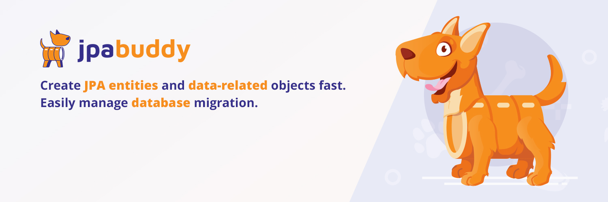

# JPA Buddy Documentation

This repository contains the JPA Buddy Documentation. The documentation is published at https://www.jpa-buddy.com/documentation/.

# Reporting Issues

If you notice a mistake, typo or would like us to add more information, feel free to create an issue. We will fix it as soon as possible.

# License
The source code is licensed under Apache 2.0. Hence, all materials located in this repository are allowed to be used for academic purposes as well as public presentations.
