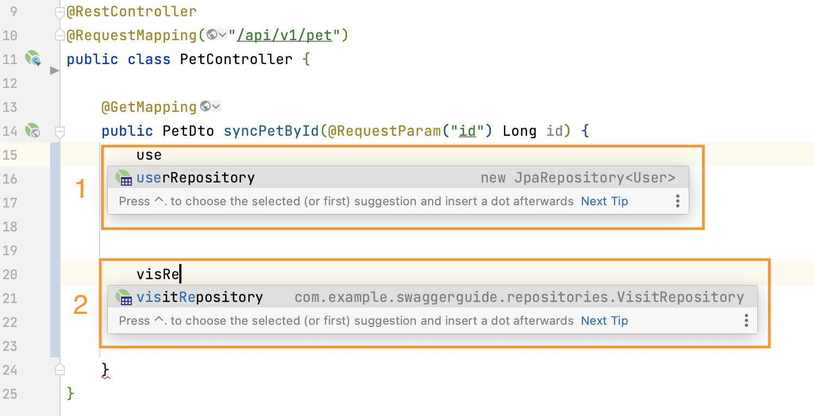
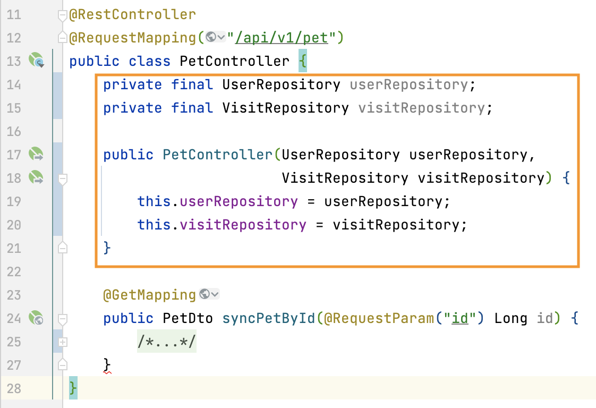
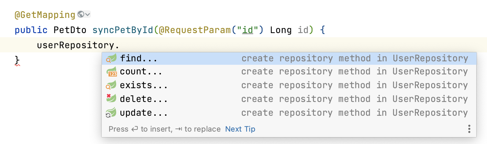
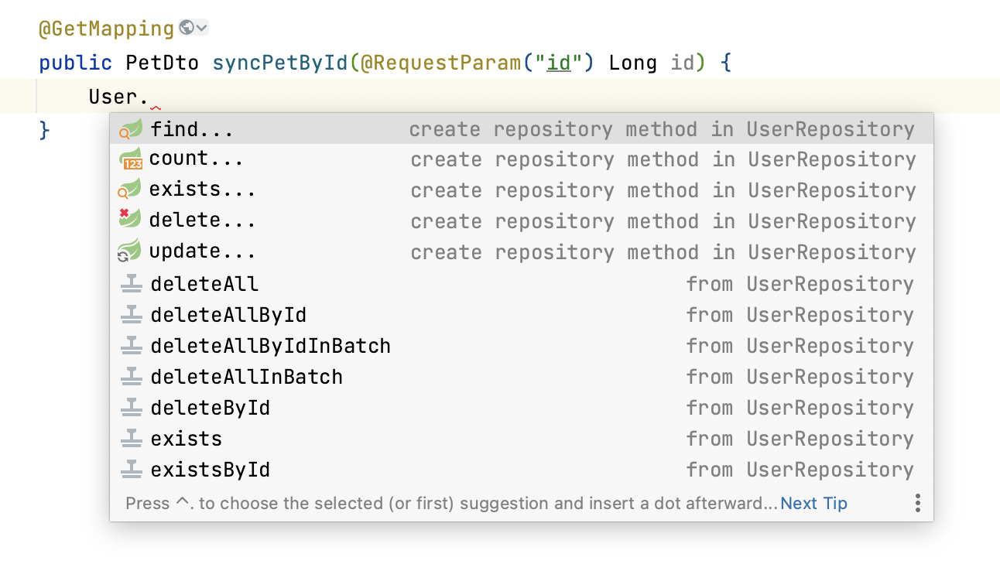
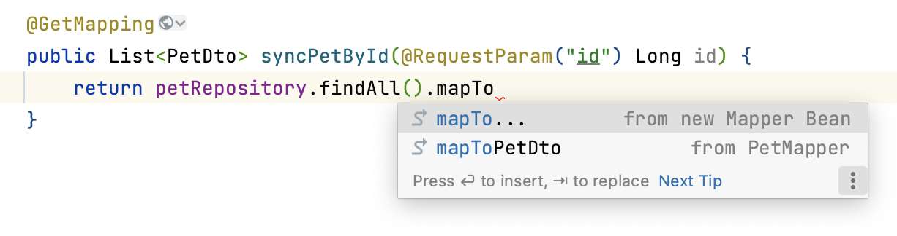
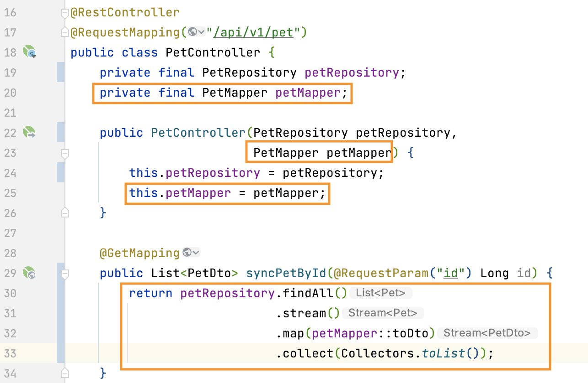
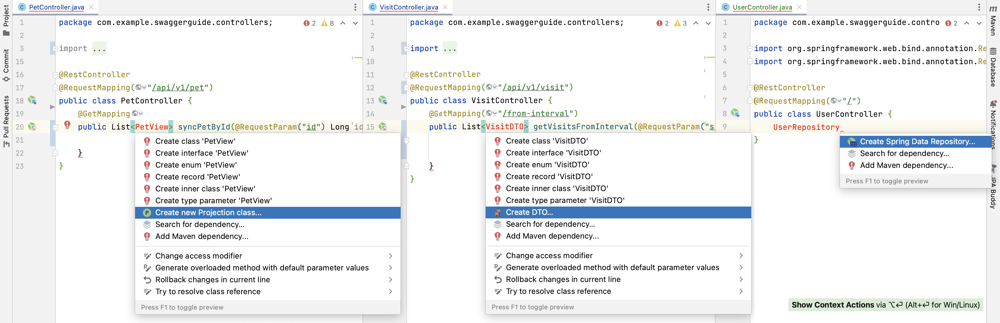
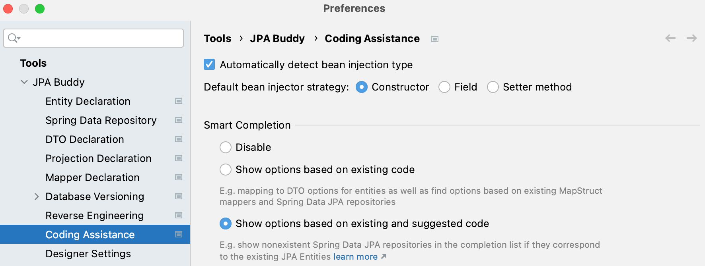

## Introduction

JPA represents the anemic domain model pattern. So, usually, the main domain objects are layered as follows:

1. Entities contain only data 
2. Spring Data repositories declare CRUD operations for entities 
3. DTOs and mappers that transfer entities to their DTOs

Such segregation looks natural because each layer has its clear responsibility area. However, it brings additional complexity during development due to bad discoverability for different operations available over entities.

JPA Buddy addresses this problem by integrating a lot of coding assistance features for JPA entities, Spring Data repositories, DTOs and MapStruct mappers that make development more straightforward and transparent.

<iframe width="560" height="315" src="https://www.youtube.com/embed/J0rix2wqOFU" title="YouTube video player" frameborder="0" allow="accelerometer; autoplay; clipboard-write; encrypted-media; gyroscope; picture-in-picture" allowfullscreen></iframe>

## Code Completion

### Generate & Inject Spring Data JPA Repositories

To create a new Spring Data JPA repository just start typing the repository name that begins with the entity name (1). Then, the [repository wizard](https://www.jpa-buddy.com/documentation/spring-data/#repository-creation) will open.

By following the same coding style, you can also inject an existing Spring Data JPA repository (2). Just start typing the existing repository name and JPA Buddy will find it.

According to your [injection settings](#settings), JPA Buddy will inject the repository into the current class. Example below shows constructor based injection:

#### Generate & Call Methods/Queries

With JPA Buddy, you don't need to switch focus between multiple editors. It allows to call [query visual designers](https://www.jpa-buddy.com/documentation/spring-data/#example) right from here:

Also, you can find/create repository methods via entity class name call:

### Generate & Inject MapStruct Mappers

JPA Buddy is able to generate MapStruct mapper, inject it, and scaffold a proper mapping call. Use "mapTo..." option to [generate a new mapper](https://www.jpa-buddy.com/documentation/dto-generator/#mapstruct-mappers), or apply methods from existing ones (e.g., "mapToPetDto" for the example below). This feature works for both: single instances and collections of entities or DTOs.

Here is the code that JPA Buddy will generate after selecting the "mapToPetDto" option:

## Generate JPA related objects from unresolved references

Some developers prefer to declare an object that doesn't exist yet first and only then implement it. JPA Buddy will help those developers who adhere to this programming style. It suggests to create:

1. Spring Data JPA Repository – in case the reference ends with the value specified in the [Spring Data Repository settings](https://www.jpa-buddy.com/documentation/spring-data/#settings). Default value is "Repository".
2. Projection – in case the reference ends with the value specified in the [Projection declaration settings](https://www.jpa-buddy.com/documentation/spring-data/#projection-declaration-settings). Default values are: "Info", "Prj", "Projection", "VO", "Vo", "View", "Request", "Browse".
3. DTO – in all other cases.

Then, corresponding wizards will open.

## Kotlin Support

All the features that Java developers love are also available to Kotlin fans. Whether you're creating Spring Data repositories on the fly, injecting MapStruct mappers, or scaffolding method calls – JPA Buddy has got you covered. And if you're looking to create a REST endpoint in Kotlin, JPA Buddy makes it incredibly easy:

<iframe width="560" height="315" src="https://www.youtube.com/embed/O6PzJdDcFWQ" title="YouTube video player" frameborder="0" allow="accelerometer; autoplay; clipboard-write; encrypted-media; gyroscope; picture-in-picture" allowfullscreen></iframe>

## Settings

JPA Buddy provides flexible settings to make the use of coding assistance features even more handful. You can:
1) Enable/disable automatic detection for bean injection type;
2) Define the [bean injection strategy](https://docs.spring.io/spring-framework/docs/current/reference/html/core.html#beans-factory-collaborators) that JPA Buddy will follow while code generation;
3) Whether to use the smart completion features or not.

