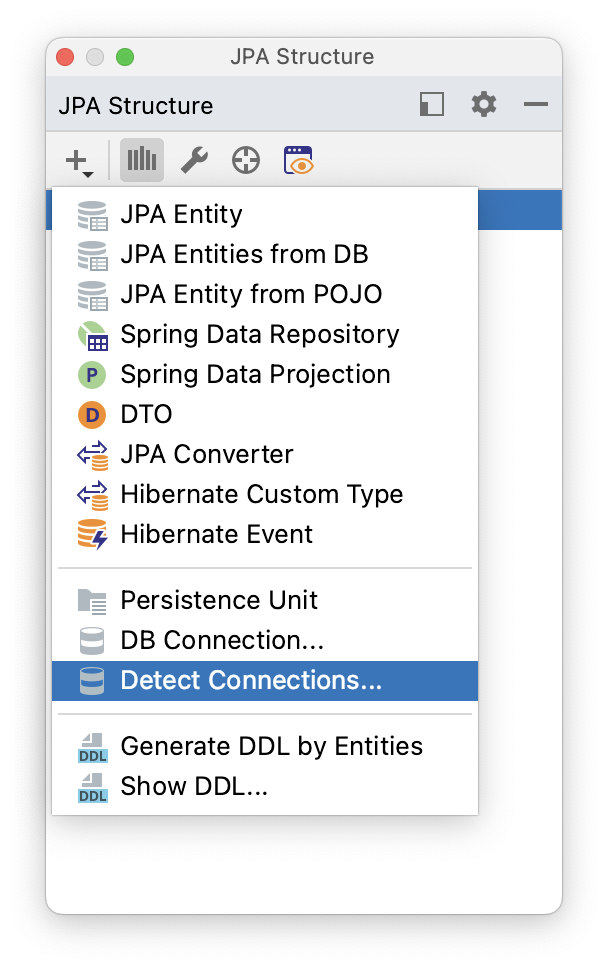

## Introduction

JPA Structure panel is responsible for everything related to DB configurations. To create a new DB connection, click on the "Plus" button and choose "DB Connection". To use [Reverse Engineering](https://www.jpa-buddy.com/documentation/reverse-engineering/) and [Database Versioning](https://www.jpa-buddy.com/documentation/database-versioning/) features, the first thing you will need to do is create a database connection.

For now, JPA Buddy supports the following databases:

* <a href="https://www.postgresql.org/" target="_blank">PostgreSQL</a>
* <a href="https://www.microsoft.com/sql-server/sql-server-2019?rtc=1" target="_blank">MSSQL</a>
* <a href="https://www.mysql.com/" target="_blank">MySQL</a>
* <a href="https://mariadb.org/" target="_blank">MariaDB</a>
* <a href="https://www.oracle.com/database/" target="_blank">Oracle</a>
* <a href="http://hsqldb.org/" target="_blank">HSQLDB</a>
* <a href="https://www.h2database.com/html/main.html" target="_blank">H2</a>
* <a href="https://www.ibm.com/analytics/db2" target="_blank">IBM Db2</a>

## Automatic Detection of Data Source Configurations

JPA Buddy offers a convenient way to automatically detect data source configurations from the *\*.properties* file and fills in the required connection settings for you.



To use this feature, simply click on the "Detect Connections" button in the JPA Structure tab, and JPA Buddy will automatically populate the corresponding fields.


Starting from version 2023.2, JPA Buddy seamlessly integrates with IntelliJ IDEA Ultimate's robust options for data source configurations, eliminating the need to create additional connections. For more information, refer to the relevant <a href="https://www.jetbrains.com/help/idea/data-sources-and-drivers-dialog.html" target="_blank">JetBrains documentation page</a>.

JPA Buddy provides a similar mechanism for the IntelliJ IDEA Community edition.


It’s worth noting that JPA Buddy is compatible with any property file that adheres to the standard naming convention for property files. This includes YAML files, environment-specific properties files, test-specific properties files, and more.  E.g.: 'application.properties', 'application-test.properties', 'application.yaml', 'application-prod.yaml', etc.

## Automatic Generation of Property Files

Additionally, JPA Buddy can help you generate *\*.properties* files based on your data source configuration. This feature will save you time and effort in configuring your application.

To do so, open the relevant property file, then access the Context Actions menu by pressing Alt+Enter/⌥ ⏎. Select the Data Source option from the menu.


This will open the Data Source window, as shown in the screenshot below.


From the Data Source window, select the appropriate data source for your application. You can choose the DDL auto mode you need in the drop-down menu below. Additionally, there are two other options available in the Data Source window: 'Show SQL' and 'Format SQL'.
These options allow you to choose whether to show SQL statements that are executed by Hibernate on your standard output for debugging purposes and whether to format those statements for readability, respectively.

Once you have selected the data source and any other options you need, JPA Buddy will fill in the selected property file with the necessary configuration for you.

## Non-Default Schema Connection

Some RDBMSs that JPA Buddy supports provide the possibility to create non-default schemas, but not all of them work well with JDBC. That's why you may encounter some known issues when generating diffs or reverse engineering. For now, these issues can only be solved with some workaround. Below are examples of connecting to non-default schemas for all databases supported by JPA Buddy.

<div class="note">
We show two screenshots for all the examples below: the first from the IntelliJ IDEA Community Edition, the second from the IntelliJ IDEA Ultimate Edition.
</div>

### PostgreSQL

The default PostgreSQL schema is "public". For other schemes you need to specify desired schema name in the Connection params field via "currentSchema" parameter:


<div class="note">
JPA Buddy automatically creates the required schema connection for IntelliJ IDEA Ultimate, without any additional actions required from you. For example, use a connection with the default schema (public) and try to create an entity from another schema. JPA Buddy will create and configure another DB connection with the parameters as described above.
</div>

### Microsoft SQL Server

The default Microsoft SQL Server schema is "dbo". To connect to the non-default scheme in Microsoft SQL Server, you should follow the steps described below:

1. Create a login:

    ```sql
    create login JohnDoe with password='saPassword1'
    ```

2. Create a user with a default schema from which you want to create an entity:

    ```sql
    create user JohnDoe for login JohnDoe with default_schema = my_schema 
    ```

3. Give it owner rights:

    ```sql
    exec sp_addrolemember 'db_owner', 'JohnDoe' 
    ```

4. Create a new connection with the newly created user’s credentials and add a schema name in the database URL field

For JDBC the connection setup will look like this:


And for <a href="http://jtds.sourceforge.net/faq.html" target="_blank">JTDS</a> like this:


### Oracle

In Oracle, schema, user and database are the same thing. Hence, to connect to the non-default scheme you need to specify its schema name in the user field.

For the connection via SID setup will look like this:


And for the connection via service name like this:


<div class="note">
Reverse engineering does not work for system tables located in the "SYS" schema.
</div>

### MySQL & MariaDB

To connect to the non-default scheme you need to specify the schema name in the Database URL field:


## Database Drivers

Since IntelliJ IDEA CE doesn't allow configuring database drives, JPA Buddy is to the rescue! Open Tools -> JPA Buddy -> Database Drivers window. Here you can configure drivers for each supported RDBMS by selecting one of the proposed driver versions and adding additional files from your local machine.


## How to connect via SSH

JPA Buddy uses a different mechanism from what IntelliJ IDEA uses to connect to the database. So, JPA Buddy can't use the SSH tunnel configured in IntelliJ IDEA. To make Buddy work properly in this case, you need to establish an SSH tunnel on the system level. Here is <a href="https://www.linode.com/docs/guides/create-an-ssh-tunnel-for-mysql-remote-access/" target="_blank">an example</a> of how you can do it.
