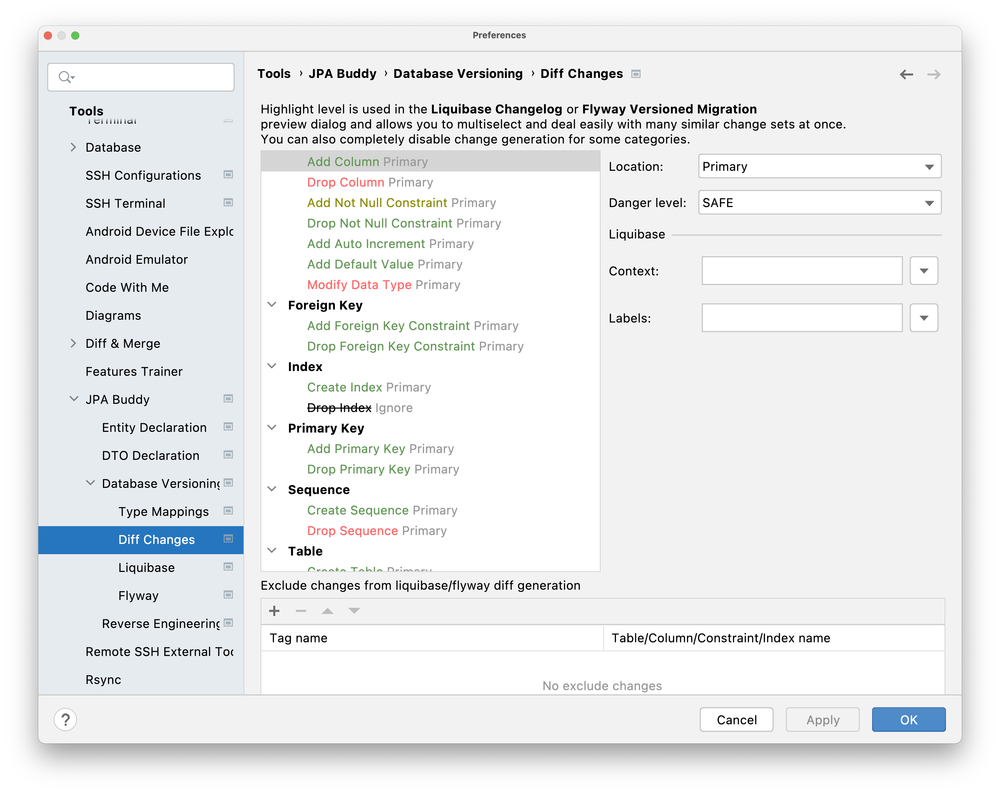
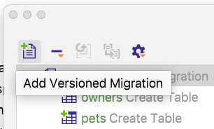
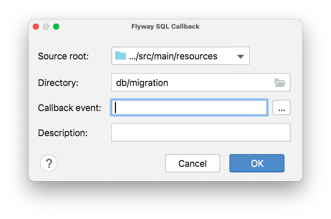
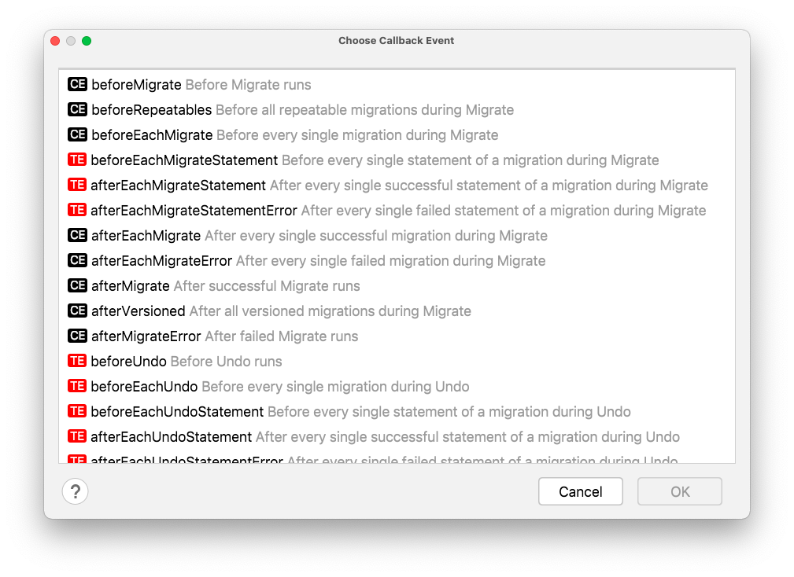
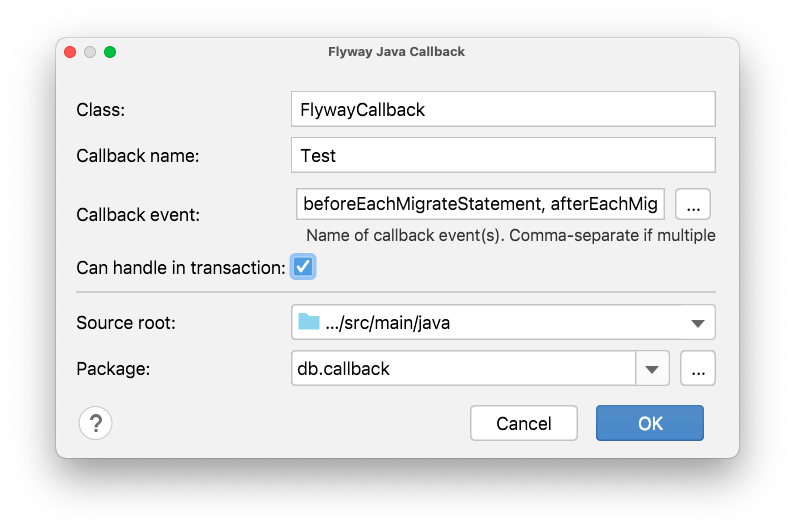

## Introduction

Working with relational databases it is important to keep them synchronized with the data model represented in the source code. There are two popular approaches to this challenge: 

- **Database first.** This approach takes the database as the first-class citizen, while data model classes (POJOs or JPA entities) are derived from the database schema via code generation, aka "Database reverse engineering". Following this scenario, you should not touch the generated classes, because they can be re-generated at any moment, and all changes made in the source code will be lost. Also, this way **doesn't save you from the migration scripts generation**, because they will be required to upgrade the existing installations to the newest version. 
- **Source code first**. This is an opposite approach having the single source of truth in the data model classes. Hence, the database gets modified in accordance with changes in the data model. To handle database update, the difference between the old state of the database and up-to-date state of the data model classes should be represented in migration scripts of any format (Flyway SQL migrations or Liquibase changelogs). 

**JPA Buddy** provides convenient tools that help developers to proceed with each of the described scenarios. This guide shows how JPA Buddy can save a lot of time for differential update scripts generation. 

## Database Connection

The first thing you need to do to use the database versioning features is to create a DB connection. The correct way to do it and possible issues are described in the separate [documentation](https://www.jpa-buddy.com/documentation/database-connections/). Check it out to learn more. 

## Library Support 

JPA Buddy supports two most used solutions that are often used in Java applications along with JPA: [**Flyway**](https://flywaydb.org/) and [**Liquibase**](https://www.liquibase.org/). However, there is an option to obtain DDL scripts for your JPA entities even if none of these are used in the project. 

If you would like to see a short overview and practical examples of using Flyway or Liquibase you can use the following links: 

- https://www.baeldung.com/database-migrations-with-flyway 
- https://www.baeldung.com/liquibase-refactor-schema-of-java-app 

To be certain that JPA Buddy is ready to help, make sure that the project contains right maven dependencies: 

```xml
<dependency> 
 <groupId>org.liquibase</groupId> 
 <artifactId>liquibase-core</artifactId> 
 <version>4.4.3</version> 
</dependency> 
```

Or: 

```xml
<dependency> 
 <groupId>org.flywaydb</groupId> 
 <artifactId>flyway-core</artifactId> 
 <version>7.15.0</version> 
</dependency> 
```

JPA Buddy scans the project dependencies and enables the corresponding features. 

## General Differential Scripts Generation Flow 

The general path of the diff scripts generation for both of frameworks is nearly the same. However, there are some differences which are also highlighted in this guide. To avoid repetition, we will call both Liquibase changelogs and Flyway versioned migrations "migration scripts". 

To generate a differential migration script with JPA Buddy, right-click on the desired folder and select New -> Liquibase -> Diff Changelog or New -> Flyway -> Diff Versioned Migration. Alternatively, click the Plus button on top of the JPA Structure tool window and select the corresponding item there. 

In the opened dialog select source (the desired state of the data model) and target (the old state of the data model). 

**Resulting migration script(s) = Current State (Source) – Previous State (Target).** 

In other words, JPA Buddy will generate the resulting migration script for upgrading the target database to the state of the source. 

 As a source you can choose between the following options: 

- **DB** — should be used in case you have an up-to-date database and would like to generate migration scripts for updating another DB to the same state. 

- **Model** — use it to generate migration scripts representing the difference between the current state of the entity relationship model (JPA entities) and old (target) state. 

The target can be set to: 

- **DB** — target DB with older version of the schema. 
- **Snapshot** — use this option in case you have the desired state stored in a data model snapshot. It can be generated by JPA Buddy as well. 

Click OK to proceed further. JPA Buddy will analyze the difference between Source and Target and show the Preview dialog to enable fine tuning for the resulting migration script. Click Save to add the new script to the project or to append an existing one. 

<div class="youtube" align="center">
  <iframe width="560" height="315" src="https://www.youtube.com/embed/xxzfgSvRsMk" title="YouTube video player" frameborder="0" allow="accelerometer; autoplay; clipboard-write; encrypted-media; gyroscope; picture-in-picture" allowfullscreen></iframe>
</div>


### Differential Migration Scripts Generation Options 

#### Using a Database

Comparing a database with another database/snapshot makes sense if you have a source database already synchronized with your data model. There are two popular approaches for keeping a database in accordance with JPA entities: 

- using schema auto-generators (Hibernate and EclipseLink provide their own implementations). 
  Note, that even Hibernate documentation warns against using this way beyond prototyping or testing reasons. 
- applying changes in JPA entities over the database schema manually. 
  This approach may appear to be too laborious, especially for early development stages when the data model is being changed frequently. 

#### Using a Data Model

Following JPA principles, an application represents the data model (entities, associations, indexes, etc.) via the declared JPA entities. In other words, it already contains sufficient information about the database schema. So, your source code is the only point of truth, which represents the up-to-date (source) schema in the first place. This is why comparing your data model with a database/snapshot is the preferable option for generating differential changelogs. 

JPA Buddy scans all JPA objects, compares them with a target database or a snapshot and generates a differential migration script. 

Using a data model as a source of the current schema state triggers selection of a persistence unit. Following the documentation: 

*A persistence unit defines a set of all entity classes that are managed by EntityManager instances in an application. This set of entity classes represents the data contained within a single data store.* 

Effectively this means that if your application uses multiple data stores, you will need to generate migration scripts separately for each of them, specifying corresponding persistence units. 

To configure a new persistence unit, click on the plus button in JPA Structure panel and choose “Persistence Unit”. In the opened window, you can define the persistence unit name, the default DB connection and select required entities. For entity selection, there are two possibilities that you can combine:  

- You can scan the needed package, and all entities located in it will be added automatically  

- You can manually select entities from the project 

<div class="youtube" align="center">
	<iframe width="560" height="315" src="https://www.youtube.com/embed/uaNFvkNLT9M" title="YouTube video player" frameborder="0" allow="accelerometer; autoplay; clipboard-write; encrypted-media; gyroscope; picture-in-picture" allowfullscreen></iframe>
</div>


#### Using a Data Model Snapshot

JPA Buddy allows using a data model snapshot as the target of the comparison. Sometimes, it is impossible or hard to obtain a database for a certain state of the model, for example, when merging changes into some older version of the application. It may be simply impossible to keep a database dump for each release. JPA Buddy lets you checkout the required version of the application and generate a JSON snapshot based on the JPA entities, so no database will be required for differential migration scripts generation. 

To generate a snapshot, click the **Plus** button on top of the JPA Structure tool window and select the **JSON Snapshot** item. 


This allows you to capture the state of the data model at some older point, so that you can create a diff migration script describing all the modifications that happened from that point until now.

For example, you have been working in a feature branch and modified the model. Before merging, it is necessary to create a diff changelog describing the changes in this branch only.

Depending on the setup, there might be no DB that is always in sync with the main branch. Things get even more complicated when you need to merge not into the main branch, but some other state of the application (for example, into a release branch). It may be simply impossible to keep a database dump for each release. JPA Buddy offers a simpler solution:

1. Checkout the target branch (for example, main or release)
2. Create a snapshot of the model in that branch
3. Checkout the feature branch
4. Generate a diff migration script by comparing the model and the snapshot you created in step 2.

In four simple steps you get a migration script that describes the changes between the current branch and the target branch.

### Preview Window

Click OK to proceed to the preview window of the migration script. The preview window for Liquibase looks like this (Flyway preview window is slightly different):


Some types of changes have custom fields in the preview window. For example, “add not null constraint” change allows you to replace all existing NULL values in the DB with a specified value:


Each change type is color-coded according to its danger level: green for SAFE, yellow for CAUTION and red for DANGER. SAFE operations are the ones that cannot cause loss of data in any way, for example, adding a column does not affect the existing data. Operations marked with CAUTION are generally safe but require your attention: for instance, adding a NOT NULL constraint can fail if there are null values in the column. DANGER operations can cause loss of data, for example, dropping a column or modifying data type.

The danger levels can be customized in the plugin preferences in JPA Buddy -> Database Versioning -> Diff Changes:



You can also configure whether each change type is placed in the primary/secondary location or ignored completely. The ignored changes will be excluded from all newly generated migration scripts by default, instead they will be displayed in the “Ignored” section during preview so that they can be added back manually. For Liquibase, you can also set the context and labels that should be used for each change type.

#### Merging statements

Basically, renaming schema elements, such as table name, column name, etc., leads to the two statements:

- Drop an existing value
- Add the new one

But JPA Buddy can replace such statements with the single rename or modify statement. For example, you will see two statements in the preview window after renaming column/table/sequence name or changing column type. But by choosing any of the related statements, you can merge them:

<div class="youtube" align="center">
<iframe width="560" height="315" src="https://www.youtube.com/embed/nhGhcpdqTMs" title="YouTube video player" frameborder="0" allow="accelerometer; autoplay; clipboard-write; encrypted-media; gyroscope; picture-in-picture" allowfullscreen></iframe>
</div>

After the merge, drop statements may be irrelevant. You can choose changes that should be removed from the migration scripts. For example, after renaming an id column (rather than dropping an old value and adding a new one), there is no need to add a new primary key for it:


## Liquibase Support

### Changelog Preview Window


“Directory” and “File name” fields are responsible for configuring the location of the generated changelog. If a changelog with the specified name already exists, you will be prompted with a warning, after which the changes will be appended to that changelog. 

“Include to”, “include folder” and “include context” configure whether the changelog should be included in some other changelog. If checked, the “include folder” box will generate the include statement for the whole folder, not only the current changelog.

From the "File type" drop-down list, you can choose one of the four supported by Liquibase file type (YAML, JSON, SQL, XML), in which JPA Buddy will generate the changelog.

On the left of the window, there is a preview of the actual changesets to be generated. You can see what each change is going to look like by clicking on them. To combine several changes into one changeset or to ignore them, simply drag them around. The top left corner of the preview window contains various actions to modify the resulting changelog:


The following actions are provided:

- *Add Changelog* — create a secondary changelog
- *Add Change Set* — create a new changeset in the selected changelog
- *Remove from Changelog* with options:
  - *Remove from Changelog* — simply remove the changes from the current changelog
  - *Remove and Ignore* — remove the changes and add them to “Ignored”, so they are excluded from future changesets too
  - *Restore from Ignored* — move the changes from “Ignored” to the changelog

- *Set Context* (for changesets)
- *Set Labels* (for changesets)
- *Show Other Actions* — select all changes based on the danger level, expand/collapse all changes

### Primary and Secondary Changelogs

JPA Buddy lets you put the changes into two types of changelogs: Primary and Secondary. One use case for this is separating safe changes that can be run automatically and changes that require your attention and need to be run manually.

The changes can be separated automatically by their type (in Settings -> Diff Change Types). Alternatively, you can create a secondary changelog manually in the Preview window using the “Add Changelog” action. Then you can simply drag the desired changesets into the new changelog.

By default, Primary and Secondary changelogs are generated in separate directories, which can be customized in the plugin settings. Read more in the Settings -> Database Versioning -> Liquibase section.

### Creating and Modifying Changelogs

JPA Buddy also offers tools for viewing, creating and modifying changelogs by hand. It adds three panels to the IntelliJ IDEA UI: JPA Palette, JPA Inspector and JPA Structure.


JPA Structure displays everything that JPA Buddy knows about the project. For Liquibase changelogs, it shows their hierarchy and contents:


To create a new changelog, right-click the desired folder in the project tree and select New -> Liquibase -> Empty Changelog. Or click the “plus” button in the top-left corner of the JPA Structure panel:


JPA Palette and JPA Inspector panels let you generate and modify code. They are context-dependent, they display options available for the opened file type. The Palette is used for code generation, and the Inspector for code modification.

For example, here are some options JPA Palette offers for Liquibase changelogs:


JPA Buddy understands your data model and prefills the changesets as much as possible. And with the help of JPA Inspector you can explore the attributes of each changelog element: 


JPA Buddy also makes writing code by hand easier by providing code completion based on the JPA data model:

<div class="youtube" align="center">
<iframe width="560" height="315" src="https://www.youtube.com/embed/zZhOW5hvlK8" title="YouTube video player" frameborder="0" allow="accelerometer; autoplay; clipboard-write; encrypted-media; gyroscope; picture-in-picture" allowfullscreen></iframe>
</div>


### Running Liquibase changelogs/previewing SQL without Gradle/Maven plugins

The JPA Structure panel also offers a way to run Liquibase updates and preview SQL. To run an update, click the “Liquibase Update” button:


The Liquibase Update window will open with configuration options: 

- the path to the changelog file
- which DB connection to use
- Liquibase context and labels
- the log level of the operation


Clicking “Update” runs the Liquibase update command with the configured options. Clicking “Show SQL” displays a preview window:


### Liquibase Settings

Whenever an empty or differential Liquibase changelog is created, JPA Buddy generates the file name based on the templates specified in the plugin settings:


The following variables and macros are available in the templates:

- `#date([format])` – the current system date in the specified [SimpleDateFormat](https://docs.oracle.com/javase/8/docs/api/java/text/SimpleDateFormat.html). For example, `#date(\"yyyy-MM-dd\")` returns the date formatted as 2020-12-31.
- `#increment([start], [step], [decimalFormat])` — a number that is used to keep the name unique. `start` value is used for the first file and is incremented by step for each next file. `decimalFormat` parameter specifies the [DecimalFormat](https://docs.oracle.com/javase/8/docs/api/java/text/DecimalFormat.html) of the number. For example, `#increment(1.0, 0.1, \"#.0\")` returns the value formatted as 1.1, 1.2, 1.3, etc.
- `semVer` — semantic version of the project (aka SemVer), is a widely adopted version scheme that uses a sequence of three digits (Major.Minor.Patch), an optional pre-release tag and optional build meta tag. The object contains the following methods (the full version in the examples is 1.2.3-SNAPSHOT+meta):
  - `semVer.getRawVersion()`: 1.2.3-SNAPSHOT
  - `semVer.getMajor()`: 1
  - `semVer.getMinor()`: 2
  - `semVer.getPatch()`: 3
  - `semVer.getPreRelease()`: SNAPSHOT
  - `semVer.getMeta()`: meta


## Flyway Support

### Preview window Actions


"Directory" and "File name" fields are responsible for configuring the location of the generated migration. If a migration with the specified name already exists, you will be prompted with a warning, after which the changes will be appended to that migration. 

On the left of the window, there is a preview of the actual changes to be generated. You can see what each change is going to look like by clicking on them.



Above the list of changes, there is a button panel with the following actions: 

- Add Versioned Migration— create a secondary versioned migration. 
- Remove from Versioned Migration with options: 
  - Remove from Versioned Migration — to remove the changes from the current migration. 
  - Remove and Ignore — to remove the changes and add them to the "Ignored" section, so they are excluded from future migrations too.

- Restore from Ignored — move the changes from "Ignored" to the migration.
- Move to Another Versioned Migration — by default, a single migration script is created on each diff generation with all the changes. This action lets you move a change to another migration file.
- Show Other Actions — This button will help you to conveniently interact with a large number of changes in the migration files: 
  - "Select all ..."
  - "Expand/collapse all"


To combine several changes into one migration file or to ignore them, drag them around.

### Java Migration

Java-based migrations are a great fit for all changes that can not easily be expressed using SQL. These migrations represent java classes that implement the `JavaMigration` interface or inherit from the `BaseJavaMigration` class. JPA Buddy follows the second option and generates the class name according to Flyway’s default [naming convention](https://flywaydb.org/documentation/concepts/migrations.html#naming-1). This enables Flyway to automatically extract the version and the description from the class name.

To generate java migration, press the plus button in the JPA Structure panel and choose the corresponding item.


In the opened window, you can set class name, source root and package name: 


After that, the following java class will be generated:

```java
public class V4__ extends BaseJavaMigration {

   @Override
   public void migrate(Context context) {
      new JdbcTemplate(new SingleConnectionDataSource(context.getConnection(), true))
         .execute("");
   }
}
```

### Flyway Callbacks

While migrations are sufficient for most needs, certain situations require you to execute the same action over and over again. With the help of JPA Buddy, you can generate [all events](https://flywaydb.org/documentation/concepts/callbacks) that Flyway supports. To generate SQL or java callbacks, press the plus button in the JPA Structure panel and choose the corresponding item.


#### SQL Callbacks

JPA Buddy provides Flyway SQL Callback window, with the following fields:

- “Source root” and “Directory” fields are responsible for the location of the generated file: 

  

- “Callback event” field allows you to choose one of the events that Flyway supports:



- Optionally the callbacks may also include a description. The value in the “Description” filed will be appended along with the separator to the callback name. 

#### Java Callbacks

If SQL Callbacks aren’t flexible enough for you, flyway supports Java Callbacks. JPA Buddy provides Flyway Java Callback window, with the following fields:



- “Class” and “Class name” these fields are responsible for configuring corresponding values for generated java-class.

- “Callback event” field allows you to choose several events that Flyway supports:

  

- “Can handle in transaction” checkbox defines whether true or false will return the canHandleInTransaction overridden method from the Callback interface. 
- “Source root” and “Directory” fields are responsible for the location of the generated file. 

```java
  public class TestCallback implements Callback { 

  @Override 
    public boolean supports(Event event, Context context) { 
        return event.equals(Event.*BEFORE_EACH_MIGRATE_STATEMENT*) || 
      event.equals(Event.*AFTER_EACH_MIGRATE_ERROR*) || 
      event.equals(Event.*AFTER_EACH_UNDO_STATEMENT*); 
    } 

    @Override 
    public boolean canHandleInTransaction(Event event, Context context) { 
        return true; 
    } 
     
    @Override 
    public void handle(Event event, Context context) { 
        *//**TODO handle logic...* 
    } 
     
    public String getCallbackName() { 
        return "Test"; 
    } 

}
```

### Flyway Settings

Whenever an empty or differential Flyway migration is created, JPA Buddy generates the file name based on the flyway [naming pattern](https://flywaydb.org/documentation/concepts/migrations#naming). In plugin settings you can configure following values for name generation:


- Migration prefix. The default value is V.
- Version pattern. After the hyphen, an example of the generated sequence is presented. 
- Migration separator. The default value is “_”.
- Migration description.

The following variables and macros are available in the templates:

- `#date([format])` – the current system date in the specified [SimpleDateFormat](https://docs.oracle.com/javase/8/docs/api/java/text/SimpleDateFormat.html). For example, `#date(\"yyyy-MM-dd\")` returns the date formatted as 2020-12-31.
- `#increment([start], [step], [decimalFormat])` — a number that is used to keep the name unique. `start` value is used for the first file and is incremented by step for each next file. `decimalFormat` parameter specifies the [DecimalFormat](https://docs.oracle.com/javase/8/docs/api/java/text/DecimalFormat.html) of the number. For example, `#increment(1.0, 0.1, \"#.0\")` returns the value formatted as 1.1, 1.2, 1.3, etc.
- `semVer` — semantic version of the project (aka SemVer), is a widely adopted version scheme that uses a sequence of three digits (Major.Minor.Patch), an optional pre-release tag and optional build meta tag. The object contains the following methods (the full version in the examples is 1.2.3-SNAPSHOT+meta):
  - `semVer.getRawVersion(): 1.2.3-SNAPSHOT
  - `semVer.getMajor()`: 1
  - `semVer.getMinor()`: 2
  - `semVer.getPatch()`: 3
  - `semVer.getPreRelease()`: SNAPSHOT
  - `semVer.getMeta()`: meta


## SQL Visual Designer

In some cases, it’s useful to have SQL scripts for the JPA data model, especially when you need to quickly set up a fresh database. JPA Buddy can generate a wide range of SQL statements via JPA Palette. For each statement, there is a corresponding window that allows you to configure the statement:

<div class="youtube" align="center">
<iframe width="560" height="315" src="https://www.youtube.com/embed/61_tr0QovfU" title="YouTube video player" frameborder="0" allow="accelerometer; autoplay; clipboard-write; encrypted-media; gyroscope; picture-in-picture" allowfullscreen></iframe>
</div>


## Show DDL... Action 

To generate create script for existing entities you can use Show DDL action.


All you need to generate the script is to choose the required table and DB type. JPA Buddy provides the possibility to generate scripts for the six most popular databases.


## Custom Type Mappings

When the application works with several DBMSs, your schema might have slightly different data types for each of them.

Let’s say the application needs to support both PostgreSQL and MS SQL. And you want to store Unicode characters in your strings. PostgreSQL supports Unicode chars in VARCHAR, but MS SQL has a separate NVARCHAR data type for it.

JPA Buddy lets you specify type mappings for each DBMS, simply check the “Enabled” box on each desired DBMS and add the mappings. It is also possible to set mappings for JPA Converters and Hibernate Types:


When generating changelogs, JPA Buddy uses Liquibase properties to specify correct data types for each DBMS:

```xml
<property name="string.type" value="varchar" dbms="postgresql"/>
<property name="string.type" value="nvarchar" dbms="mssql"/>
<changeSet id="1622118750064-2" author="jpa-buddy">
  <createTable tableName="owners">
     <column autoIncrement="true" name="id" type="INT">
        <constraints nullable="false" primaryKey="true" primaryKeyName="PK_OWNERS"/>
     </column>
     <column name="first_name" type="${string.type}(255)"/>
     <column name="last_name" type="${string.type}(255)"/>
     <column name="address" type="${string.type}(255)"/>
     <column name="city" type="${string.type}(255)"/>
  </createTable>
</changeSet>
```

Therefore, there is no need to create separate changelogs for different DBMSs.

As for generating Flyway migrations, choose the needed DB connection in the corresponding field. JPA Buddy will generate the script according to the mappings that you defined for the selected DB.

### Convertors

In order to simplify type mapping, JPA Buddy introduces DB-agnostic SQL types, that are transformed into the DB-specific type. For example, “varchar" is transformed into “varchar2” for Oracle DB and left as “varchar" for PostgreSQL.

Each DB-agnostic type has a set of aliases (for example, “java.sql.Types.VARCHAR” or “character varying”), which in most cases are interchangeable. Unknown types are used as is without any transformations. Check out the full list of aliases in the table:

<div class="table">
<table class="tg">
<thead>
  <tr>
    <th class="tg-0pky">Name</th>
    <th class="tg-0pky">Aliases</th>
    <th class="tg-0lax">Liquibase class</th>
  </tr>
</thead>
<tbody>
  <tr>
    <td class="tg-0pky"><span style="color:#000">bigint</span><br></td>
    <td class="tg-0pky"><span style="color:#000">java.sql.Types.BIGINT</span><br><span style="font-weight:normal;font-style:normal;color:#000">java.math.BigInteger</span><br><span style="font-weight:normal;font-style:normal;color:#000">java.lang.Long</span><br><span style="font-weight:normal;font-style:normal;color:#000">integer8</span><br><span style="font-weight:normal;font-style:normal;color:#000">bigserial</span> <br><span style="font-weight:normal;font-style:normal;color:#000">serial8</span><br><span style="color:#000">int8</span> </td>
    <td class="tg-0lax"><span style="color:#000">liquibase.datatype.core.BigIntType</span> </td>
  </tr>
  <tr>
    <td class="tg-0pky"><span style="color:#000">blob</span> </td>
    <td class="tg-0pky"><span style="color:#000">longblob</span><br><span style="color:#000">longvarbinary</span><br><span style="color:#000">java.sql.Types.BLOB</span><br><span style="color:#000">java.sql.Types.LONGBLOB</span><br><span style="color:#000">java.sql.Types.LONGVARBINARY</span><br><span style="color:#000">java.sql.Types.VARBINARY</span><br><span style="color:#000">java.sql.Types.BINARY</span><br><span style="color:#000">varbinary</span><br><span style="color:#000">binary</span><br><span style="color:#000">image</span><br><span style="color:#000">tinyblob</span><br><span style="color:#000">mediumblob</span> </td>
    <td class="tg-0lax"><span style="color:#000">liquibase.datatype.core.BlobType</span> </td>
  </tr>
  <tr>
    <td class="tg-0pky"><span style="color:#000">boolean</span></td>
    <td class="tg-0pky"><span style="color:#000">java.sql.Types.BOOLEAN</span><br><span style="color:#000">java.lang.Boolean</span><br><span style="color:#000">bit</span><br><span style="color:#000">bool</span> </td>
    <td class="tg-0lax"><span style="color:#000">liquibase.datatype.core.BooleanType</span> </td>
  </tr>
  <tr>
    <td class="tg-0pky"><span style="color:#000">char</span> </td>
    <td class="tg-0pky"><span style="color:#000">java.sql.Types.CHAR</span><br><span style="color:#000">bpchar</span> </td>
    <td class="tg-0lax"><span style="color:#000">liquibase.datatype.core.CharType</span> </td>
  </tr>
  <tr>
    <td class="tg-0pky"><span style="color:#000">clob</span> </td>
    <td class="tg-0pky"><span style="color:#000">longvarchar</span><br><span style="color:#000">text</span><br><span style="color:#000">longtext</span><br><span style="color:#000">java.sql.Types.LONGVARCHAR</span><br><span style="color:#000">java.sql.Types.CLOB</span><br><span style="color:#000">nclob</span><br><span style="color:#000">longnvarchar</span><br><span style="color:#000">ntext</span><br><span style="color:#000">java.sql.Types.LONGNVARCHAR</span><br><span style="color:#000">java.sql.Types.NCLOB</span><br><span style="color:#000">tinytext</span><br><span style="color:#000">mediumtext</span> </td>
    <td class="tg-0lax"><span style="color:#000">liquibase.datatype.core.ClobType</span> </td>
  </tr>
  <tr>
    <td class="tg-0pky"><span style="color:#000">currency</span> </td>
    <td class="tg-0pky"><span style="color:#000">money</span><br><span style="color:#000">smallmoney</span> </td>
    <td class="tg-0lax"><span style="color:#000">liquibase.datatype.core.CurrencyType</span> </td>
  </tr>
  <tr>
    <td class="tg-0pky"><span style="color:#000">function</span> </td>
    <td class="tg-0pky"><span style="color:#000">liquibase.statement.DatabaseFunction</span> </td>
    <td class="tg-0lax"><span style="color:#000">liquibase.datatype.core.DatabaseFunctionType </span> </td>
  </tr>
  <tr>
    <td class="tg-0pky"><span style="color:#000">datetime</span> </td>
    <td class="tg-0pky"><span style="color:#000">java.sql.Types.DATETIME</span><br><span style="color:#000">java.util.Date</span><br><span style="color:#000">smalldatetime</span><br><span style="color:#000">datetime2</span> </td>
    <td class="tg-0lax"><span style="color:#000">liquibase.datatype.core.LiquibaseDataType</span> </td>
  </tr>
  <tr>
    <td class="tg-0lax"><span style="color:#000">date</span> </td>
    <td class="tg-0lax"><span style="color:#000">java.sql.Types.DATE</span><br><span style="color:#000">java.sql.Date</span> </td>
    <td class="tg-0lax"><span style="color:#000">liquibase.datatype.core.DateType</span> </td>
  </tr>
  <tr>
    <td class="tg-0lax"><span style="color:#000">decimal</span> </td>
    <td class="tg-0lax"><span style="color:#000">java.sql.Types.DECIMAL</span><br><span style="color:#000">java.math.BigDecimal</span> </td>
    <td class="tg-0lax"><span style="color:#000">liquibase.datatype.core.DecimalType</span> </td>
  </tr>
  <tr>
    <td class="tg-0lax"><span style="color:#000">double</span> </td>
    <td class="tg-0lax"><span style="color:#000">java.sql.Types.DOUBLE</span><br><span style="color:#000">java.lang.Double</span> </td>
    <td class="tg-0lax"><span style="color:#000">liquibase.datatype.core.DoubleType</span> </td>
  </tr>
  <tr>
    <td class="tg-0lax"><span style="color:#000">float</span> </td>
    <td class="tg-0lax"><span style="color:#000">java.sql.Types.FLOAT</span><br><span style="color:#000">java.lang.Float</span><br><span style="color:#000">real</span><br><span style="color:#000">java.sql.Types.REAL</span> </td>
    <td class="tg-0lax"><span style="color:#000">liquibase.datatype.core.FloatType</span> </td>
  </tr>
  <tr>
    <td class="tg-0lax"><span style="color:#000">int</span> </td>
    <td class="tg-0lax"><span style="color:#000">integer</span><br><span style="color:#000">java.sql.Types.INTEGER</span><br><span style="color:#000">java.lang.Integer</span><br><span style="color:#000">serial</span><br><span style="color:#000">int4</span><br><span style="color:#000">serial4</span> </td>
    <td class="tg-0lax"><span style="color:#000">liquibase.datatype.core.IntType</span> </td>
  </tr>
  <tr>
    <td class="tg-0lax"><span style="color:#000">mediumint</span> </td>
    <td class="tg-0lax"></td>
    <td class="tg-0lax"><span style="color:#000">liquibase.datatype.core.MediumIntType</span> </td>
  </tr>
  <tr>
    <td class="tg-0lax"><span style="color:#000">nchar</span> </td>
    <td class="tg-0lax"><span style="color:#000">java.sql.Types.NCHAR</span><br><span style="color:#000">nchar2</span> </td>
    <td class="tg-0lax"><span style="color:#000">liquibase.datatype.core.NCharType</span> </td>
  </tr>
  <tr>
    <td class="tg-0lax"><span style="color:#000">number</span></td>
    <td class="tg-0lax"><span style="color:#000">numeric</span><br><span style="color:#000">java.sql.Types.NUMERIC</span> </td>
    <td class="tg-0lax"><span style="color:#000">liquibase.datatype.core.NumberType</span> </td>
  </tr>
  <tr>
    <td class="tg-0lax"><span style="color:#000">nvarchar</span></td>
    <td class="tg-0lax"><span style="color:#000">java.sql.Types.NVARCHAR</span><br><span style="color:#000">nvarchar2</span><br><span style="color:#000">national</span> </td>
    <td class="tg-0lax"><span style="color:#000">liquibase.datatype.core.NVarcharType</span></td>
  </tr>
  <tr>
    <td class="tg-0lax"><span style="color:#000">smallint</span></td>
    <td class="tg-0lax"><span style="color:#000">java.sql.Types.SMALLINT</span><br><span style="color:#000">int2</span> </td>
    <td class="tg-0lax"><span style="color:#000">liquibase.datatype.core.SmallIntType</span> </td>
  </tr>
  <tr>
    <td class="tg-0lax"><span style="color:#000">timestamp</span> </td>
    <td class="tg-0lax"><span style="color:#000">java.sql.Types.TIMESTAMP</span><br><span style="color:#000">java.sql.Types.TIMESTAMP_WITH_TIMEZONE</span><br><span style="color:#000">java.sql.Timestamp</span><br><span style="color:#000">timestamptz</span> </td>
    <td class="tg-0lax"><span style="color:#000">liquibase.datatype.core.TimestampType</span> </td>
  </tr>
  <tr>
    <td class="tg-0lax"><span style="color:#000">time</span> </td>
    <td class="tg-0lax"><span style="color:#000">java.sql.Types.TIME</span><br><span style="color:#000">java.sql.Time</span><br><span style="color:#000">timetz</span> </td>
    <td class="tg-0lax"><span style="color:#000">liquibase.datatype.core.TimeType</span> </td>
  </tr>
  <tr>
    <td class="tg-0lax"><span style="color:#000">tinyint</span> </td>
    <td class="tg-0lax"><span style="color:#000">java.sql.Types.TINYINT</span> </td>
    <td class="tg-0lax"><span style="color:#000">liquibase.datatype.core.TinyIntType</span> </td>
  </tr>
  <tr>
    <td class="tg-0lax"><span style="color:#000">uuid</span> </td>
    <td class="tg-0lax"><span style="color:#000">uniqueidentifier</span><br><span style="color:#000">java.util.UUID</span> </td>
    <td class="tg-0lax"><span style="color:#000">liquibase.datatype.core.UnknownType</span> </td>
  </tr>
  <tr>
    <td class="tg-0lax"><span style="color:#000">varchar</span> </td>
    <td class="tg-0lax"><span style="color:#000">java.sql.Types.VARCHAR</span><br><span style="color:#000">java.lang.String</span><br><span style="color:#000">varchar2</span><br><span style="color:#000">character varying</span> </td>
    <td class="tg-0lax"><span style="color:#000">liquibase.datatype.core.VarcharType</span> </td>
  </tr>
  <tr>
    <td class="tg-0lax"><span style="color:#000">xml</span> </td>
    <td class="tg-0lax"><span style="color:#000">xmltype</span><br><span style="color:#000">java.sql.Types.SQLXML</span> </td>
    <td class="tg-0lax"><span style="color:#000">liquibase.datatype.core.XMLType</span> </td>
  </tr>
</tbody>
</table>
</div>

## Naming Strategy and Max Identifier Settings

Since JPA Buddy supports six databases at once, this is important to have the ability to configure naming strategies and max identifier length.

By default, Spring Boot configures the physical naming strategy with SpringPhysicalNamingStrategy. This implementation generates all table names in lower case separated by underscores. For example, a TelephoneNumber entity is mapped to the telephone_number table. Even if you annotate the entity with `@`Table(name = "TelephoneNumber"). The same names must be used in the migration scripts, so JPA Buddy also applies a physical naming strategy to all names during script generation. 

The following strategies are supported:

- SpringPhysicalNamingStrategy – the default option
- PhysicalNamingStrategyStandardlmpl

To learn more about naming strategies, you can check out our [article](https://www.jpa-buddy.com/blog/hibernate-naming-strategies-jpa-specification-vs-springboot-opinionation/).

RDBMSs have their own limitations. For example, table names for [OracleDatabase](https://twitter.com/OracleDatabase) earlier than 12.1 version are limited to 30 bytes. To avoid problems with versioning scripts, you can limit table names:


## Sharing Settings via Version Control 

JPA Buddy settings define conventions that are supposed to be shared among the team members: file naming rules, how to mark or separate change types, which data types to use for DBMSs etc. To make sharing easier, all the plugin settings are stored in the ‘.jpb’ folder in the root of the project. This folder is supposed to be pushed to the version control, which automatically keeps the settings in sync across the development team. 
