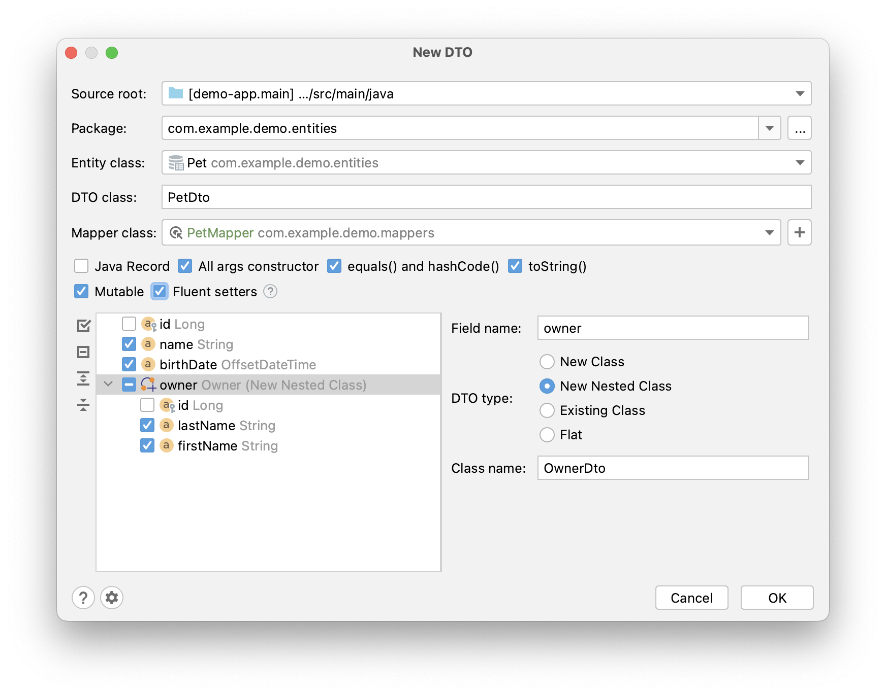
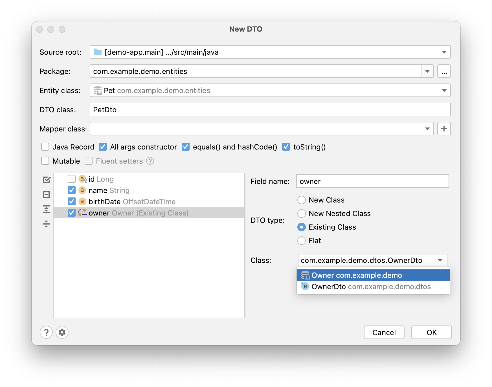
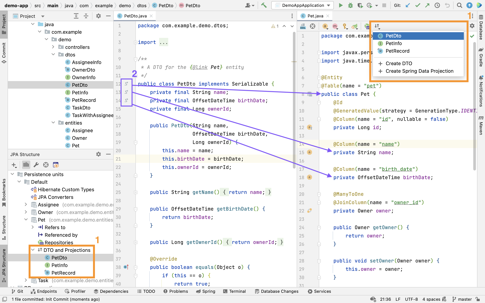

## Basics

DTO (data transfer object) is an object that carries data between processes. DTOs for JPA entities generally contain a subset of entity attributes. For example, if you need to expose only a few of the entity attributes via REST API, you can map entities to DTOs with those attributes and serialize only them. Basically, DTOs allow you to decouple presentation/business logic layer from the data access layer.

JPA Buddy offers DTO generation from JPA entities via visual designer:

<div class="youtube" align="center">
   <iframe width="560" height="315" src="https://www.youtube.com/embed/qpnM_k-TGFk" title="YouTube video player" frameborder="0" allow="accelerometer; autoplay; clipboard-write; encrypted-media; gyroscope; picture-in-picture" allowfullscreen></iframe>
 </div>

## Mutability

By default, JPA Buddy generates immutable DTOs – all the fields are final, and there are no setters for them. To generate DTOs with simple private fields, setters for them, and no-args constructor, check the **Mutable** box.
Also, for mutable DTOs, you can define whether to use fluent setters or not. Such setters will return `this` instead of `void`. It can be helpful if you want to chain multiple method calls.



## Inner DTOs for associations

Entities can reference other entities via associations, and JPA Buddy allows you to generate DTOs for the referenced entities from the same window. Just check the referenced entity in the tree, choose the DTO type and pick the required fields.



Let’s look at the available DTO types:

* New Class – a new class will be created in a separate file.
* New Nested Class – a new public static nested class will be created.
* Existing Class – you can select a DTO class that already exists in the project.
* Flat – all inner class fields will be top-class fields. Their names will consist of the inner class name + fields names.

## Java Records Support

If you use SDK version 16 and higher in your project, then JPA Buddy will provide an additional "Java Record" checkbox in the "New DTO" wizard. To check the SDK version of the project, open File -> Project Structure...


<div class="youtube" align="center">
<iframe width="560" height="315" src="https://www.youtube.com/embed/_MtJO4QKr0A" title="YouTube video player" frameborder="0" allow="accelerometer; autoplay; clipboard-write; encrypted-media; gyroscope; picture-in-picture" allowfullscreen></iframe>
 </div>

## Generate Entities from POJOs

JPA Buddy provides **Entity from POJO** action that helps to generate a JPA entity from any java/kotlin class. This feature may be helpful if you develop your application following the API-first approach: define DTOs for the API first and implement the data model later.

//video with voiceover about swagget codegen will be there

The most remarkable thing about JPA Buddy is that it even detects the relationship's cardinality and allows to generate related entities or select existing ones:


## MapStruct Mappers

[MapStruct](https://mapstruct.org/) is a code generator that greatly simplifies the implementation of mappings. The "Mapper class" field appears in the "New DTO" window if your project contains the corresponding dependency. You can select an existing Mapper or create a new one.

<div class="youtube" align="center">
   <iframe width="560" height="315" src="https://www.youtube.com/embed/MKQRRWqNLNk" title="YouTube video player" frameborder="0" allow="accelerometer; autoplay; clipboard-write; encrypted-media; gyroscope; picture-in-picture" allowfullscreen></iframe>
 </div>

JPA Buddy analyzes MapStruct mappers and can define which DTO is associated with which entity. Thanks to this, you can see the DTOs in the corresponding section in the JPA Structure and navigate between entity and DTOs through gutter icons.

Also, JPA Buddy can help if you prefer to have a single big mapper interface with methods for all entities. In this case, use IntelliJ IDEA "Generate Menu" (Cmd+N/Alt+Insert) in the open mapper class and create methods for any entity.

<div class="youtube" align="center">
   <iframe width="560" height="315" src="https://www.youtube.com/embed/XahPsC2TciE" title="YouTube video player" frameborder="0" allow="accelerometer; autoplay; clipboard-write; encrypted-media; gyroscope; picture-in-picture" allowfullscreen></iframe>
 </div>

## Refactor entity properties along with the related fields in DTOs

Often DTOs are used at the API controller level, aimed to declare only fields required by the client. That's why DTOs nearly copy the structure of their entities. There are popular frameworks to map entities to DTOs and vice versa: MapStruct and ModelMapper. They auto-map namesake properties. Hence, changing the property name in an entity often leads to the corrupted mapping logic. That's why JPA Buddy helps developers to refactor entity properties along with the related fields in DTOs:

<div class="youtube" align="center">
   <iframe width="560" height="315" src="https://www.youtube.com/embed/AY-lB-uKDDE" title="YouTube video player" frameborder="0" allow="accelerometer; autoplay; clipboard-write; encrypted-media; gyroscope; picture-in-picture" allowfullscreen></iframe>
 </div>

## DTO Declaration Settings


Each project may follow its own conventions for code writing. In the Tools -> JPA Buddy -> DTO Declaration you can configure:

- Serializable type.
- Class name postfix.
- Whether to use Lombok or not.
- Comment link regexp. It allows JPA Buddy to associate DTO with its JPA Entity. To specify a placeholder for the target entity FQN (Fully Qualified Name) in a comment use the `(?<entity>.*)` pattern. So, if the regexp is defined as `A DTO for the{@link (?.*)} entity.` it will be resolved in the following comment:

  ```java
  // A DTO for the {@link io.jpabuddy.demo.entities.Project} entity.
  ```

  The feature is disabled when the field is empty.
- Name pattern regexp. This option is useful if you use an obligatory naming convention for DTOs. It allows JPA Buddy to associate DTO with its JPA Entity using a DTO name only. To specify a placeholder for the simple class name of the target JPA entity, use the `(?<entity>.)` pattern. E.g., `(?.)Dto` means that the `MyEntityDto` class will be considered as a DTO for `MyEntity`. The feature is disabled when the field is empty.
- Class comment. Defines the comment that will be generated over the DTO class.

### Convinient Navigation between Entity and its DTOs

As soon as JPA Buddy is able to associate DTO class with the entity:

- The DTO class will appear in the **Dto & Projections** section in the JPA Structure panel and in the Editor Toolbar (1)
- The gutter icon will appear in the DTO to ease the navigation to its entity (2)


