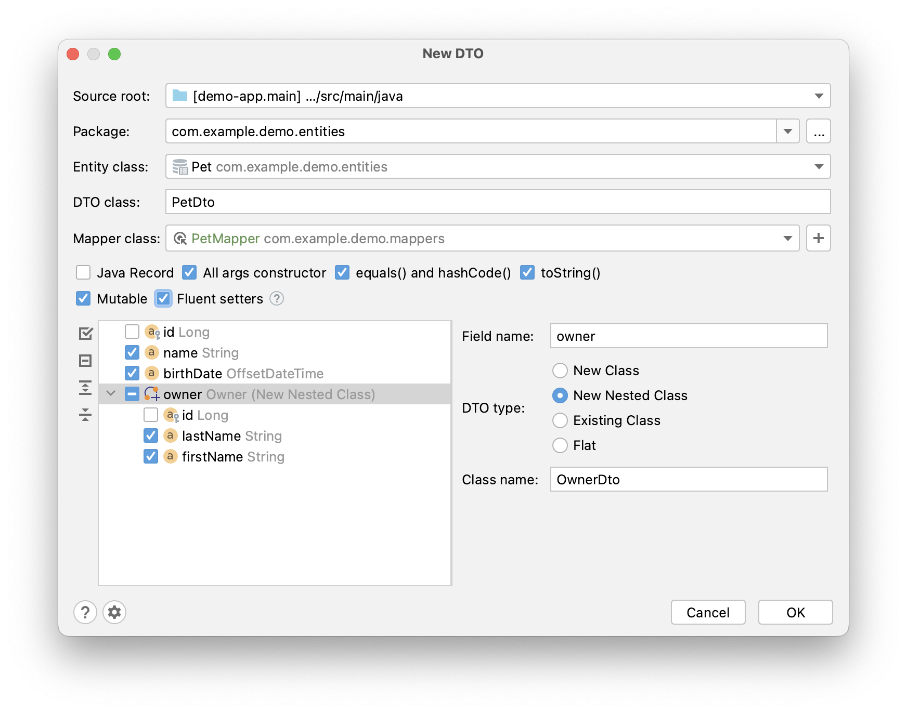
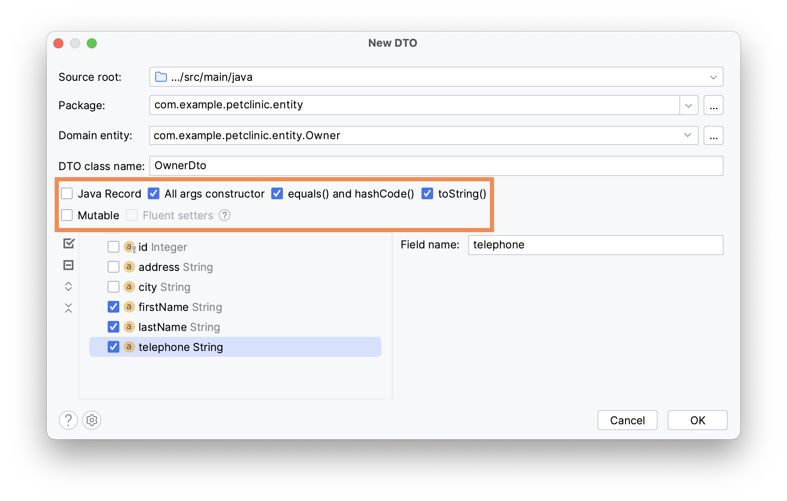
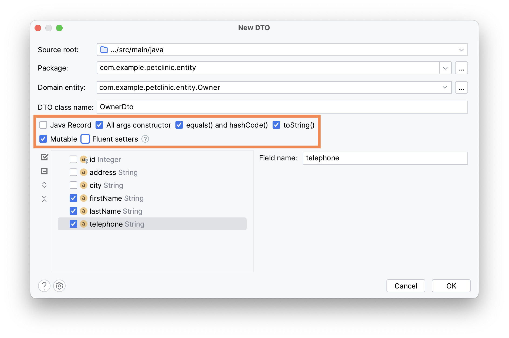
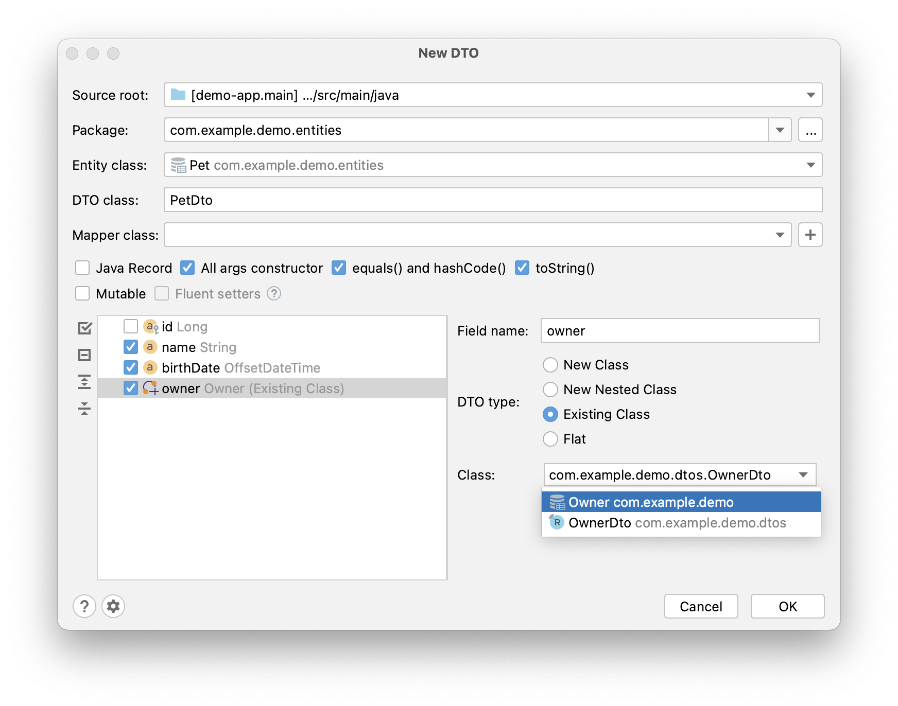
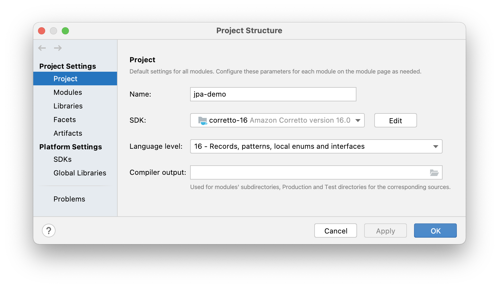
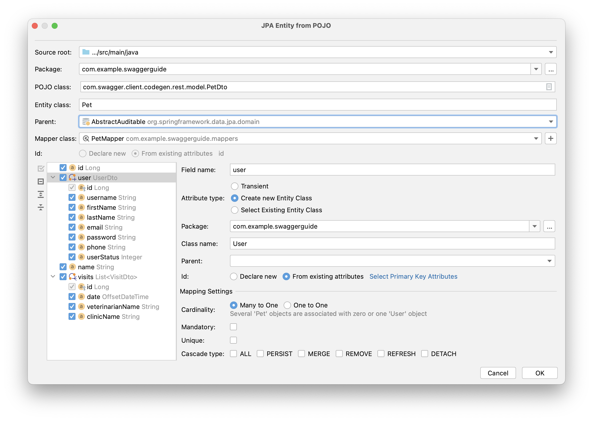
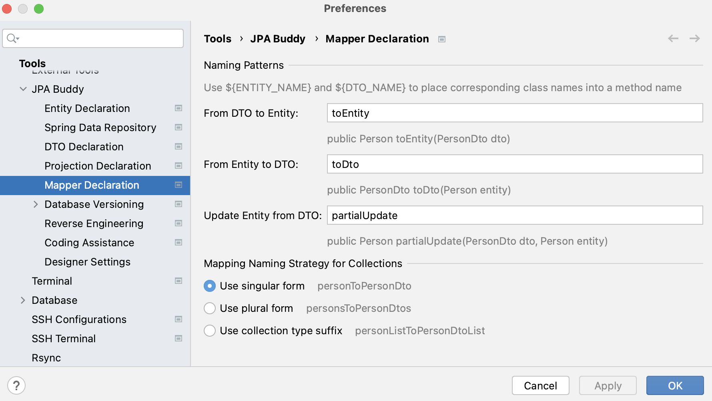
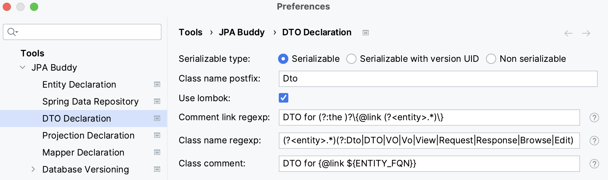
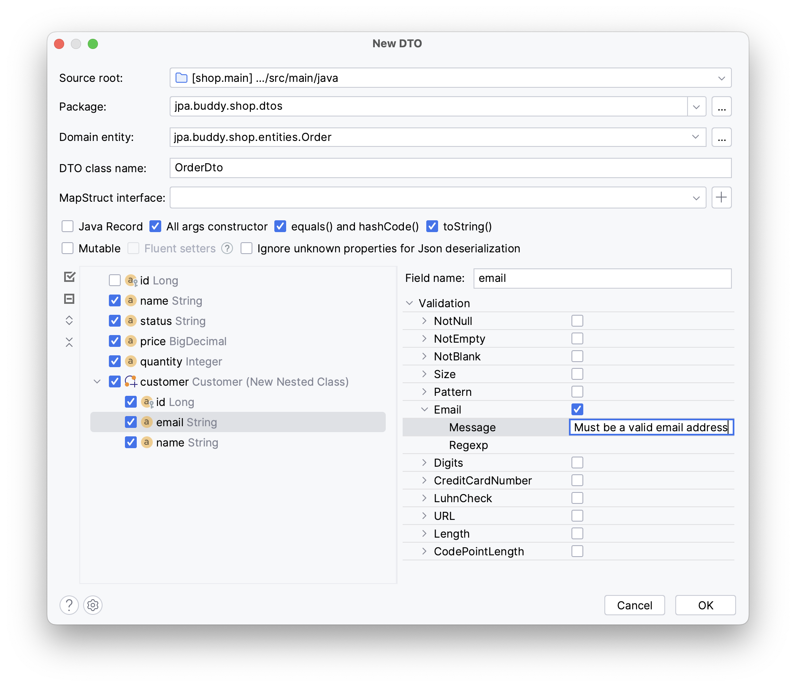
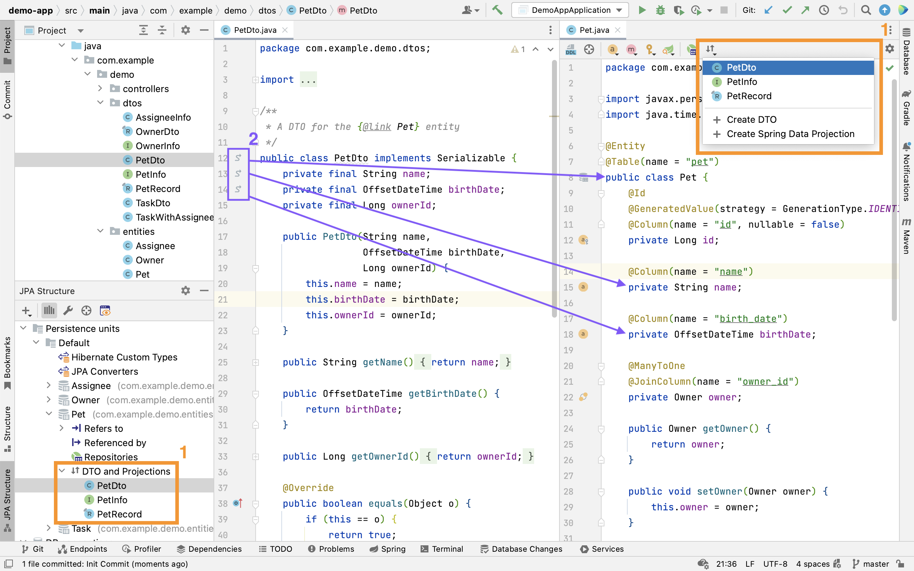

## Introduction

DTO (data transfer object) is an object that carries data between processes. DTOs for JPA entities generally contain a subset of entity attributes. For example, if you need to expose only a few of the entity attributes via REST API, you can map entities to DTOs with those attributes and serialize only them. Basically, DTOs allow you to decouple presentation/business logic layer from the data access layer.

JPA Buddy offers DTO generation from JPA entities via visual designer:

<div class="youtube">
   <iframe width="560" height="315" src="https://www.youtube.com/embed/qpnM_k-TGFk" title="YouTube video player" allow="accelerometer; autoplay; clipboard-write; encrypted-media; gyroscope; picture-in-picture" allowfullscreen></iframe>
 </div>

## Mutability

By default, JPA Buddy generates immutable DTOs – all the fields are final, and there are no setters for them. To generate DTOs with simple private fields, setters for them, and no-args constructor, check the **Mutable** box.
Also, for mutable DTOs, you can define whether to use fluent setters or not. Such setters will return `this` instead of `void`. It can be helpful if you want to chain multiple method calls.



## Lombok Support

JPA Buddy simplifies the generation of DTOs by providing Lombok support in the most optimal way.

For example, when you choose the `All args constructor`, `equals() and hashCode()` and `toString()` options in the DTO generator wizard, JPA Buddy applies `@Value` to the generated DTO, discarding the redundant access modifiers to keep your code clean.



```java
  @Value
  public class OwnerDto implements Serializable {
      String firstName;
      String lastName;
      String telephone;
  }
```

In case you need a [mutable DTO](https://jpa-buddy.com/documentation/dto-generator/#mutability) with the same parameters as in the example above, JPA Buddy will add `@Data`,`@AllArgsConstructor` and `@NoArgsConstructor` annotations instead.



```java
@Data
@AllArgsConstructor
@NoArgsConstructor
public class OwnerDto implements Serializable {
    private String firstName;
    private String lastName;
    private String telephone;
}
```

> To use this feature, make sure to add <a href="https://mvnrepository.com/artifact/org.projectlombok/lombok" target="_blank" rel="noopener noreferrer">Lombok dependencies</a> to your project and enable it in the [DTO Declaration Settings](https://jpa-buddy.com/documentation/dto-generator/#dto-declaration-settings).

## Inner DTOs for associations

Entities can reference other entities via associations, and JPA Buddy allows you to generate DTOs for the referenced entities from the same window. Just check the referenced entity in the tree, choose the DTO type and pick the required fields.



Let’s look at the available DTO types:

* New Class – a new class will be created in a separate file.
* New Nested Class – a new public static nested class will be created.
* Existing Class – you can select a DTO class that already exists in the project.
* Flat – all inner class fields will be top-class fields. The names of the generated entities will be formed by combining the inner class name with the field names.

## Java Records Support

If you use SDK version 16 and higher in your project, then JPA Buddy will provide an additional "Java Record" checkbox in the "New DTO" wizard. To check the SDK version of the project, open File -> Project Structure...



<div class="youtube">
<iframe width="560" height="315" src="https://www.youtube.com/embed/_MtJO4QKr0A" title="YouTube video player" allow="accelerometer; autoplay; clipboard-write; encrypted-media; gyroscope; picture-in-picture" allowfullscreen></iframe>
 </div>

## Generate Entities from POJOs

JPA Buddy provides an **Entity from POJO** action that helps to generate a JPA entity from any java/kotlin class. This feature may be helpful if you develop your application following the API-first approach: define DTOs for the API first and implement the data model later.

<div class="youtube">
<iframe width="560" height="315" src="https://www.youtube.com/embed/7tRD3u6u_bM" title="YouTube video player" allow="accelerometer; autoplay; clipboard-write; encrypted-media; gyroscope; picture-in-picture" allowfullscreen></iframe>
</div>

JPA Buddy's notable feature is its ability to detect the relationship's cardinality and generate related entities or select existing ones:



## Generate DTOs from any Java/Kotlin classes

Nowadays, the DTO pattern is widely used in software development. It is not only used with JPA entities, but also with regular POJO classes. With JPA Buddy, you are not restricted to using DTOs with just JPA entities. You can create DTOs from any Java or Kotlin class, which gives you more flexibility and control over your code. For example, check out how easy you can use JPA Buddy with MongoDB documents:

<div class="youtube">
<iframe width="560" height="315" src="https://www.youtube.com/embed/OrvtVvQ0eJE" title="YouTube video player" allow="accelerometer; autoplay; clipboard-write; encrypted-media; gyroscope; picture-in-picture" allowfullscreen></iframe>
</div>

## MapStruct Support

<a href="https://mapstruct.org/" target="_blank">MapStruct</a> is a code generator that greatly simplifies the implementation of mappings. The "Mapper class" field appears in the "New DTO" window if your project contains the corresponding dependency. You can select an existing Mapper or create a new one.

<div class="youtube">
   <iframe width="560" height="315" src="https://www.youtube.com/embed/MKQRRWqNLNk" title="YouTube video player" allow="accelerometer; autoplay; clipboard-write; encrypted-media; gyroscope; picture-in-picture" allowfullscreen></iframe>
 </div>

JPA Buddy analyzes MapStruct mappers and can define which DTO is associated with which entity. Thanks to this, you can see the DTOs in the corresponding section in the JPA Structure and navigate between entity and DTOs through gutter icons.

### Mapping Methods

Also, JPA Buddy can help if you prefer to have a single big mapper interface with methods for all entities. In this case, use IntelliJ IDEA "Generate Menu" (Cmd+N/Alt+Insert) in the open mapper class and create methods for any entity.

<div class="youtube">
   <iframe width="560" height="315" src="https://www.youtube.com/embed/XahPsC2TciE" title="YouTube video player" allow="accelerometer; autoplay; clipboard-write; encrypted-media; gyroscope; picture-in-picture" allowfullscreen></iframe>
 </div>

### Generic Mappers Inheritance

MapStruct allows to declare generic mappers:

```java
public interface EntityMapper<D, E> {
    E toEntity(D dto);

    D toDto(E entity);

    List<E> toEntity(List<D> dtoList);

    List<D> toDto(List<E> entityList);
}
```

Such a mapper is convenient to use as a parent for all other mappers and keep them concise and clean:

```java
@Mapper(componentModel = "spring")
public interface UserMapper extends EntityMapper<UserDTO, User> {}
```

Still, complex mapping logic can be easily added if required:

````java
@Mapper(unmappedTargetPolicy = ReportingPolicy.IGNORE, componentModel = "spring")
public interface ProjectMapper extends EntityMapper<ProjectDTO, Project> {
    @AfterMapping
    default void linkTasks(@MappingTarget Project project) {
        project.getTasks().forEach(task -> task.setProject(project));
    }
}
````

JPA Buddy supports generic mappers' inheritance:

<div class="youtube">
   <iframe width="560" height="315" src="https://www.youtube.com/embed/ZcY-dDWqihg" title="YouTube video player" allow="accelerometer; autoplay; clipboard-write; encrypted-media; gyroscope; picture-in-picture" allowfullscreen></iframe>
 </div>

### Mapper Declaration

JPA Buddy provides flexible settings for mapper declaration. To configure naming patterns or mapping naming strategy for collections, open Tools -> JPA Buddy -> Mapper Declaration:
 


## ModelMapper Support

<a href="https://modelmapper.org/" target="_blank">ModelMapper</a> is one of the most popular libraries for converting entities to DTOs and vice versa. JPA Buddy provides many features that streamline the mapping process even further, including:
1. Generating custom mapping methods.
2. Providing code scaffolding for mapping a single entity or a collection of entities to DTOs and vice versa, with the help of postfix autocompletion.
3. Enabling on-the-fly injection of the ModelMapper bean into the relevant class.

<div class="youtube">
   <iframe width="560" height="315" src="https://www.youtube.com/embed/oKQEhXwbms4" title="YouTube video player" allow="accelerometer; autoplay; clipboard-write; encrypted-media; gyroscope; picture-in-picture" allowfullscreen></iframe>
 </div>

<div class="note">
JPA Buddy assumes that you have declared the ModelMapper bean in your project.
</div>

## Keep DTOs in sync with its JPA entity

### Refactor attributes

DTOs are commonly used at the API controller level to define only the fields required by the client. That's why DTOs nearly copy the structure of their entities. There are popular frameworks to map entities to DTOs and vice versa: MapStruct and ModelMapper. They auto-map namesake properties. However, changing the property name in an entity often leads to a corrupted mapping logic. JPA Buddy helps developers refactor entity properties along with their related fields in DTOs:

<div class="youtube">
   <iframe width="560" height="315" src="https://www.youtube.com/embed/AY-lB-uKDDE" title="YouTube video player" allow="accelerometer; autoplay; clipboard-write; encrypted-media; gyroscope; picture-in-picture" allowfullscreen></iframe>
 </div>

### Add attributes

If you happen to add a new attribute to an entity, the corresponding DTOs may also need to be updated with this new field. JPA Buddy enables you to add a new field to all the required DTOs at once. 
Moreover, if you prefer typing the code manually instead of using wizards, JPA Buddy can help you with that too! Just start typing the name of the field that is not in your DTO, and it will be correctly added to the class. The best part is that it even works with associations!

<div class="youtube">
   <iframe width="560" height="315" src="https://www.youtube.com/embed/L2TgkXj2Dqs" title="YouTube video player" allow="accelerometer; autoplay; clipboard-write; encrypted-media; gyroscope; picture-in-picture" allowfullscreen></iframe>
 </div>

## DTO Declaration Settings



Each project may follow its own conventions for code writing. In the Tools -> JPA Buddy -> DTO Declaration you can configure:

1. Serializable type.
2. Class name postfix.
3. Whether to use Lombok or not.
4. Comment link regexp (The feature is disabled when the field is empty). It allows JPA Buddy to associate a DTO with its JPA Entity. To specify a placeholder for the target entity FQN (Fully Qualified Name) in a comment use the `(?<entity>.*)` pattern. So, if the regexp is defined as `DTO for (?:the )?\{@link (?<entity>.*)\}` it will be resolved in the following comment:
    ```java
    //DTO for the {@link io.jpabuddy.demo.entities.Project} entity
    ```
5. Class name regexp. This option is useful if you follow an obligatory naming convention for DTOs. It allows JPA Buddy to associate a DTO with its JPA Entity using a DTO name only. You can specify a placeholder for the simple class name of the target JPA entity using the `(?<entity>.)` pattern. E.g., `(?.)Dto` means that the `MyEntityDto` class will be considered as a DTO for `MyEntity`. This feature is disabled when the field is empty. 
6. Class comment. Defines the comment that will be generated over the DTO class.

### Validation Rules

JPA Buddy offers seamless configuration of bean validation constraints for DTO fields within its dedicated DTO generation wizard. In addition to defining validations from scratch, you can automatically transfer the validations from the corresponding entities and manage them in the same wizard.



With the flexibility to enable or disable each constraint and customize validation messages, this comprehensive feature allows you to conveniently manage a full range of bean validation constraints for your DTO fields, ensuring consistency and reusability across your application.

> To enable the validations list, it is necessary to include either the <a href="https://mvnrepository.com/artifact/org.hibernate.validator/hibernate-validator" target="_blank" rel="noopener noreferrer">Hibernate Validator</a> or <a href="https://mvnrepository.com/artifact/org.springframework.boot/spring-boot-starter-validation" target="_blank" rel="noopener noreferrer">Spring Boot Starter Validation</a> dependency.

### Convenient Navigation between Entity and its DTOs

Once JPA Buddy associates a DTO class with its corresponding entity:

* The DTO class will appear in the **Dto & Projections** section in the JPA Structure tab and in the Editor Toolbar (1)
* A gutter icon will appear in the DTO class, providing a convenient way to navigate to its associated entity (2)


