## Introduction

Once you [install JPA Buddy](https://www.jpa-buddy.com/documentation/), you will find three additional tool windows: JPA Structure, JPA Palette and JPA Inspector. 

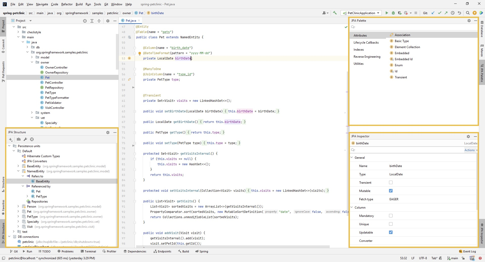 

## Entity Creation

To create a new Entity, right-click on the desired folder and select New -> JPA -> Entity. Also, you can create a new entity from JPA Structure panel:


After that, the following window will appear:

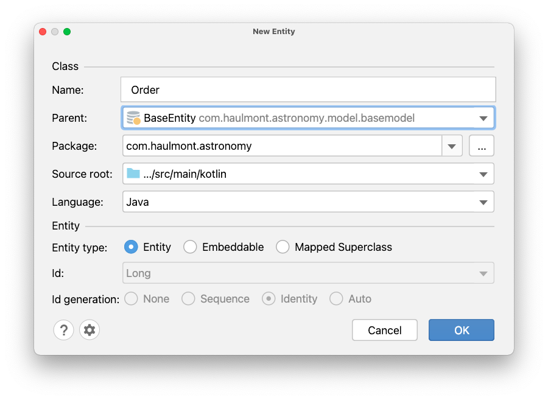


### Languages Support

JPA Buddy supports both [Java](https://www.java.com/) and [Kotlin](https://kotlinlang.org/). When JPA Buddy detects the [Kotlin dependency](https://kotlinlang.org/docs/maven.html) in your project, an additional option appears in the “New Entity” window, letting you pick the language:

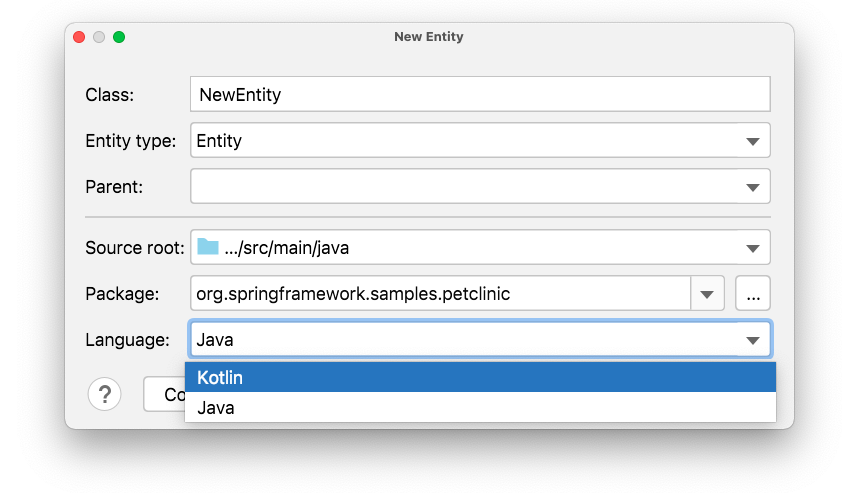

Also, in the Settings -> JPA Buddy -> Entity Declaration, you can choose which language will be selected by default for New Entity window:

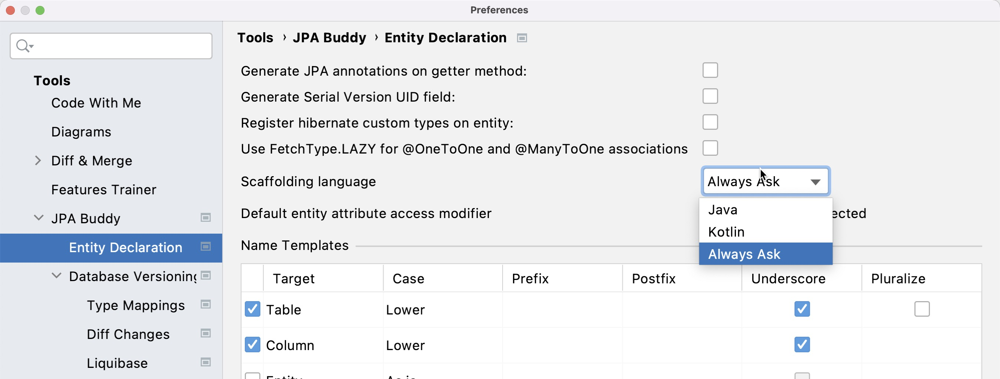

### Id and Generation Strategy

The most important attribute of any entity is ID. JPA Buddy allows you to choose the type (1) and generation strategy (2). Also, you can specify what sequence to use for the `Sequence` generation strategy (3).

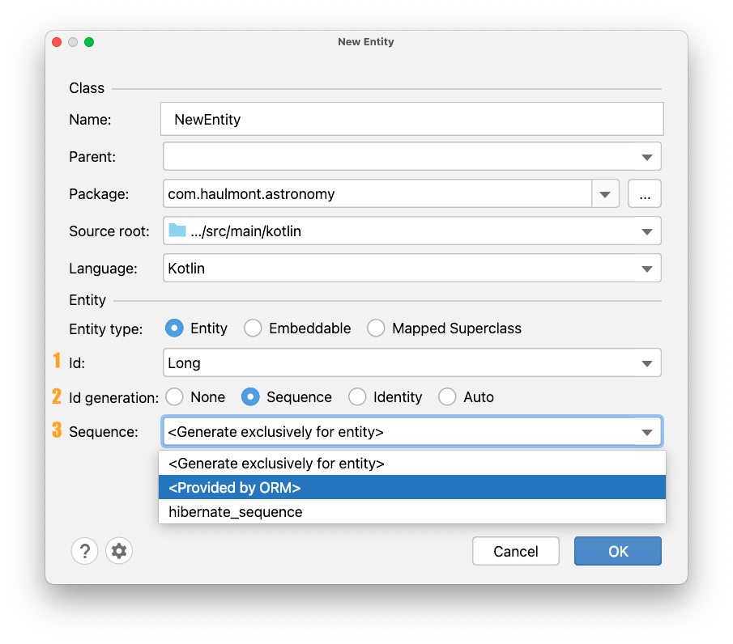

If you want to use an Embedded entity as an ID, JPA Buddy will provide you the list of  `@`Embeddable entities that exist in the project:

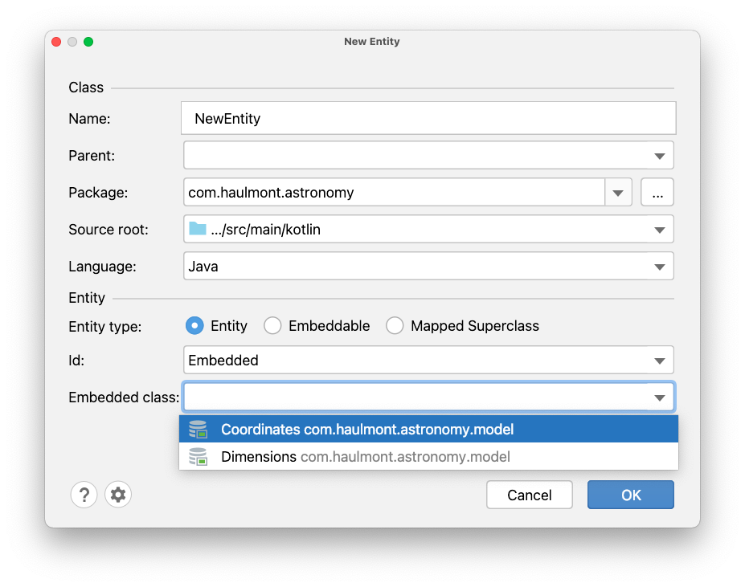]

Also, you can leave the Id field empty and complete the Id generation later. To do it, hover over the class name and click on the “Add Id attribute” button to generate it.

For AUTO and IDENTITY strategies, you can define type, name, column name, and mark the attribute as mandatory if required. In addition to configurations described in the previous sentence, you can set generator name, sequence name, initial value, and allocation size for SEQUENCE and TABLE strategies.

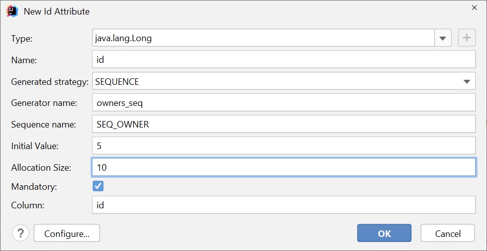

```java
@Id
@GeneratedValue(strategy=GenerationType.SEQUENCE,generator = "owners_seq")
@SequenceGenerator(name = "owners_seq",sequenceName = "SEQ_OWNER", initialValue = 5, allocationSize = 10)
@Column(name = "id", nullable = false)
private Long id;
```

## JPA Structure

JPA Structure panel is always available on the bottom-left side. It provides a comprehensive data-centric view on the project. You can use it for many different purposes:

1. Traverse through the data model. The entity structure is represented hierarchically. You can easily observe and navigate to entities referencing the current one and ones the current entity refers to. This is an extremely useful feature, especially for those who are just diving into an existing project with a large entity graph or for code reviewers, who often see parts of the data model for the first time and have limited time to understand how it is designed.
2. Create data-related objects: entities, JPA converters / Hibernate types, Spring Data repositories and Liquibase changelog.
3. Observe related Spring Data repositories for each entity.
4. Specify plugin-related settings such as DB connection, persistence units and others, which the plugin was not able to detect automatically.

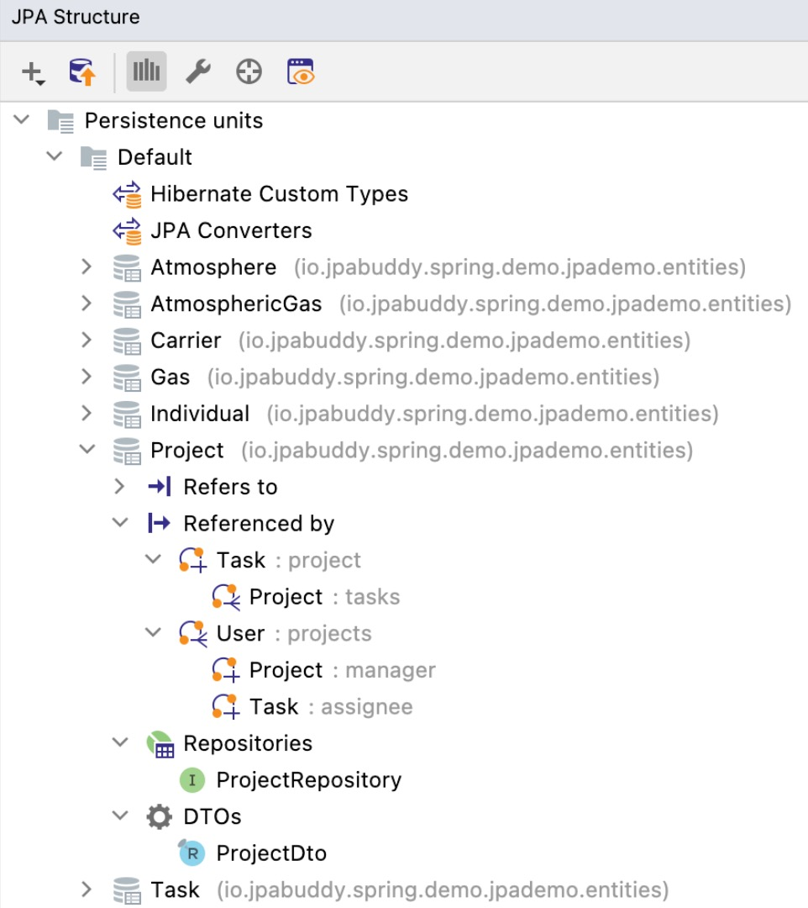

## JPA Palette and Inspector

Once the JPA entity is created, two panels appear at the right side of the window: JPA Palette and JPA Inspector. The content of these panels is context-depended. The idea of the JPA Palette is to generate attributes, indexes, queries, etc. Meanwhile, JPA Inspector is designed to edit existing attributes, indexes, queries, etc. 

### JPA Palette

JPA Palette provides a corresponding generation window for everything listed below. There is a difference between them according to the context, but they all have a similar design.

- Attributes

<div class="youtube" align="center">
<iframe width="560" height="315" src="https://www.youtube.com/embed/8A_ftrU_yYE" title="YouTube video player" frameborder="0" allow="accelerometer; autoplay; clipboard-write; encrypted-media; gyroscope; picture-in-picture" allowfullscreen></iframe>
</div>

- Lifecycle Callbacks

<div class="youtube" align="center">
<iframe width="560" height="315" src="https://www.youtube.com/embed/d77p30UXBzc" title="YouTube video player" frameborder="0" allow="accelerometer; autoplay; clipboard-write; encrypted-media; gyroscope; picture-in-picture" allowfullscreen></iframe>
</div>

- Indexes

<div class="youtube" align="center">
<iframe width="560" height="315" src="https://www.youtube.com/embed/9YVtxVeN9Yk" title="YouTube video player" frameborder="0" allow="accelerometer; autoplay; clipboard-write; encrypted-media; gyroscope; picture-in-picture" allowfullscreen></iframe>
</div>

- Named Query

<div class="youtube" align="center">
<iframe width="560" height="315" src="https://www.youtube.com/embed/iV6jTbzjgkE" title="YouTube video player" frameborder="0" allow="accelerometer; autoplay; clipboard-write; encrypted-media; gyroscope; picture-in-picture" allowfullscreen></iframe>
</div>


- Reverse Engineering

<div class="youtube" align="center">
<iframe width="560" height="315" src="https://www.youtube.com/embed/az9ghvGczys" title="YouTube video player" frameborder="0" allow="accelerometer; autoplay; clipboard-write; encrypted-media; gyroscope; picture-in-picture" allowfullscreen></iframe>
</div>

As you can see in the video, via JPA Palette, you can only generate attributes for the entity. But JPA Buddy provides more features for this. You can learn more in [Reverse Engineering](https://www.jpa-buddy.com/documentation/reverse-engineering/) documentation.

- Utilities (Equals/HashCode/ToString) - JPA Buddy follows best practices for Equals/HashCode/ToString generated implementations. Learn more about this topic in articles by [Thorben Janssen](https://thorben-janssen.com/ultimate-guide-to-implementing-equals-and-hashcode-with-hibernate/).

<div class="youtube" align="center"> 
<iframe width="560" height="315" src="https://www.youtube.com/embed/jTdMIOfyx2Q" title="YouTube video player" frameborder="0" allow="accelerometer; autoplay; clipboard-write; encrypted-media; gyroscope; picture-in-picture" allowfullscreen></iframe>
</div>

#### Associations Performance Tips

Hibernate comes with many relationships mapping types, but not all of them are equal in terms of efficiency. 

During associations creation, JPA Buddy provides short explanation in “Learn more” button, why the current configuration is not efficient and may cause performance issues:

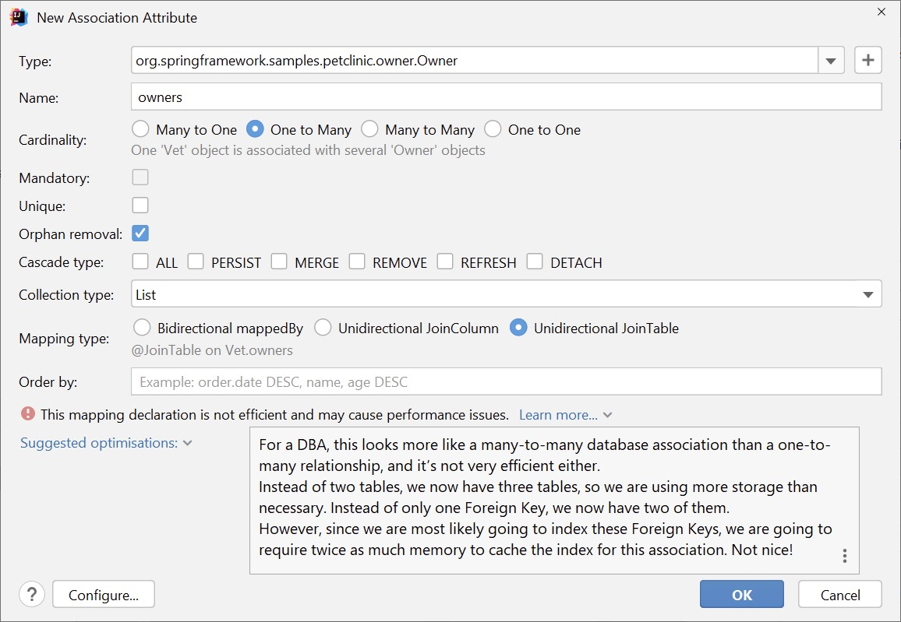

Also, there is a drop-down list with possible optimizations that you can apply in one click:

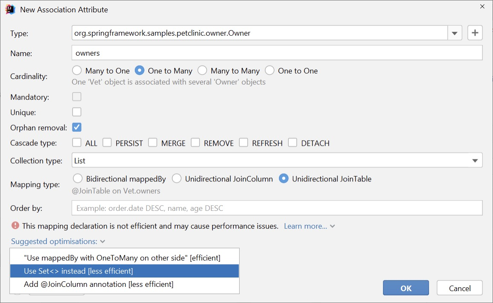


<div class="youtube" align="center">
<iframe width="560" height="315" src="https://www.youtube.com/embed/QLQi02WzItw" title="YouTube video player" frameborder="0" allow="accelerometer; autoplay; clipboard-write; encrypted-media; gyroscope; picture-in-picture" allowfullscreen></iframe>
</div>

### JPA Inspector 

JPA Inspector allows you to configure classes and fields in it. Click on any element that you need to configure, and change the required properties:

<div class="youtube" align="center">
<iframe width="560" height="315" src="https://www.youtube.com/embed/SwnxWJMVin0" title="YouTube video player" frameborder="0" allow="accelerometer; autoplay; clipboard-write; encrypted-media; gyroscope; picture-in-picture" allowfullscreen></iframe>
</div>

### Hibernate Validations

For projects with Hibernate Validations, a section appears with validations that you can apply for the selected attribute:

<div class="youtube" align="center">
<iframe width="560" height="315" src="https://www.youtube.com/embed/yIOcQ_bGxBc" title="YouTube video player" frameborder="0" allow="accelerometer; autoplay; clipboard-write; encrypted-media; gyroscope; picture-in-picture" allowfullscreen></iframe>
</div>

## Lombok

### Inspections

[Lombok](https://projectlombok.org/) is a great tool that makes your Java code concise and clean. But there are a few things to consider when using Lombok with JPA, and to follow them easily, JPA Buddy provides corresponding inspections:

- Avoid using `@`EqualsAndHashCode and `@`Data with JPA entities. Entities are immutable by their nature, so implementing equals() and hashCode() for them is not a trivial task. The implementations provided by Lombok are not well suited for JPA entities and may cause issues with collections and accidental loading of lazy attributes.

<div class="youtube" align="center">
<iframe width="560" height="315" src="https://www.youtube.com/embed/E6qZXvz-Fs0" title="YouTube video player" frameborder="0" allow="accelerometer; autoplay; clipboard-write; encrypted-media; gyroscope; picture-in-picture" allowfullscreen></iframe>
</div>

- Always exclude lazy attributes when using `@`ToString - by default, `@`ToString includes all the object fields. Such an approach can have an unwanted side-effect for JPA entities: accidentally loading lazy attributes. This can easily harm the application performance or lead to a LazyInitializationException if it happens outside a transaction.

<div class="youtube" align="center">
<iframe width="560" height="315" src="https://www.youtube.com/embed/fUtRJBKskig" title="YouTube video player" frameborder="0" allow="accelerometer; autoplay; clipboard-write; encrypted-media; gyroscope; picture-in-picture" allowfullscreen></iframe>
</div>

- Don’t forget to add `@`NoArgsConstructor to entities with `@`Builder or `@`AllArgsConstructor – they introduce their own constructors, so the compiler doesn’t generate a default one. A no-argument constructor is required for all JPA entities according to the specification.

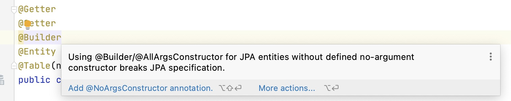

Check out our [article](https://www.jpa-buddy.com/blog/lombok-and-jpa-what-may-go-wrong/) to learn more about why it is so important to follow the rules above.

### Annotations

For the projects with Lombok in JPA Inspector appears section with possible annotations that you can add to the entity.

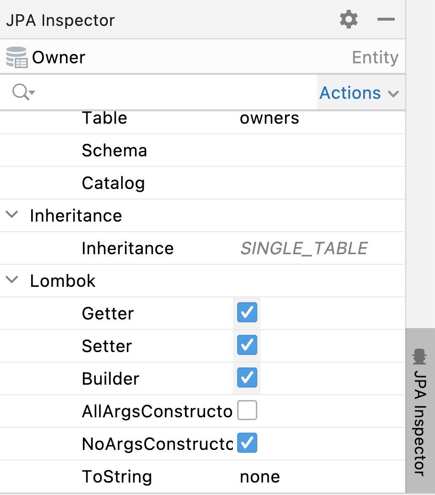

### Settings

JPA Buddy provides the possibility to generate new entities and attributes with Lombok annotations. To configure whether attributes you want to add at once with new entities and attributes, choose required at the bottom of the Entity Declaration window.

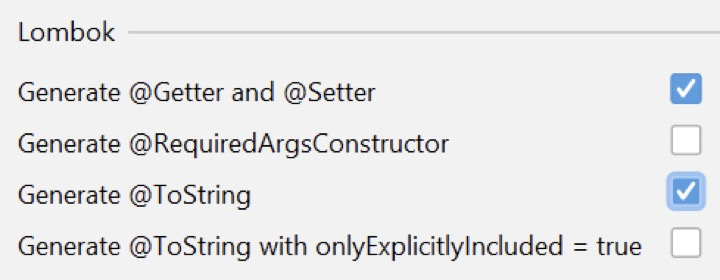

## Hibernate Types & JPA Converters

JPA Buddy helps you to generate blank for JPA Converter or a Hibernate Custom Type via JPA Inspector: 

<div class="youtube" align="center">
<iframe width="560" height="315" src="https://www.youtube.com/embed/taBDP5x9nLc" title="YouTube video player" frameborder="0" allow="accelerometer; autoplay; clipboard-write; encrypted-media; gyroscope; picture-in-picture" allowfullscreen></iframe>
</div>

Also, you can create via JPA Structure. Just click on the “Plus” button and choose JPA Converter or Hibernate Custom Type:

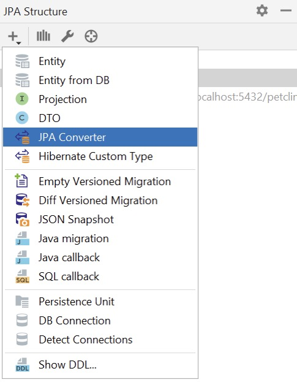

In the Create Custom Type window, you can configure the class name, entity attribute type and database column type. 

For JPA Converter you can define whether it will be auto applicable or not. 

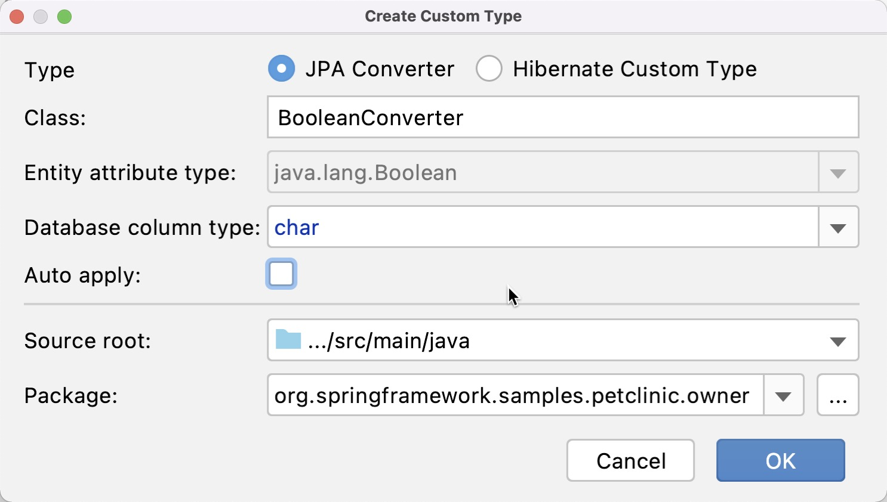

For Hibernate Custom Type you can set whether it will be possible to alter the behavior of types based on parameters or not. 

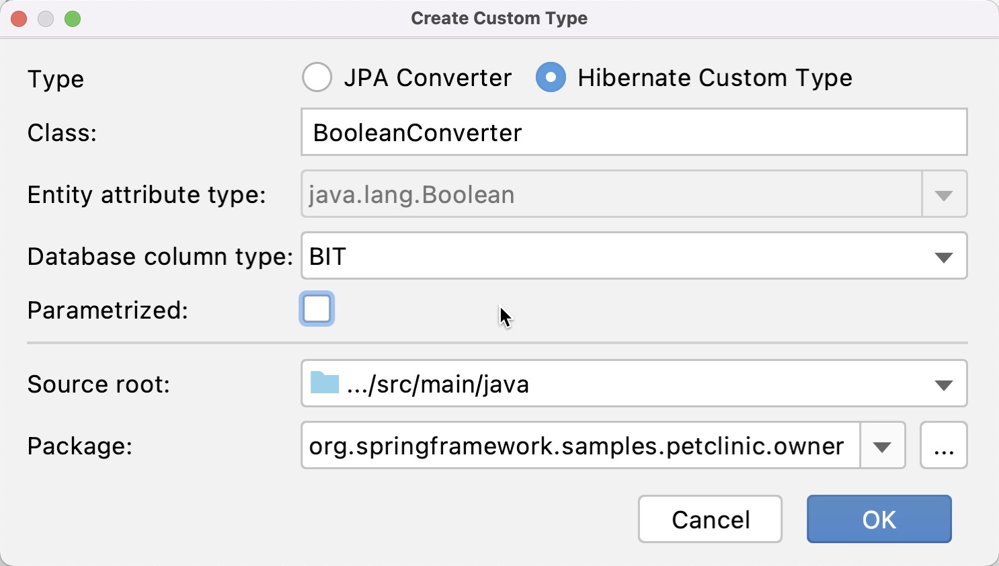

Here is the example of generated Hibernate Custom Type:

```java
public class BooleanConverter extends AbstractSingleColumnStandardBasicType<Boolean> {
    public BooleanConverter() {
        super(new CharTypeDescriptor(), new BooleanConverterDescriptor());
    }

    @Override
    public String getName() {
        return "BooleanConverter";
    }

    @Override
    public Object resolve(Object value,
                          SharedSessionContractImplementor session,
                          Object owner,
                          Boolean overridingEager) throws HibernateException {
        return null;
    }
}
```

## Inspections

JPA Buddy provides a lot of inspections that help during coding. By default, all inspections are enabled in all scopes and have warning severity. You can see full list of provided inspections and configure them in Settings -> Editor -> Inspections -> JPA Buddy.

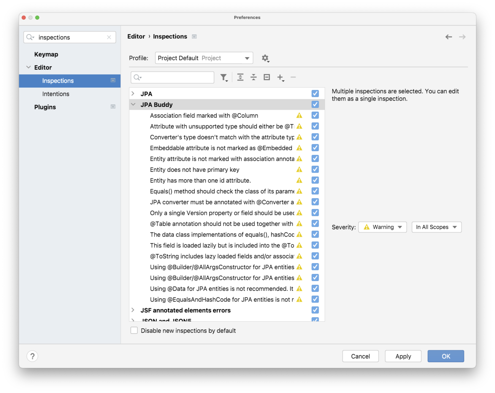

## Settings

### Naming Templates

Java code style may change from project to project. Also, working with external databases you have to follow naming conventions for tables, columns, etc., when mapping them to JPA entities. JPA Buddy offers you flexible configurations of naming templates, which are automatically applied to new entities and attributes.

<div class="youtube" align="center">
<iframe width="560" height="315" src="https://www.youtube.com/embed/npHuDl8pdmM" title="YouTube video player" frameborder="0" allow="accelerometer; autoplay; clipboard-write; encrypted-media; gyroscope; picture-in-picture" allowfullscreen></iframe>
</div>

<div class="note">The name that is specified is logical, and the appropriate physical naming strategy will be applied to it. Even if you have specified the name in a certain way, it may be saved to the database with a different one. Learn more about naming strategies in <a href="https://www.jpa-buddy.com/blog/hibernate-naming-strategies-jpa-specification-vs-springboot-opinionation/">our article</a>. JPA Buddy allows you to choose naming strategies for scripts generation in the <a href="https://www.jpa-buddy.com/documentation/database-versioning/#naming-strategy-and-max-identifier-settings">settings</a>.</div>

*By default, Spring Boot configures the physical naming strategy with SpringPhysicalNamingStrategy. This implementation provides the same table structure as Hibernate 4: all dots are replaced by underscores and camel casing is replaced by underscores as well. Additionally, by default, all table names are generated in lower case. For example, for both of the entity declarations below, the actual name of the DB table will be pet_type.*

```java
@Entity
public class PetType {
    // fields omitted
}
```

or

```java
@Entity
@Table(name = "PetType")
public class PetType {
    // fields omitted
}
```

### Constants Generation

One of the most important characteristics of a project is maintainability. JPA projects contain a lot of Strings containing things like JPQL or native query statements and references to attributes, queries, and bind parameter names. According to the best practices, one of the ways to rest your persistence layer well-structured is constants. You can learn about it in [Thorben Janssen](https://thorben-janssen.com/hibernate-best-practices-for-readable-and-maintainable-code/) article. 

<div class="youtube" align="center">
<iframe width="560" height="315" src="https://www.youtube.com/embed/xc-ayDDdjss" title="YouTube video player" frameborder="0" allow="accelerometer; autoplay; clipboard-write; encrypted-media; gyroscope; picture-in-picture" allowfullscreen></iframe>
</div>

JPA Buddy provides constants generation for the entity, table, and column names. You can also choose where you want to place constants.

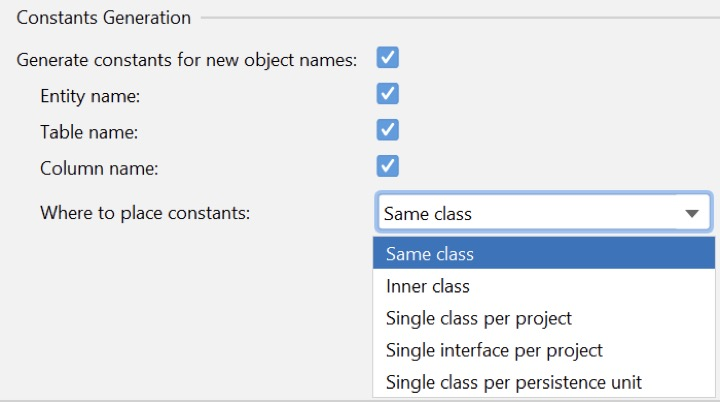

 

 
