## Introduction

Once you [install JPA Buddy](https://www.jpa-buddy.com/documentation/), you will find an editor toolbar (1) and additional tool windows (2,3).

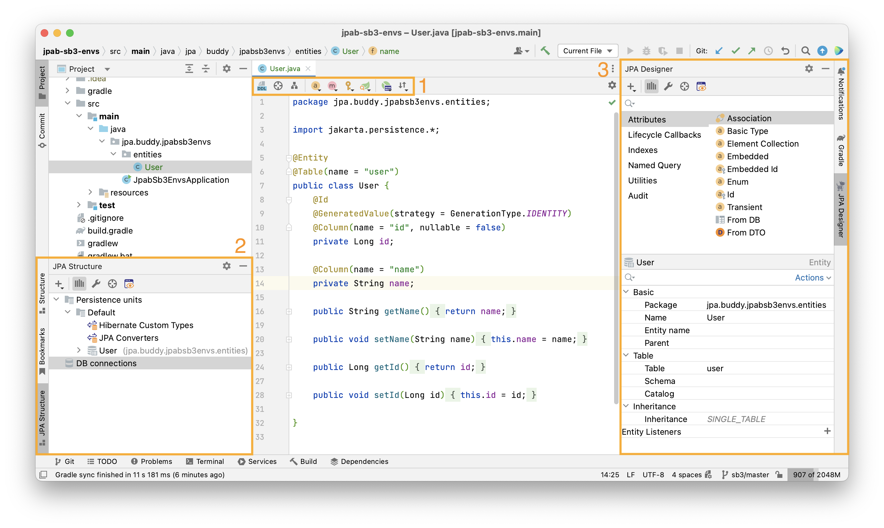

## JPA Buddy Tool Windows

JPA Buddy provides the following tool windows:

* [JPA Structure](#jpa-structure) (1) 
* [JPA Palette](#jpa-palette) (2)
* [JPA Inspector](#jpa-inspector) (3)

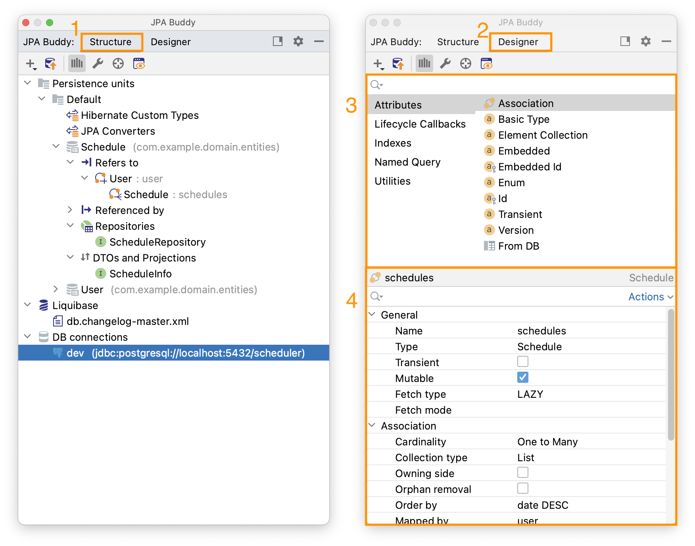

You can customize the appearance of the panel in the [designer settings](#designer-settings). You have the option to display it together with other panels, as separate panels, integrate it into the standard IntelliJ IDEA panels, or hide it altogether.

### JPA Structure

The JPA Structure tab offers a comprehensive, data-centric view of the project. You can use it for various purposes:

1. Traverse through the data model and observe the entity structure represented hierarchically. This feature allows for easy navigation to entities referencing the current one, as well as ones that the current entity refers to. This is an extremely useful feature, especially for those who are new to an existing project with a large entity graph or for code reviewers who have limited time to understand the data model design.
2. Create data-related objects: entities, JPA converters / Hibernate types, Spring Data repositories and Liquibase changelog.
3. Observe related Spring Data repositories, DTOs and projections for each entity.
4. Edit additional project artifacts such as DB connections, persistence units, and others that the plugin could not detect automatically.

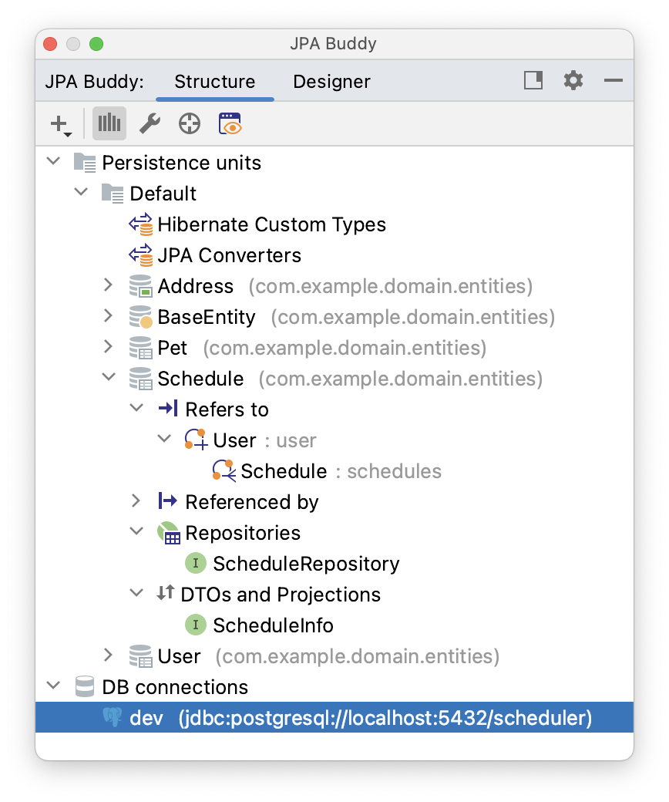

<div class="note">You can set up JPA Structure visibility in <a href="https://www.jpa-buddy.com/documentation/entity-designer/#designer-settings">visual designer settings</a>.</div>

### JPA Palette

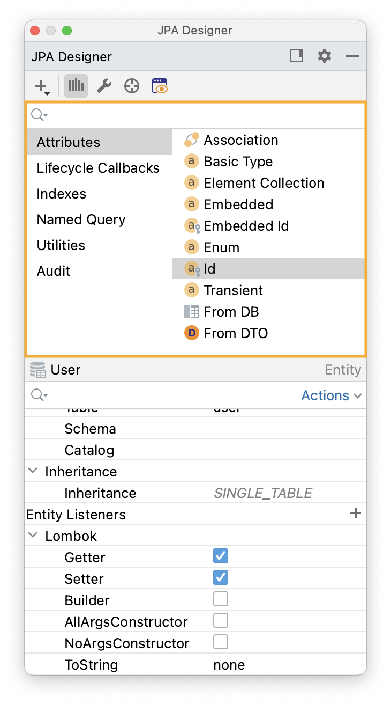

The JPA Palette aims to generate appropriate code for the current context. For an entity, it can be an attribute or index; for a repository - a query method, etc.

JPA Palette provides code-generation wizards for the following features:

- <a href="https://www.youtube.com/embed/8A_ftrU_yYE" target="_blank">Attributes</a>
- <a href="https://www.youtube.com/embed/d77p30UXBzc" target="_blank">Lifecycle Callbacks</a>
- <a href="https://www.youtube.com/embed/9YVtxVeN9Yk" target="_blank">Indexes</a>
- <a href="https://www.youtube.com/embed/iV6jTbzjgkE" target="_blank">Named Query</a>
- <a href="https://youtu.be/az9ghvGczys" target="_blank">Reverse Engineering</a>
- <a href="https://youtu.be/jTdMIOfyx2Q" target="_blank">Utilities – Equals/HashCode/ToString</a>

<div class="note">You can set up JPA Palette's visibility in <a href="https://www.jpa-buddy.com/documentation/entity-designer/#designer-settings">visual designer settings</a>.</div>

#### Associations Performance Tips

Hibernate has many relationship mapping types, but not all are equally efficient.

During association creation, JPA Buddy briefly explains why the current configuration is inefficient and may cause performance issues. Use the "Learn more" button to see it.

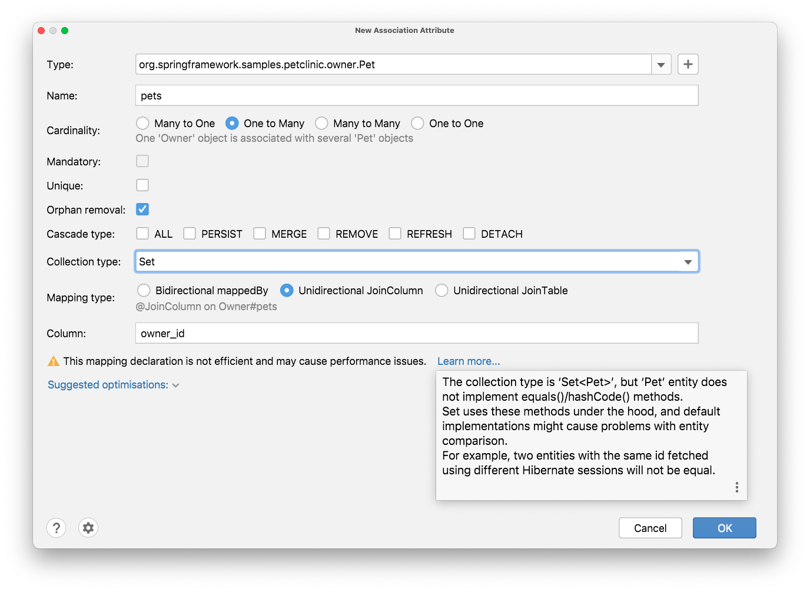

Also, you can apply optimizations suggested by JPA Buddy. Just select it from a drop-down list with possible options:

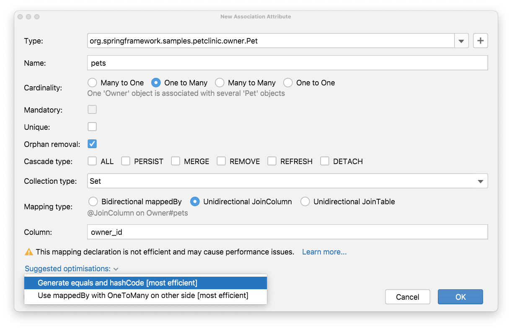

<div class="youtube">
<iframe width="560" height="315" src="https://www.youtube.com/embed/QLQi02WzItw" title="YouTube video player" allow="accelerometer; autoplay; clipboard-write; encrypted-media; gyroscope; picture-in-picture" allowfullscreen></iframe>
</div>

### JPA Inspector

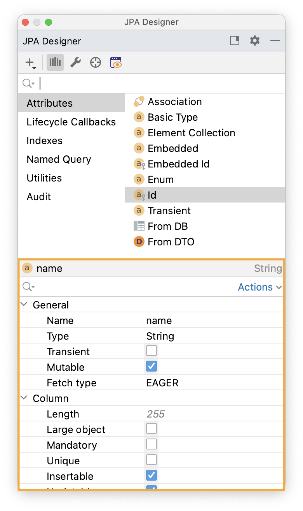

JPA Inspector is designed to edit existing code: attributes, indexes, queries, etc.

JPA Inspector allows you to configure JPA entities and attributes in it. Click on any element that you need to configure, and change the required properties:

<div class="youtube">
<iframe width="560" height="315" src="https://www.youtube.com/embed/SwnxWJMVin0" title="YouTube video player" allow="accelerometer; autoplay; clipboard-write; encrypted-media; gyroscope; picture-in-picture" allowfullscreen></iframe>
</div>

<div class="note">You can set up JPA Inspector visibility in <a href="https://www.jpa-buddy.com/documentation/entity-designer/#designer-settings">visual designer settings</a>.</div>

#### Hibernate Validations

For projects with Hibernate Validations, a section appears with validations that you can apply for the selected attribute:

<div class="youtube">
<iframe width="560" height="315" src="https://www.youtube.com/embed/yIOcQ_bGxBc" title="YouTube video player" allow="accelerometer; autoplay; clipboard-write; encrypted-media; gyroscope; picture-in-picture" allowfullscreen></iframe>
</div>

### Editor Toolbar

Editor Toolbar contains relevant actions depending on the file content. You can find it on top of the editor window.

<div class="youtube">
<iframe width="560" height="315" src="https://www.youtube.com/embed/psZWTxq73ws" title="YouTube video player" allow="accelerometer; autoplay; clipboard-write; encrypted-media; gyroscope; picture-in-picture" allowfullscreen></iframe>
</div>

<div class="note">You can set up Editor Toolbar visibility in <a href="https://www.jpa-buddy.com/documentation/entity-designer/#designer-settings">visual designer settings</a>.</div>

## Entity Generation

To create a new JPA entity, right-click on the desired folder and select New -> JPA Entity (1). Also, you can create a new entity from the JPA Structure (2) tab:

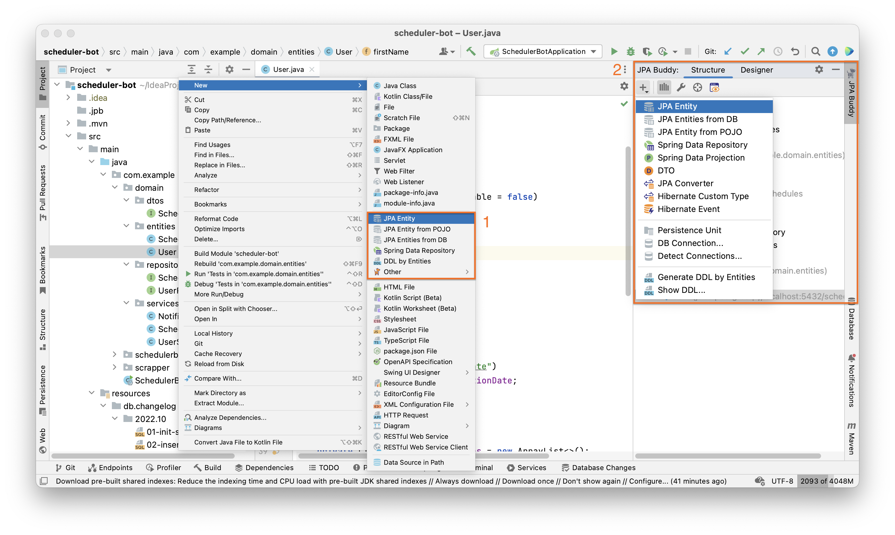

After that, the following window will appear:

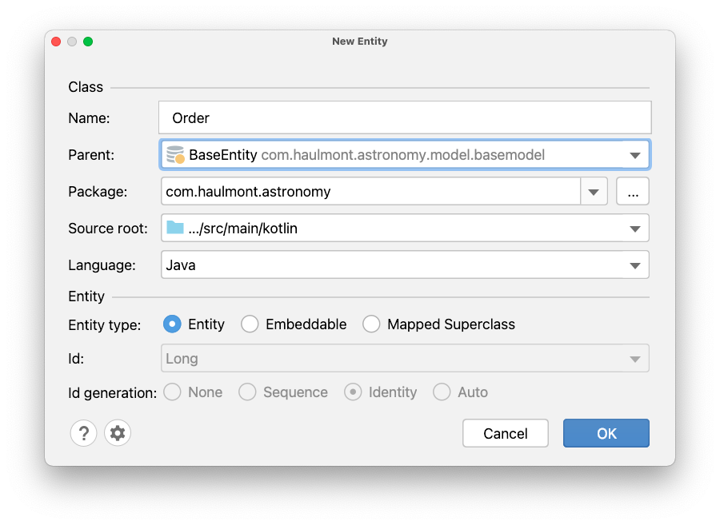

### Languages Support

JPA Buddy supports both <a href="https://www.java.com/" target="_blank">Java</a> and <a href="https://kotlinlang.org/" target="_blank">Kotlin</a>. When JPA Buddy detects the <a href="https://kotlinlang.org/docs/maven.html" target="_blank">Kotlin dependency</a> in your project, an additional option will appear in the "New Entity" window, letting you pick the language:

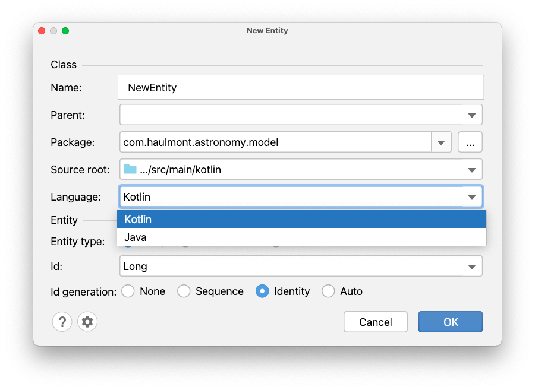

Also, in the Settings -> Tools -> JPA Buddy -> Entity Declaration, you can choose which language you want to select by default in the "New Entity" window:

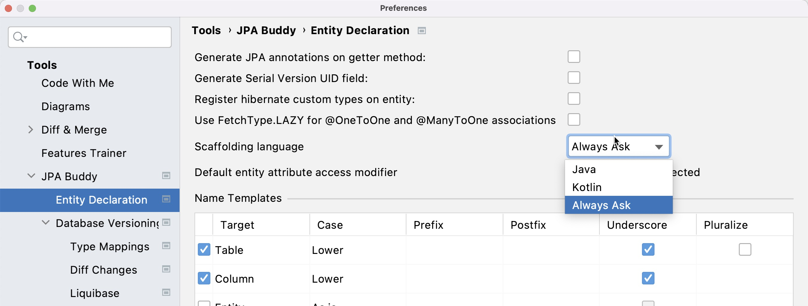

### ID and Its Generation Strategy

According to the JPA specification, an ID attribute is required for an entity definition. JPA Buddy allows you to generate this attribute and choose the type (1) and generation strategy (2). Also, you can specify what sequence to use for the `Sequence` generation strategy (3).

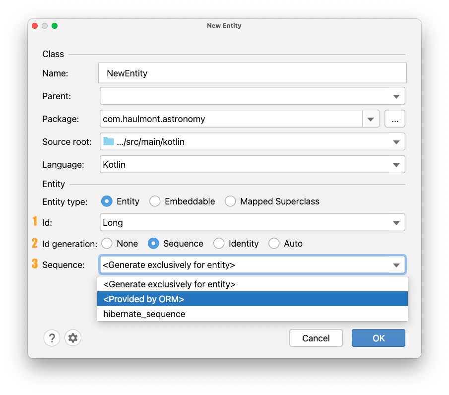

If you want to use an Embedded entity as an ID, JPA Buddy will provide you the list of  `@`Embeddable entities that exist in the project:

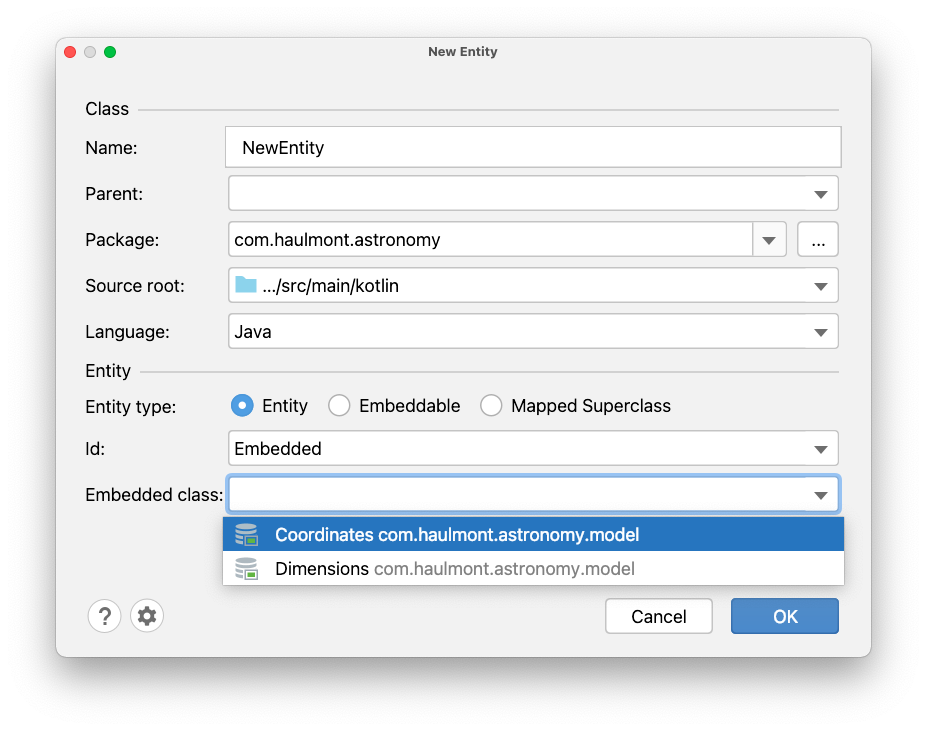

Also, you can generate an ID attribute via JPA Palette (1), Editor Toolbar (2) or use a quick-fix (Alt+Enter/⌥ ⏎) (3).

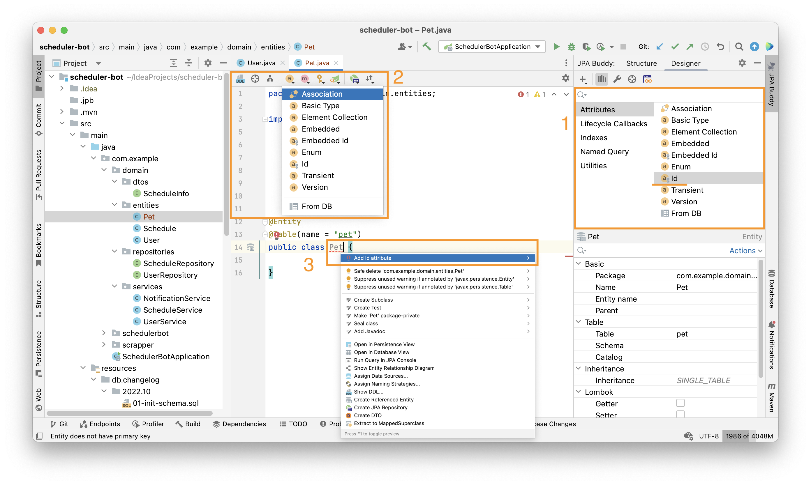

After that, a wizard with more comprehensive customization options will appear:

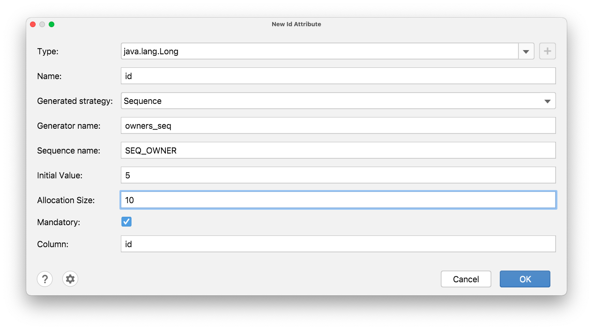

See the example of the generated ID below:

```java
@Id
@GeneratedValue(
    strategy=GenerationType.SEQUENCE,
    generator = "owners_seq"
)
@SequenceGenerator(
    name = "owners_seq",
    sequenceName = "SEQ_OWNER",
    initialValue = 5,
    allocationSize = 10
)
@Column(name = "id", nullable = false)
private Long id;
```

## Extract to MappedSuperclass

As your application grows and the JPA model evolves, you may realize that certain attributes are common among multiple entities and should be extracted to a `@MappedSuperclass` for better code organization. JPA Buddy can easily extract attributes along with JPA annotations to MappedSuperclass and build a well-designed entities' hierarchy.

<div class="youtube">
<iframe width="560" height="315" src="https://www.youtube.com/embed/BAmwdEbj8LQ" title="YouTube video player" allow="accelerometer; autoplay; clipboard-write; encrypted-media; gyroscope; picture-in-picture" allowfullscreen></iframe>
</div>

## Lombok

### Inspections

<a href="https://projectlombok.org/" target="_blank">Lombok</a> is a great tool that makes your Java code concise and clean. But there are a few things to consider when using Lombok with JPA. JPA Buddy helps you follow best practices when using Lombok in your JPA entities with a set of inspections:

**Avoid using `@`EqualsAndHashCode and `@`Data with JPA entities.** 

Entities are mutable by their nature, so implementing equals() and hashCode() for them is not a trivial task. The implementations provided by Lombok are not well suited for JPA entities and may cause issues with collections and accidental loading of lazy attributes.

<div class="youtube">
<iframe width="560" height="315" src="https://www.youtube.com/embed/E6qZXvz-Fs0" title="YouTube video player" allow="accelerometer; autoplay; clipboard-write; encrypted-media; gyroscope; picture-in-picture" allowfullscreen></iframe>
</div>

**Always exclude lazy attributes when using `@`ToString**

By default, `@`ToString includes all the object fields. Such an approach can have an unwanted side effect for JPA entities: accidentally loading lazy attributes. This can easily harm the application performance or lead to a LazyInitializationException if it happens outside a transaction.

<div class="youtube">
<iframe width="560" height="315" src="https://www.youtube.com/embed/fUtRJBKskig" title="YouTube video player" allow="accelerometer; autoplay; clipboard-write; encrypted-media; gyroscope; picture-in-picture" allowfullscreen></iframe>
</div>

**Don't forget to add `@`NoArgsConstructor to entities with `@`Builder or `@`AllArgsConstructor**

They introduce their own constructors, so the compiler doesn't generate a default one. A no-argument constructor is required for all JPA entities according to the specification.

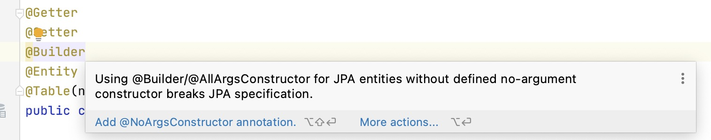

Check out our <a href="https://www.jpa-buddy.com/blog/lombok-and-jpa-what-may-go-wrong/" target="_blank">article</a> to learn more about why it is so important to follow the rules above.

### Annotations

For projects with Lombok, the JPA Inspector displays a section with possible annotations that you can add to the entity.

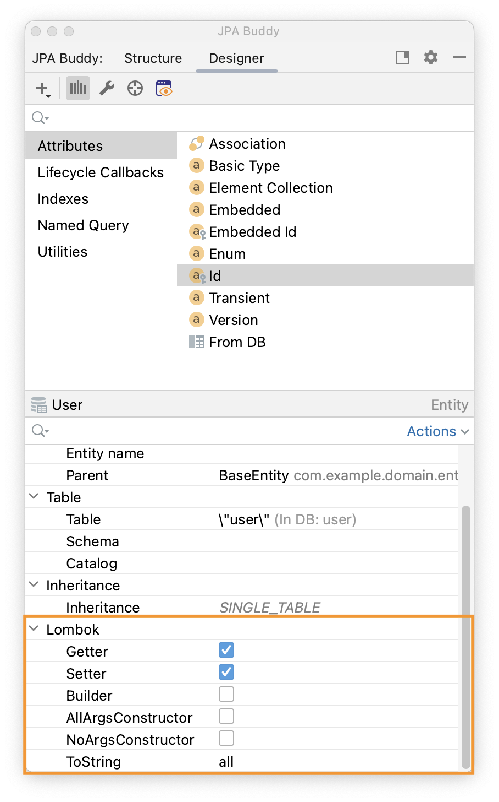

### Settings

JPA Buddy provides a possibility to generate new entities and attributes with Lombok annotations. To configure which attributes you want to add when creating new entities or attributes, you can select the desired options at the bottom of the Entity Declaration window.

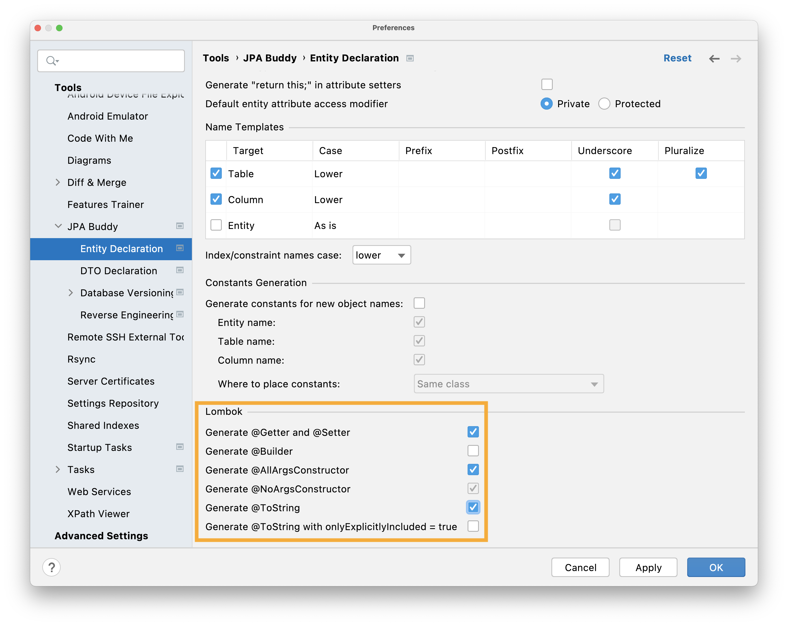

## Hibernate Types & JPA Converters

JPA Buddy helps you generate blanks for JPA Converter or a Hibernate Custom Type via JPA Inspector:

<div class="youtube">
<iframe width="560" height="315" src="https://www.youtube.com/embed/taBDP5x9nLc" title="YouTube video player" allow="accelerometer; autoplay; clipboard-write; encrypted-media; gyroscope; picture-in-picture" allowfullscreen></iframe>
</div>

Also, you can create it via JPA Structure. Just click on the "Plus" button and choose JPA Converter or Hibernate Custom Type:

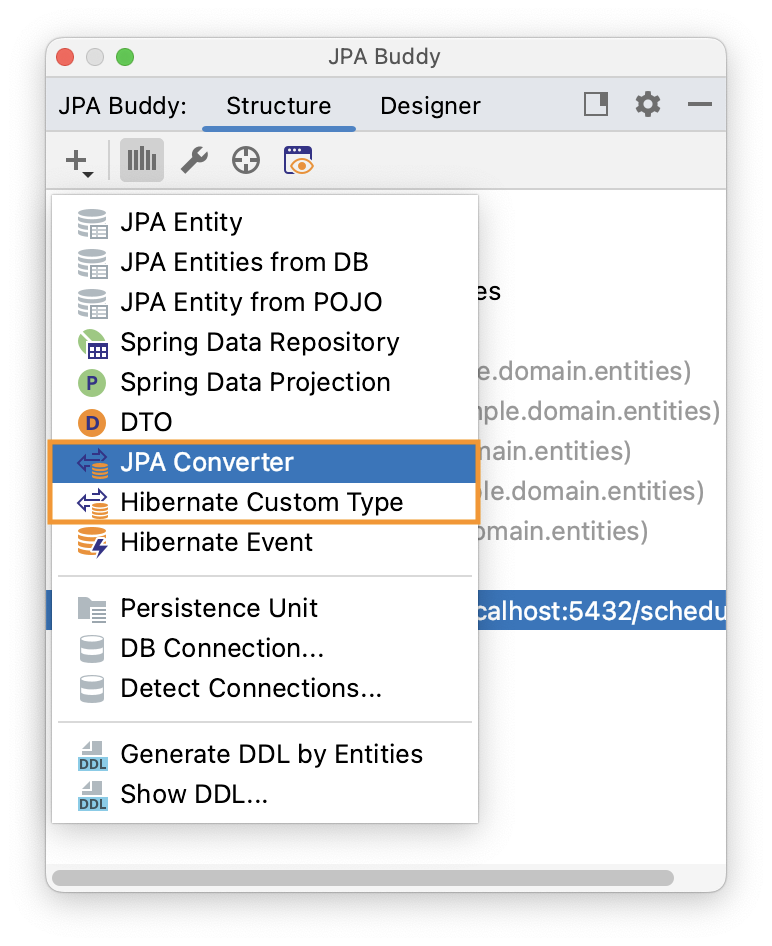

In the Create Custom Type window, you can configure the class name, entity attribute type and database column type.

For JPA Converter you can define whether it will be auto applicable or not.

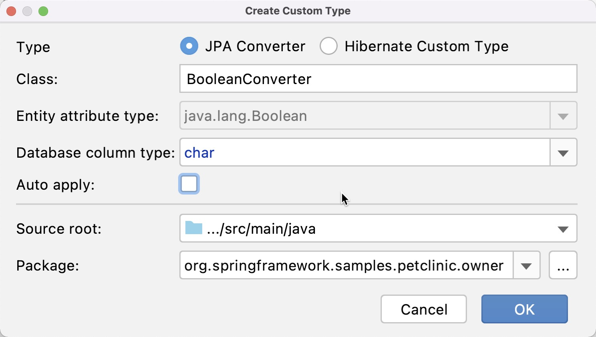

For Hibernate Custom Type you can set whether it will be possible to alter the behavior of types based on parameters or not.

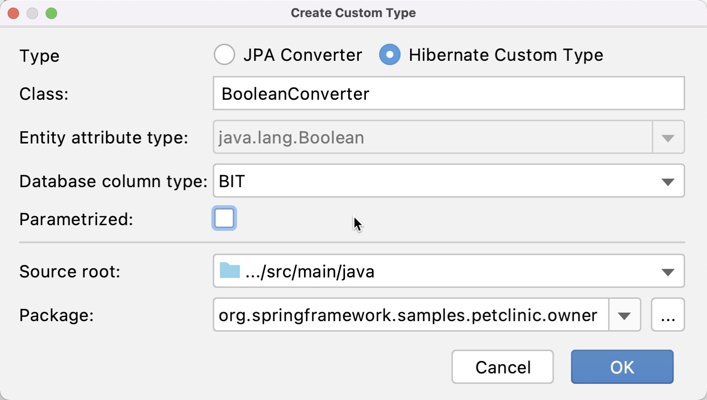

Here is an example of generated Hibernate Custom Type:

```java
public class BooleanConverter extends AbstractSingleColumnStandardBasicType<Boolean> {
    public BooleanConverter() {
        super(new CharTypeDescriptor(), new BooleanConverterDescriptor());
    }

    @Override
    public String getName() {
        return "BooleanConverter";
    }

    @Override
    public Object resolve(Object value,
                          SharedSessionContractImplementor session,
                          Object owner,
                          Boolean overridingEager) throws HibernateException {
        return null;
    }
}
```

## Hibernate Events

Hibernate Event System is a powerful tool that allows you to log or broadcast changes, perform additional checks before irreversible operations, hook business logic when data state gets changed, etc. For all these occasions, Hibernate provides Event Listeners and JPA Buddy helps to scaffold them in a few clicks:

<div class="youtube">
<iframe width="560" height="315" src="https://www.youtube.com/embed/TVa-T8aLgbA" title="YouTube video player" allow="accelerometer; autoplay; clipboard-write; encrypted-media; gyroscope; picture-in-picture" allowfullscreen></iframe>
</div>

## Inspections

JPA Buddy provides a lot of inspections that help during coding. By default, all inspections are enabled in all scopes and have warning severity. You can see full list of provided inspections and configure them in Settings -> Editor -> Inspections -> JPA Buddy.

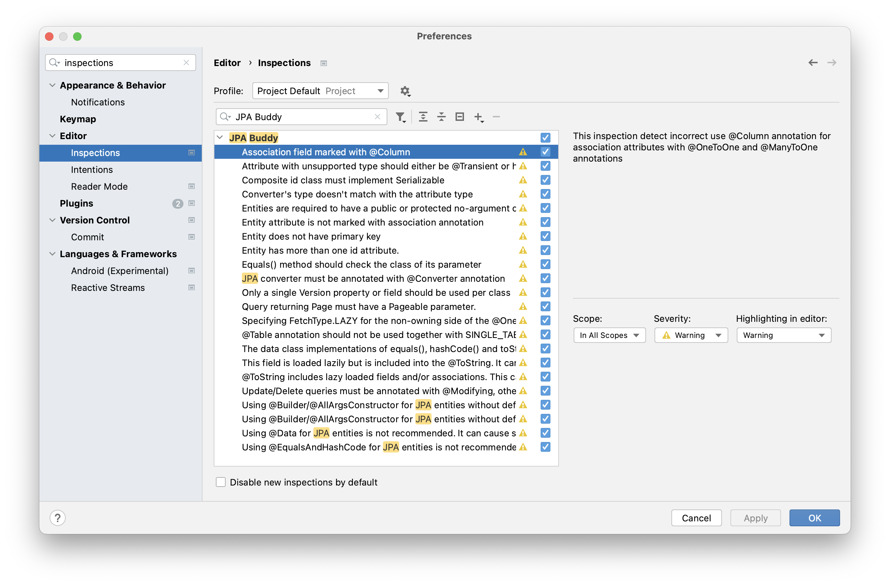

## Settings

### Naming Templates

Java code style may change from project to project. Also, working with external databases you have to follow naming conventions for tables, columns, etc., when mapping them to JPA entities. JPA Buddy offers you flexible configurations of naming templates, which are automatically applied to new entities and attributes.

<div class="youtube">
<iframe width="560" height="315" src="https://www.youtube.com/embed/npHuDl8pdmM" title="YouTube video player" allow="accelerometer; autoplay; clipboard-write; encrypted-media; gyroscope; picture-in-picture" allowfullscreen></iframe>
</div>

<div class="note">The name that is specified is logical, and the appropriate physical naming strategy will be applied to it. Even if you have specified the name in a certain way, it may be saved to the database with a different one. Learn more about naming strategies in <a href="https://www.jpa-buddy.com/blog/hibernate-naming-strategies-jpa-specification-vs-springboot-opinionation/" target="_blank">our article</a>. JPA Buddy allows you to choose naming strategies for scripts generation in the <a href="https://www.jpa-buddy.com/documentation/database-versioning/#naming-strategy-and-max-identifier-settings" target="_blank">settings</a>.</div>

*By default, Spring Boot configures the physical naming strategy with SpringPhysicalNamingStrategy. This implementation provides the same table structure as Hibernate 4: all dots are replaced by underscores and camel casing is replaced by underscores as well. Additionally, by default, all table names are generated in lower case. For example, for both of the entity declarations below, the actual name of the DB table will be pet_type.*

```java
@Entity
public class PetType {
    // fields omitted
}
```

or

```java
@Entity
@Table(name = "PetType")
public class PetType {
    // fields omitted
}
```

### Constants Generation

Maintainability is a crucial aspect of any project, and JPA projects often contain numerous Strings that involve JPQL or native query statements, references to attributes, queries, and bind parameter names. According to the best practices, one of the ways to rest your persistence layer well-structured is constants. You can learn about it in <a href="https://thorben-janssen.com/hibernate-best-practices-for-readable-and-maintainable-code/" target="_blank">Thorben Janssen</a> article.

<div class="youtube">
<iframe width="560" height="315" src="https://www.youtube.com/embed/xc-ayDDdjss" title="YouTube video player" allow="accelerometer; autoplay; clipboard-write; encrypted-media; gyroscope; picture-in-picture" allowfullscreen></iframe>
</div>

JPA Buddy provides constants generation for the entity, table, and column names. You can also choose where you want to place constants.

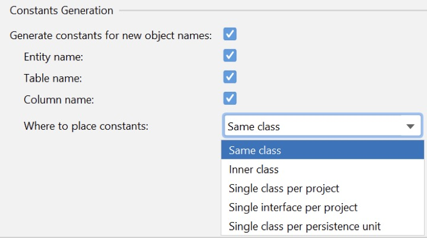

### Designer Settings

In its default mode, JPA Buddy provides functionally rich tool window. However, tool windows may steal too much horizontal space, especially for those who prefer 13-inch laptops. In this case, it was recommended to use the [minimalistic mode](https://www.jpa-buddy.com/documentation/minimalistic-mode/). Besides it, JPA Buddy also provides settings to fine-tune the appearance of the main visual elements:

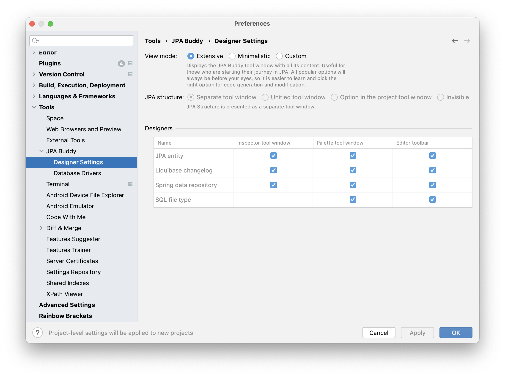
