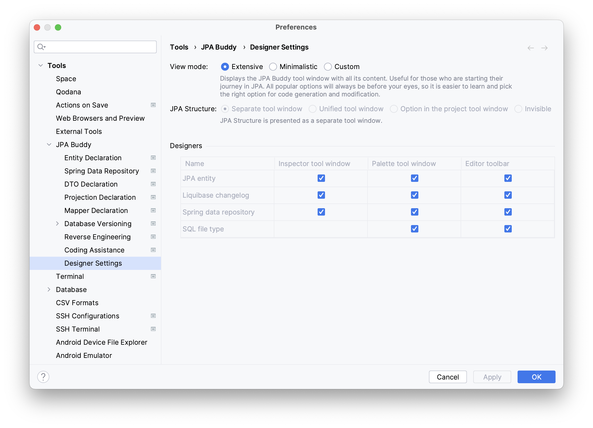
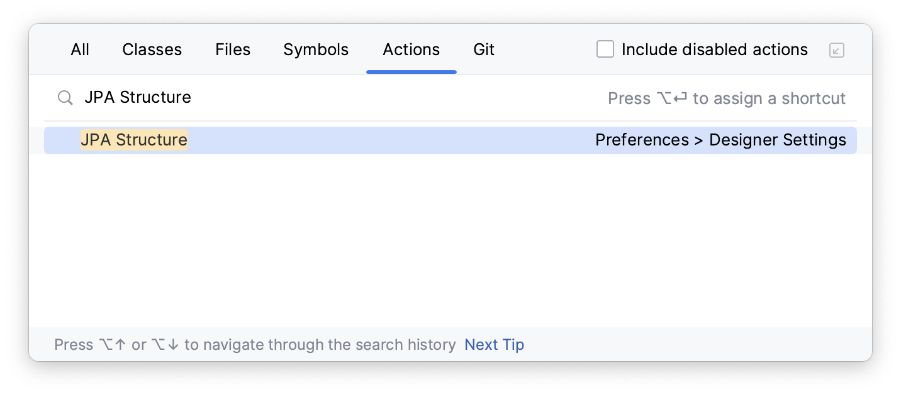
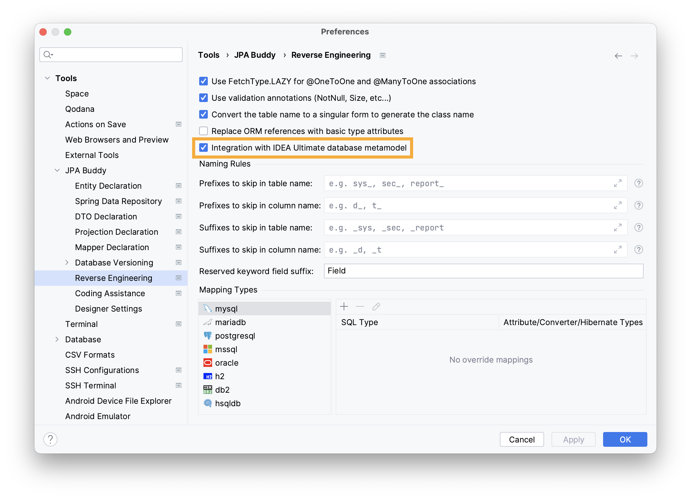

## Why can't I find the JPA Buddy tabs/panels?

There are several reasons why you may not see the JPA Buddy panels.

**1. You may not be in the correct file.** 
   
JPA Buddy panels are only visible in certain files that JPA Buddy is familiar with, such as JPA entities, Spring Data JPA repositories, and Liquibase changelogs. 
This is because JPA Buddy panels are context-dependent. If you are not in a file that can be adjusted using JPA Designer, the corresponding panel might not be visible. 
To check if the JPA Designer panel is available, try opening a JPA entity. If it's not visible, move on to the next reason.

**2. You may have Minimalistic Mode turned on.** 
   
JPA Buddy has a [Minimalistic Mode](/minimalistic-mode/minimalistic-mode.md) that allows you to hide some or all panels according to your preference. If you accidentally turned on this mode, you can turn it off in the settings. 
To do so, go to _Settings -> Tools -> JPA Buddy -> Designer Settings_ and select the extensive option.

Then, check if the panels are present (as described in point 1). Move to the next reason if JPA Buddy Panels still missing.

**3. Your project may be missing necessary dependencies.**

As mentioned earlier, JPA Buddy displays its panels only when necessary. Therefore, if your project does not have any of [the libraries described in our documentation](/installation-guide/installation-guide.md#dependencies), all JPA Buddy functionality will be disabled. 
To check if the necessary dependency exists in your project for JPA Buddy to work correctly, use the following method: _Shift+Shift -> Actions -> JPA Structure_.

If you see the same, it means JPA Buddy is active, and the JPA Designer panel should be displayed if points 1 and 2 have been successful. If you are still unable to locate the panel, please refer to the last reason.

**4. Something may have gone wrong with the plugin or IntelliJ IDEA.**

If none of the above points solve your problem, you can try the following steps:
* Remove the plugin: go to _Settings -> Plugins -> Installed Tab -> Right Click on JPA Buddy -> Uninstall_ 
* Clear the cache: go to _File -> Invalidate caches... -> Tick all the boxes -> Invalidate and Restart_ 
* Reinstall the plugin: go to _Settings -> Plugins -> Marketplace tab -> Type JPA Buddy -> Click Install_

If this still does not help, and you have the latest stable versions of <a href="https://www.jetbrains.com/idea/download/other.html" target="blank">IntelliJ IDEA</a>  and <a href="https://plugins.jetbrains.com/plugin/15075-jpa-buddy/versions" target="blank">JPA Buddy</a>, please write to us on <a href="https://discord.com/invite/zUsVXYGsQr" target="blank">Discord</a>. When making the request, we would appreciate it if you could mention the version of IntelliJ IDEA, its type (CE or Ultimate), and the version of JPA Buddy.

## Why aren't my entities showing up during reverse engineering?

While creating entities from the database, IntelliJ IDEA CE and Ultimate users experience some differences.

### IntelliJ IDEA CE

If your tables are in a non-default schema, you need to create a new connection that targets the database and schema. This is because JPA Buddy can only retrieve data from an explicitly specified connection string since it uses a JDBC driver to obtain meta information.
You can find instructions on how to create a new connection [here](/database-connections/database-connections.md#non-default-schema-connection).

If your tables are still not visible even after specifying the schema explicitly, please let us know on <a href="https://discord.com/invite/zUsVXYGsQr" target="blank">Discord</a>. When making your request, please provide the version and type of your IntelliJ IDEA (CE or Ultimate), database provider (PostgreSQL, Oracle, MySQL, etc.) and the version of JPA Buddy.

### IntelliJ IDEA Ultimate

If you are using JPA Buddy version 2023.2 or older with IntelliJ IDEA Ultimate, you need to explicitly specify the schema in the connection string to create entities. This is because the same mechanism was used for both IntelliJ IDEA Ultimate and IntelliJ IDEA CE in older JPA Buddy versions. 
You can find instructions on how to create a new connection string targeting the database and schema [here](/database-connections/database-connections.md#non-default-schema-connection).

Starting from version 2023.2, JPA Buddy seamlessly integrates with IntelliJ IDEA capabilities to read metadata about the database. By default, this integration is enabled. If you see tables in the "Database" panel of IntelliJ IDEA, creating entities should work without any problems. You can check if the integration is enabled by going to _Settings -> Tools -> JPA Buddy -> Reverse Engineering -> Integration with IDEA Ultimate database metamodel_.

If you still can’t see any tables, please contact us on <a href="https://discord.com/invite/zUsVXYGsQr" target="blank">Discord</a>. When making your request, please provide the version and type of your IntelliJ IDEA (CE or Ultimate), database provider (PostgreSQL, Oracle, MySQL, etc.) and the version of JPA Buddy.

## Does JPA Buddy supports the IntelliJ IDEA EAP?

Yes, but unfortunately, we cannot support EAP at early stages. Normally, we provide support for EAP since its 3-4th release. Otherwise, it becomes too laborious, because JetBrains often makes significant API changes during earlier EAP releases.

## Why am I unable to find certain features?

Certain features in JPA Buddy are only available when specific libraries are present. For instance, you can create Liquibase changelogs or MapStruct mappers only if you have the [corresponding library in the libraries list](/installation-guide/installation-guide.md#dependencies). So, please make sure you have [the required library](/installation-guide/installation-guide.md#dependencies) in your project.

## Is JPA Buddy available for free?

Since we started the plugin, we established a clear list of values that we should deliver to JPA Buddy users:
* Make it easier to start with Jakarta Persistence API and surrounding frameworks and libraries. 
* Ensure the right use of the mentioned frameworks and libraries. To achieve this JPA Buddy strongly follows best practices and documentation while code generation and provides smart inspections to examine the existing code. 
* Accelerate the development process itself.

We decided that the features supporting the first two goals **should stay free**. Here we speak about the visual designers for entities, Spring Data JPA repositories, Liquibase changelogs, SQL statements, etc. We also keep coding assistance on the free side. All features of JPA Buddy remain free for academic use (teachers, students, classroom assistance) as well as training courses, coding schools and bootcamps.

The third target is about making developers more efficient. This brings direct business value, and we can measure this value in money.

Features that available **only for subscribers** are:
* Liquibase diff changelog, Flyway versioned migrations and DDL generation. 
* JPA entities generation from the existing database. 
* DTO generation and MapStruct/ModelMapper support.

In addition, we provide a few ways to get JPA Buddy license **for free**:
1. Follow us on Twitter, send us a private message, and get one month for free!
2. If you have 500+ Twitter subscribers, share our tweets 3-4 times this month and get the next month of free use!
3. Report a severe bug or share a great idea that makes it to our roadmap, and we'll reward you!
4. Write about JPA Buddy or create a YouTube video, and receive our heartfelt thanks!
1. Still don't follow us on <a href="https://twitter.com/JPABuddy" target="blank">Twitter</a>? Subscribe, send a private message to us and we will grant you one month free!
2. Has more than 500 subscribers on <a href="https://twitter.com/JPABuddy" target="blank">Twitter</a> and share our tweets 3-4 times per month? Let us know via the contact form on our website, because you definitely deserve the next month of free use!
3. Reported a severe bug? Shared great ideas that become a part of our roadmap? We will not leave you without a present!
4. Published an article about JPA Buddy or recorded a <a href="https://www.youtube.com/c/JPABuddy" target="blank">YouTube</a> video? Be sure, our big thanks are going to find you!

## Does JPA Buddy collect any personal information from users?

No, JPA Buddy does not collect any personal information, such as details about the features you use or your database model. The only way the JPA Buddy team can obtain personal information about you is if you grant permission by sending an error report.

<iframe width="560" height="315" src="https://www.youtube.com/embed/OkFBn4s-218" title="YouTube video player" allow="accelerometer; autoplay; clipboard-write; encrypted-media; gyroscope; picture-in-picture" allowfullscreen></iframe>

This information will include details about your IntelliJ IDEA and hardware specifications. This mechanism is standard for IntelliJ IDEA. 
