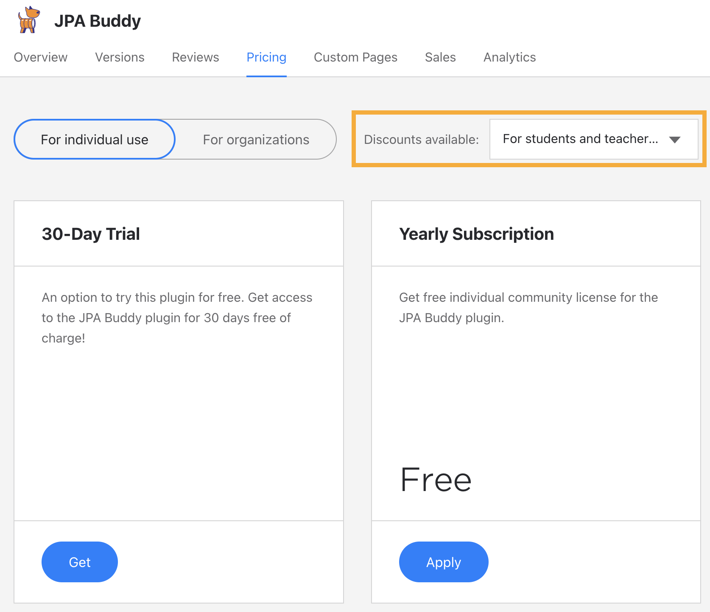
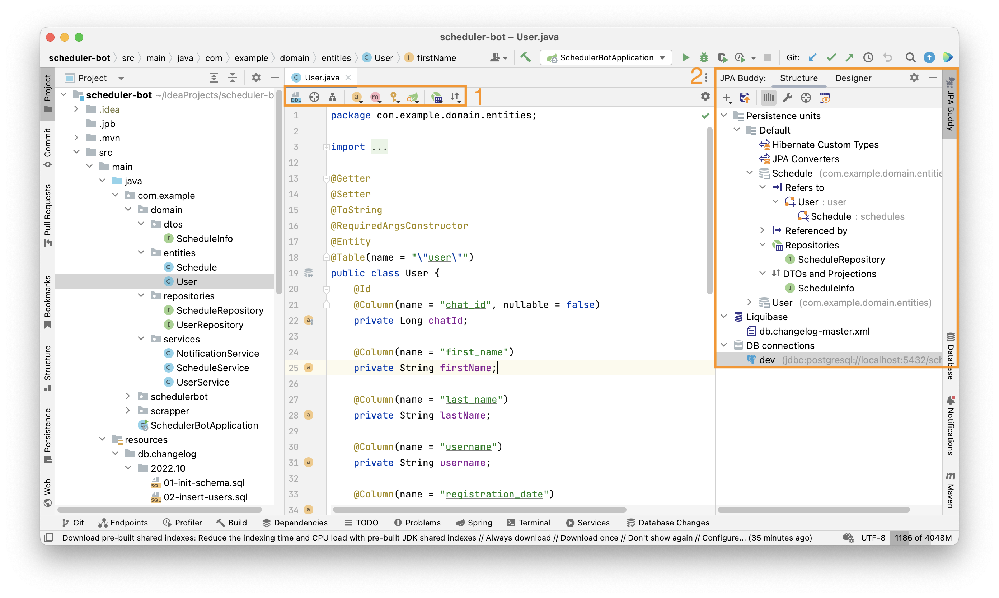

## What is JPA Buddy?

JPA Buddy is a plugin for IntelliJ IDEA that makes working with JPA and related technologies easier. It provides development tools for Hibernate, EclipseLink, Spring Data JPA, Liquibase, Flyway, SQL, and similar things.

JPA Buddy makes the development process easier by:

- introducing rich code generation capabilities

  - [Data model](https://www.jpa-buddy.com/documentation/entity-designer/)
  - [Spring Data](https://www.jpa-buddy.com/documentation/spring-data/) interfaces
  - [DB migrations](https://www.jpa-buddy.com/documentation/database-versioning/) (Liquibase, Flyway)
  - [Reverse engineering](https://www.jpa-buddy.com/documentation/reverse-engineering/)
- integrating smart inspections
- providing better navigation via a data-centric view of the project
- offering comprehensive coding assistance capabilities

## Installation and Project Setup

JPA Buddy is compatible with both IntelliJ IDEA Community Edition and IntelliJ IDEA Ultimate Edition. It is available on the [JetBrains marketplace](https://plugins.jetbrains.com/plugin/15075-jpa-buddy), where it can be downloaded and installed.

You can install JPA Buddy for running IntelliJ IDEA. Open Preferences -> Plugins and search for JPA Buddy, then simply push the install button, and there you go!

## License Activation

The purchase process is entirely managed by JetBrains Marketplace, including payment processing, invoicing, and licensing. To get a license, please visit [this page](https://plugins.jetbrains.com/plugin/15075-jpa-buddy/pricing).

### Trial Subscription

For new users who haven't tried JPA Buddy yet there is a [30-day trial period](https://plugins.jetbrains.com/plugin/15075-jpa-buddy/pricing). You can see how to obtain it in the following video:

<iframe width="560" height="315" src="https://www.youtube.com/embed/XZnA_0vS-zk" title="YouTube video player" frameborder="0" allow="accelerometer; autoplay; clipboard-write; encrypted-media; gyroscope; picture-in-picture" allowfullscreen></iframe>

### Purchase Process

For those who have already used the trial period and want to continue using JPA Buddy paid features, there are two types of subscriptions available: monthly and annual. To pay for a subscription, JetBrains Marketplace provides two possible options:

- [Pay via Credit Card](https://plugins.jetbrains.com/plugin/15075-jpa-buddy/pricing)
- [Pay via PayPal](https://plugins.jetbrains.com/plugin/15075-jpa-buddy/pricing)

In the following video, we will show you how to buy a subscription via a credit card. All the steps to get and activate a subscription will remain the same if you decide to use PayPal.

<iframe width="560" height="315" src="https://www.youtube.com/embed/C63kRXjxhRs" title="YouTube video player" frameborder="0" allow="accelerometer; autoplay; clipboard-write; encrypted-media; gyroscope; picture-in-picture" allowfullscreen></iframe>

### The Difference Between an Individual and Company Licenses

The [**Personal license**](https://plugins.jetbrains.com/plugin/15075-jpa-buddy/pricing#edition=personal) is an option for private individuals who purchase a license with their own funds and solely for their own use. This license can be used for both individual and commercial projects. Personal licenses are not to be purchased, refunded or in any way financed by companies.

The [**Company license**](https://plugins.jetbrains.com/plugin/15075-jpa-buddy/pricing#edition=commercial) is the standard licensing option for organizations and businesses. Licenses are purchased by the company and can be used by any single person within this organization. So if anyone quits the job, the company can assign this license to another employee. More than one employee should not use the same license simultaneously.

The following table should help with choosing the most appropriate licensing schema for you:

<table>
<thead>
  <tr>
    <th></th>
    <th>Individual License</th>
    <th>Company License</th>
  </tr>
</thead>
<tbody>
  <tr>
    <td>Who pays for the license?</td>
    <td>Developer with their own funds</td>
    <td>Company</td>
  </tr>
  <tr>
    <td>Who manages?</td>
    <td>Developer</td>
    <td>Company. The license can be reassigned between individuals.</td>
  </tr>
  <tr>
    <td>Can be used by more than one developer?</td>
    <td>No</td>
    <td>No</td>
  </tr>
  <tr>
    <td>Can be used to develop commercial software?</td>
    <td>Yes</td>
    <td>Yes</td>
  </tr>
  <tr>
    <td>Can be used for development in a company?</td>
    <td>Yes</td>
    <td>Yes</td>
  </tr>
  <tr>
    <td>What if a developer leaves a company?</td>
    <td>The license leaves with them</td>
    <td>The license stays within company and can be assigned to another developer</td>
  </tr>
</tbody>
</table>

### Educational And Discounted Licenses

All features of JPA Buddy remain free for academic use (teachers, students, classroom assistance) as well as training courses, coding schools and bootcamps. To get it, you need to confirm the special status of your JetBrains account. To do so, scroll through the [Pricing page](https://plugins.jetbrains.com/plugin/15075-jpa-buddy/pricing) and follow the "Learn more..." link.

Since the status of your account is confirmed, a new "Discount available" field will appear. Choose your status in this field and enjoy the new subscription options:

### Promos

We are going to give away little gifts to our active community members.

Still don't follow us on [Twitter](https://twitter.com/JPABuddy)? Subscribe, send a private message to us and we will grant you one month free!

Has more than 500 subscribers on Twitter and share our tweets 3-4 times per month? Let us know via the contact form on our [website](https://www.jpa-buddy.com/contacts/), because you definitely deserve the next month of free use!

Reported a severe bug? Shared great ideas that become a part of our roadmap? We will not leave you without a present!

Published an article about JPA Buddy or recorded a YouTube video? Be sure, our big thank is going to find you!

### Older (Free) Versions Support

Older versions will be available for free as it is shown in the table below:

<table>
<thead>
  <tr>
    <th>JPA Buddy version</th>
    <th>IntelliJ IDEA compatible versions</th>
    <th>Premium features availability</th>
  </tr>
</thead>
<tbody>
  <tr>
    <td>2022.1.*-212</td>
    <td>2021.2.*</td>
    <td>Free until October 1, 2022</td>
  </tr>
  <tr>
    <td>2022.1.*-213</td>
    <td>2021.3.*</td>
    <td>Free until October 1, 2022</td>
  </tr>
  <tr>
    <td>2022.1.*-221</td>
    <td>2022.1.*</td>
    <td>Free until October 1, 2022</td>
  </tr>
  <tr>
    <td>2022.2.*-213</td>
    <td>2021.3.*</td>
    <td>Free until January 1, 2023</td>
  </tr>
  <tr>
    <td>2022.2.*-221</td>
    <td>2022.1.*</td>
    <td>Requires subscription</td>
  </tr>
  <tr>
    <td>All newer versions of JPA Buddy</td>
    <td>2022.1+</td>
    <td>Requires subscription</td>
  </tr>
</tbody>
</table>

## Dependencies

Since JPA Buddy supports Hibernate, EclipseLink, SpringData, MapStruct, Liquibase and Flyway, it scans the project dependencies and enables the corresponding features.

<table class="tg">
<thead>
  <tr>
    <th class="tg-0pky">Framework/Lib</th>
    <th class="tg-0pky">Features</th>
  </tr>
</thead>
<tbody>
  <tr>
    <td class="tg-0pky"><a href="https://mvnrepository.com/artifact/org.hibernate/hibernate-core" target="_blank" rel="noopener noreferrer">Hibernate</a></td>
    <td class="tg-0pky" rowspan="2">- Create and edit entities, entity attributes, lifecycle callbacks, indexes and constraints in both Java and Kotlin.  - Assign JPA converters and Hibernate custom types.  - Apply Lombok annotations to entities.  - Generate proper equals, hashCode and toString.</td>
  </tr>
  <tr>
    <td class="tg-0pky"><a href="https://mvnrepository.com/artifact/org.eclipse.persistence/eclipselink" target="_blank" rel="noopener noreferrer">EclipseLink</a></td>
  </tr>
  <tr>
    <td class="tg-0pky"><a href="https://mvnrepository.com/artifact/org.springframework.data/spring-data-jpa" target="_blank" rel="noopener noreferrer">Spring</a> <a href="https://mvnrepository.com/artifact/org.springframework.data/spring-data-jpa" target="_blank" rel="noopener noreferrer">Data</a> <a href="https://mvnrepository.com/artifact/org.springframework.data/spring-data-jpa" target="_blank" rel="noopener noreferrer">JPA</a></td>
    <td class="tg-0pky">- Create repositories for entities. - Generate queries using visual constructors. - Extract JPQL from derived method queries. - Pick which fields to return from queries and generate projections.</td>
  </tr>
  <tr>
    <td class="tg-0lax"><a href="https://mvnrepository.com/artifact/org.hibernate.validator/hibernate-validator" target="_blank" rel="noopener noreferrer">Hibernate Validator</a></td>
    <td class="tg-0lax" rowspan="2">Add Hibernate Validator annotations to Entity attributes via JPA Designer.</td>
  </tr>
  <tr>
    <td class="tg-0lax"><a href="https://mvnrepository.com/artifact/org.springframework.boot/spring-boot-starter-validation" target="_blank" rel="noopener noreferrer">SpringBoot</a> <a href="https://mvnrepository.com/artifact/org.springframework.boot/spring-boot-starter-validation" target="_blank" rel="noopener noreferrer">Starter Validation</a></td>
  </tr>
  <tr>
    <td class="tg-0lax"><a href="https://mvnrepository.com/artifact/com.vladmihalcea/hibernate-types-52" target="_blank" rel="noopener noreferrer">Hibernate Types</a></td>
    <td class="tg-0lax">Assign Hibernate Custom Types to attributes via a code inspection with a quick fix.</td>
  </tr>
  <tr>
    <td class="tg-0lax"><a href="https://mvnrepository.com/artifact/org.liquibase/liquibase-core" target="_blank" rel="noopener noreferrer">Liquibase</a></td>
    <td class="tg-0lax">- Automatically generate Liquibase changelogs by comparing JPA model to target database, model to snapshot or DB to DB.  - Use visual designers for Liquibase changelogs  - Use coding assistance and autocomplete in Liquibase changelogs for table names, column names etc. JPA Buddy takes these values directly from your data model.</td>
  </tr>
  <tr>
    <td class="tg-0lax"><a href="https://mvnrepository.com/artifact/org.flywaydb/flyway-core" target="_blank" rel="noopener noreferrer">Flyway</a></td>
    <td class="tg-0lax">- Generate Flyway migrations by comparing JPA model to target database, model to snapshot or DB to DB.  - Scaffold INSERT, UPDATE and DELETE statements for your entities in SQL files.</td>
  </tr>
  <tr>
    <td class="tg-0lax"><a href="https://mvnrepository.com/artifact/org.mapstruct/mapstruct" target="_blank" rel="noopener noreferrer">MapStruct</a></td>
    <td class="tg-0lax">- Create MapStruct mappers to convert entities to DTOs and back.</td>
  </tr>
</tbody>
</table>

*After adding one of the dependencies to the project, do not forget to click on the "Load Maven Changes" button in the upper right corner.*

## Verifying Installation

To make sure that the plugin is installed correctly, follow these steps:

- Open Plugin Settings IntelliJ IDEA window: clicks File -> Settings -> Plugins -> Installed. Make sure that JPA Buddy there is in this section and enabled.

- Open existing or create a new entity and click somewhere in it. You should find Editor Toolbar (1) and JPA Buddy tool window (2). Note that visual tools will appear only after JPA Buddy detects one of the dependencies described in the section above.

## Installing a Specific Version of JPA Buddy

Every version of JPA Buddy supports a range of IntelliJ IDEA versions. For example, JPA Buddy 4.3 works correctly with IntelliJ IDEA from 2021.1 to 2021.1.3. But if you have to install JPA Buddy on the other version of IntelliJ IDEA, you can do the following:

- Open JPA Buddy JetBrains Marketplace [page.](https://plugins.jetbrains.com/plugin/15075-jpa-buddy)
- Open Versions tab.
- Find a version of JPA Buddy which satisfies the version of your IntelliJ IDEA and click on it.

- In the opened window, click on the “Download” button.

- Save .zip file to your PC.
- Now you have two options:

  - Open File -> Settings -> Plugins page click on the settings icon next to the “installed” tab and choose “install plugin from disc”. Find the downloaded .zip file, select it, and click “ok”.

  

  - Simply drag and drop the .zip file to any IntelliJ IDEA window.
- To apply changes, click on the “Restart IDE” button

## Something went wrong? Contact us!

Bugs and errors are unavoidable in any software, development tools are no exception. JPA Buddy team is always ready to help you cope with any difficulties that arise. Check out [Reporting Issues](https://www.jpa-buddy.com/documentation/reporting-issues/) section where you can find [Contact Us](https://www.jpa-buddy.com/documentation/reporting-issues/#contact-us) information and tips for [Error Reporting](https://www.jpa-buddy.com/documentation/reporting-issues/#error-reporting).
