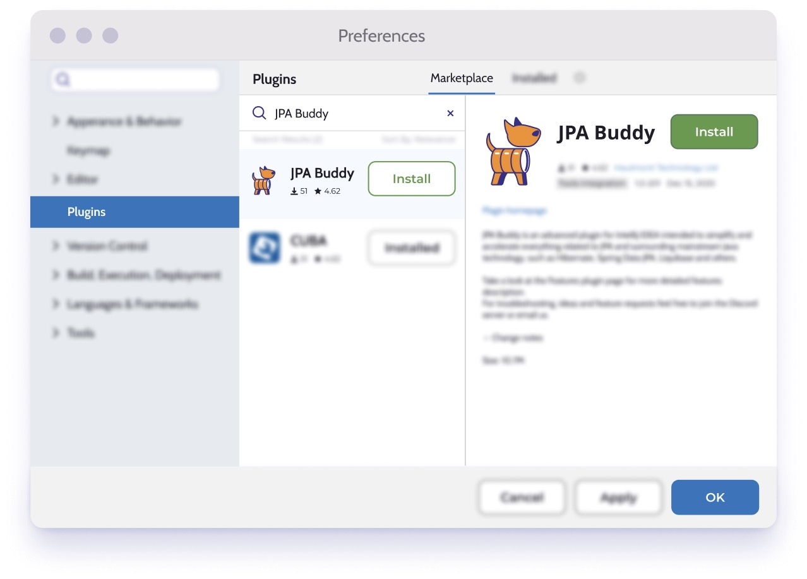
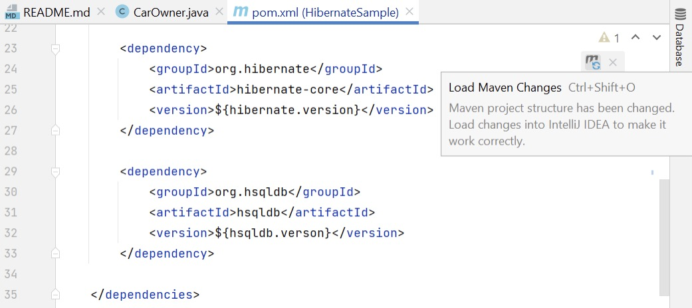
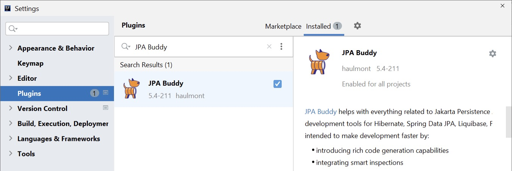
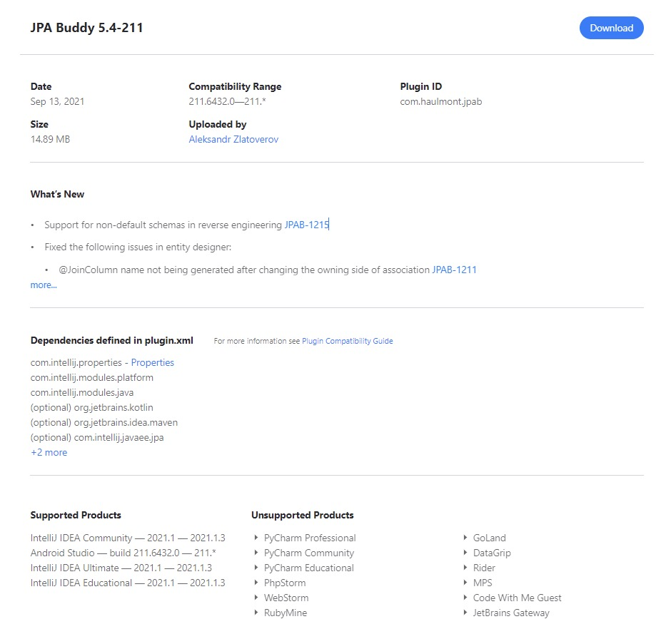
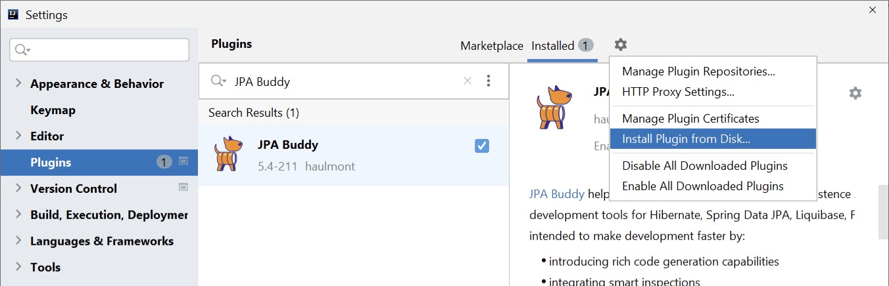
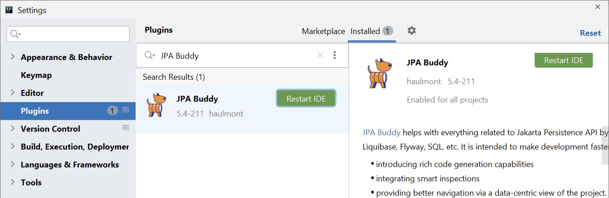

## What is JPA Buddy?

JPA Buddy is an **<a href="https://plugins.jetbrains.com/plugin/15075-jpa-buddy" target="_blank">IntelliJ IDEA plugin</a>** that helps developers work efficiently with Hibernate, EclipseLink, Spring Data JPA, Flyway, Liquibase, Lombok, MapStruct, and other related technologies in both Java and Kotlin.

**The plugin is intended to:**
* Lower barrier to entry into development with JPA
* Boost developer’s productivity
* Make sure your code follows best practices

**JPA Buddy delivers:**
* [Intuitive wizards to work with JPA](https://www.jpa-buddy.com/documentation/entity-designer/)
* [Automatic database versioning changelog generation](https://www.jpa-buddy.com/documentation/database-versioning/)
* [Smart inspections to make the code better](https://www.jpa-buddy.com/documentation/entity-designer/#inspections-1)
* [JPA Entities generation based on tables (reverse engineering)](https://www.jpa-buddy.com/documentation/reverse-engineering/)
* [Visual DTO designer and mapper code generator](https://www.jpa-buddy.com/documentation/dto-generator/)
* [Coding assistance to make development more straightforward and transparent](https://www.jpa-buddy.com/documentation/coding-assistance/)

You can use JPA Buddy in any project with Spring Boot, Jakarta Enterprise Edition, Quarkus, Micronaut, or even without any framework.

## Installation and Project Setup

JPA Buddy is compatible with both IntelliJ IDEA Community Edition and IntelliJ IDEA Ultimate Edition. It is available on the <a href="https://plugins.jetbrains.com/plugin/15075-jpa-buddy" target="_blank">JetBrains marketplace</a>, where it can be downloaded and installed.

To install JPA Buddy, open Preferences -> Plugins and search for JPA Buddy. Then, simply click on the installation button and you're good to go!

## Dependencies

Since JPA Buddy supports Hibernate, EclipseLink, SpringData, MapStruct, Liquibase and Flyway, it scans the project dependencies and enables the corresponding features. If you have a multi-module project, JPA Buddy features will be enabled depending on the presence of the dependency within the module, rather than the entire project.

<table class="tg">
<thead>
  <tr>
    <th class="tg-0pky">Framework/Lib</th>
    <th class="tg-0pky">Features</th>
  </tr>
</thead>
<tbody>
  <tr>
    <td class="tg-0pky"><a href="https://mvnrepository.com/artifact/org.hibernate/hibernate-core" target="_blank" rel="noopener noreferrer">Hibernate</a></td>
    <td class="tg-0pky" rowspan="2">- Create and edit entities, entity attributes, lifecycle callbacks, indexes and constraints in both Java and Kotlin.  - Assign JPA converters and Hibernate custom types.  - Apply Lombok annotations to entities.  - Generate proper equals, hashCode and toString.</td>
  </tr>
  <tr>
    <td class="tg-0pky"><a href="https://mvnrepository.com/artifact/org.eclipse.persistence/eclipselink" target="_blank" rel="noopener noreferrer">EclipseLink</a></td>
  </tr>
  <tr>
    <td class="tg-0pky"><a href="https://mvnrepository.com/artifact/org.springframework.data/spring-data-jpa" target="_blank" rel="noopener noreferrer">Spring</a> <a href="https://mvnrepository.com/artifact/org.springframework.data/spring-data-jpa" target="_blank" rel="noopener noreferrer">Data</a> <a href="https://mvnrepository.com/artifact/org.springframework.data/spring-data-jpa" target="_blank" rel="noopener noreferrer">JPA</a></td>
    <td class="tg-0pky">- Create repositories for entities. - Generate queries using visual constructors. - Extract JPQL from derived method queries. - Pick which fields to return from queries and generate projections.</td>
  </tr>
  <tr>
    <td class="tg-0lax"><a href="https://mvnrepository.com/artifact/org.hibernate.validator/hibernate-validator" target="_blank" rel="noopener noreferrer">Hibernate Validator</a></td>
    <td class="tg-0lax" rowspan="2">Add Hibernate Validator annotations to Entity and DTO attributes via JPA Designer and DTO generator wizard respectively.</td>
  </tr>
  <tr>
    <td class="tg-0lax"><a href="https://mvnrepository.com/artifact/org.springframework.boot/spring-boot-starter-validation" target="_blank" rel="noopener noreferrer">Spring Boot Starter Validation</a></td>
  </tr>
  <tr>
    <td class="tg-0lax"><a href="https://mvnrepository.com/artifact/com.vladmihalcea/hibernate-types-52" target="_blank" rel="noopener noreferrer">Hibernate Types</a></td>
    <td class="tg-0lax">Assign Hibernate Custom Types to attributes via a code inspection with a quick fix (Alt+Enter/⌥ ⏎).</td>
  </tr>
  <tr>
    <td class="tg-0lax"><a href="https://mvnrepository.com/artifact/org.liquibase/liquibase-core" target="_blank" rel="noopener noreferrer">Liquibase</a></td>
    <td class="tg-0lax">- Automatically generate Liquibase changelogs by comparing JPA model to target database, model to snapshot or DB to DB.  - Use visual designers for Liquibase changelogs  - Use coding assistance and autocomplete in Liquibase changelogs for table names, column names etc. JPA Buddy takes these values directly from your data model.</td>
  </tr>
  <tr>
    <td class="tg-0lax"><a href="https://mvnrepository.com/artifact/org.flywaydb/flyway-core" target="_blank" rel="noopener noreferrer">Flyway</a></td>
    <td class="tg-0lax">- Generate Flyway migrations by comparing JPA model to target database, model to snapshot or DB to DB.  - Scaffold INSERT, UPDATE and DELETE statements for your entities in SQL files.</td>
  </tr>
  <tr>
    <td class="tg-0lax"><a href="https://mvnrepository.com/artifact/org.mapstruct/mapstruct" target="_blank" rel="noopener noreferrer">MapStruct</a></td>
    <td class="tg-0lax">- Create MapStruct mappers to convert entities to DTOs and back.</td>
  </tr>
  <tr>
    <td class="tg-0lax"><a href="https://mvnrepository.com/artifact/com.blazebit/blaze-persistence-entity-view-api" target="_blank" rel="noopener noreferrer">Blazebit Persistence Entity View API</a></td>
    <td class="tg-0lax">- Create Blaze Persistence Entity View for JPA Entity.</td>
  </tr>
  <tr>
    <td class="tg-0lax"><a href="https://mvnrepository.com/artifact/com.blazebit/blaze-persistence-integration-spring-data-base" target="_blank" rel="noopener noreferrer">Blazebit Persistence Integration Spring Data Base</a></td>
    <td class="tg-0lax">- Create Spring Data JPA repository for Blaze Persistence Entity View.</td>
  </tr>
  <tr>
    <td class="tg-0lax"><a href="https://mvnrepository.com/artifact/org.hibernate/hibernate-envers" target="_blank" rel="noopener noreferrer">Hibernate Envers</a></td>
    <td class="tg-0lax">
    - Generate database migration scripts for audit tables. 
    - Create Spring Data JPA revision repositories. 
    - Annotate entities and their fields for auditing via JPA Designer.  
    - Generate @RevisionEntity via convenient wizard.
    </td>
  </tr>
</tbody>
</table>

*After adding one of the dependencies to the project, do not forget to click on the "Load Maven/Gradle Changes" button in the upper right corner.*

## Verifying Installation

To make sure that the plugin is installed correctly, follow these steps:

1. Open Plugin Settings IntelliJ IDEA window: clicks File -> Settings -> Plugins -> Installed. Make sure that JPA Buddy there is in this section and enabled.
    
2. Open existing or create a new entity and click somewhere in it. You should find Editor Toolbar (1) and JPA Buddy tool window (2). Note that visual tools will appear only after JPA Buddy detects one of the dependencies described in the section above.

    

## Installing a Specific Version of JPA Buddy

<a href="https://plugins.jetbrains.com/plugin/15075-jpa-buddy/versions" target="_blank">Every version of JPA Buddy</a> supports a range of IntelliJ IDEA versions. For example, JPA Buddy 2023.1 works correctly with IntelliJ IDEA 2022.2, 2022.3 and 2023.1. But if you have to install JPA Buddy on the other version of IntelliJ IDEA, you can do the following:

* Open <a href="https://plugins.jetbrains.com/plugin/15075-jpa-buddy" target="_blank">JPA Buddy JetBrains Marketplace page</a>.
* Open Versions tab.
* Find a version of JPA Buddy which satisfies the version of your IntelliJ IDEA and click on it.

- In the opened window, click on the "Download" button.

- Save .zip file to your PC.
- Now you have two options:

  - Open File -> Settings -> Plugins page click on the settings icon next to the "installed" tab and choose "install plugin from disk". Find the downloaded .zip file, select it, and click "ok".

  

  - Simply drag and drop the .zip file to any IntelliJ IDEA window.
- To apply changes, click on the "Restart IDE" button

## Something went wrong? Contact us!

Bugs and errors are unavoidable in any software, development tools are no exception. JPA Buddy team is always ready to help you cope with any difficulties that arise. Check out [Reporting Issues](https://www.jpa-buddy.com/documentation/reporting-issues/) section where you can find [Contact Us](https://www.jpa-buddy.com/documentation/reporting-issues/#contact-us) information and tips for [Error Reporting](https://www.jpa-buddy.com/documentation/reporting-issues/#error-reporting).