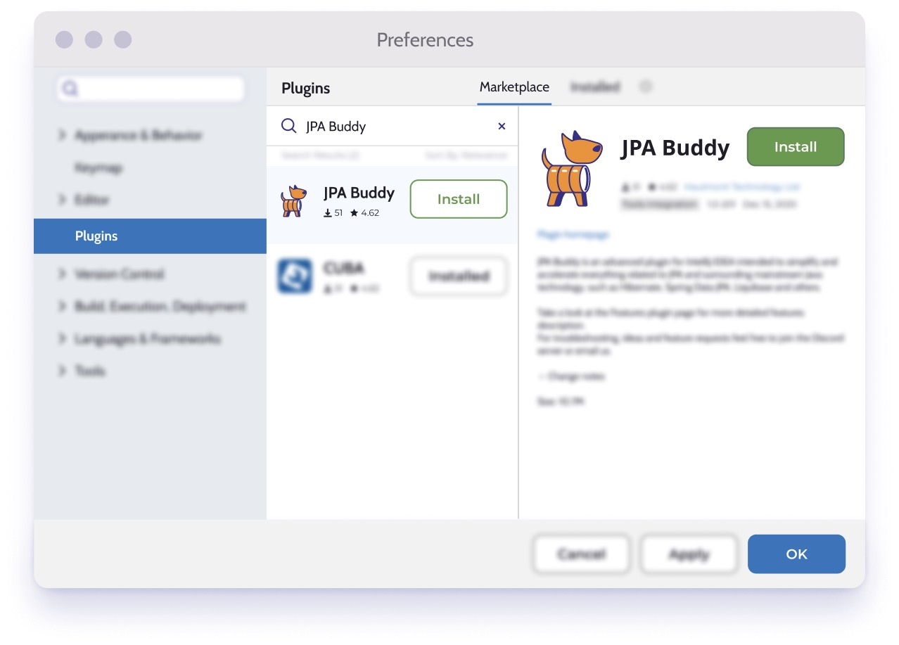
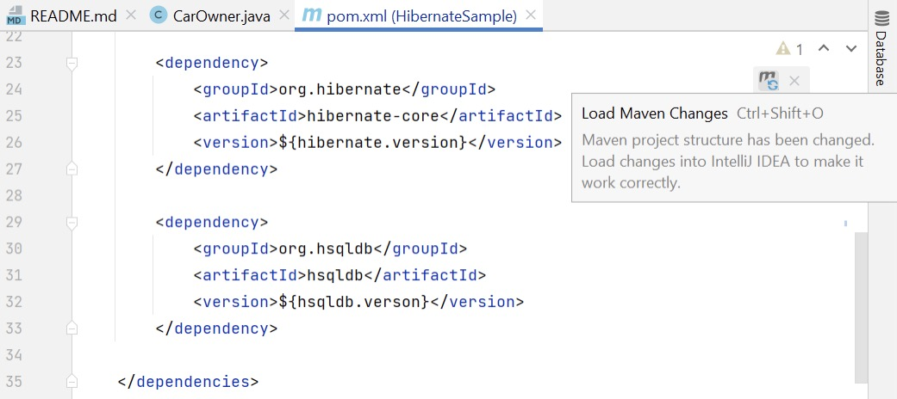
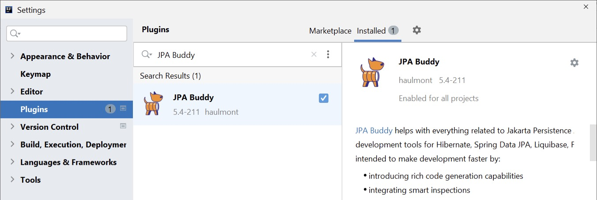
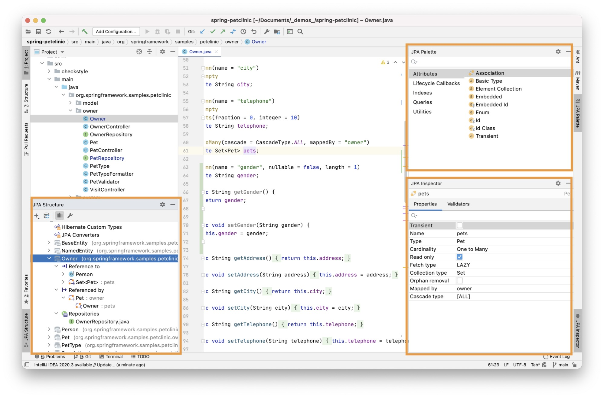
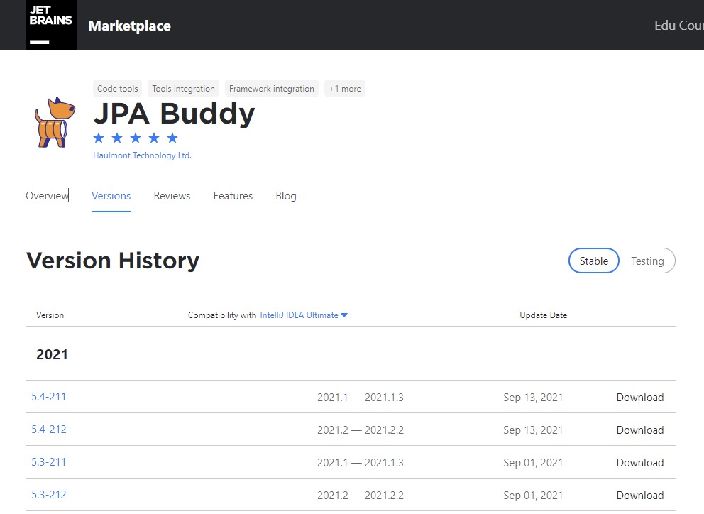
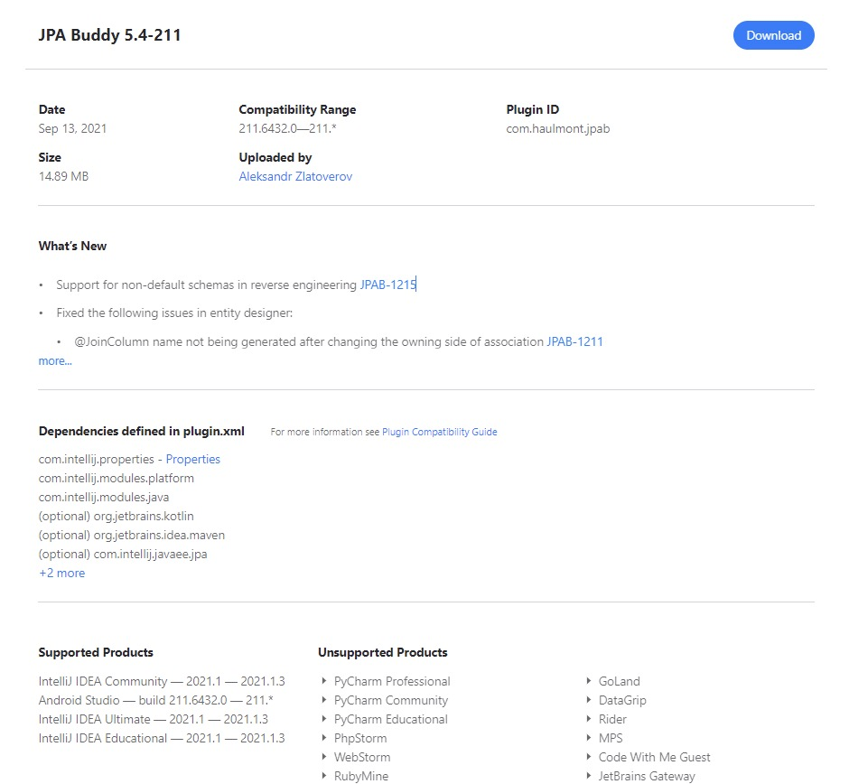
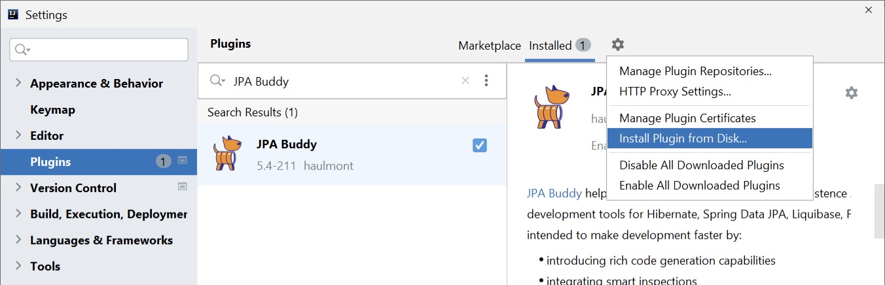

## What is JPA Buddy? 

JPA Buddy is a plugin for IntelliJ IDEA that makes working with JPA and related technologies easier. It provides development tools for Hibernate, EclipseLink, Spring Data JPA, Liquibase, Flyway, SQL, and similar things. 

JPA Buddy makes the development process easier by: 

- introducing rich code generation capabilities 
  - [Data model](https://www.jpa-buddy.com/documentation/entity-designer/)

  - [Spring Data](https://www.jpa-buddy.com/documentation/spring-data/) interfaces 
  - [DB migrations](https://www.jpa-buddy.com/documentation/database-versioning/) (Liquibase, Flyway) 
  - [Reverse engineering](https://www.jpa-buddy.com/documentation/reverse-engineering/)

- integrating smart inspections 
- providing better navigation via a data-centric view of the project 

- offering comprehensive coding assistance capabilities 

## Installation and Project Setup 

JPA Buddy is compatible with both IntelliJ IDEA Community Edition and IntelliJ IDEA Ultimate Edition. It is available on the [JetBrains marketplace](https://plugins.jetbrains.com/plugin/15075-jpa-buddy), where it can be downloaded and installed. 

You can install JPA Buddy for running IntelliJ IDEA. Open Preferences -> Plugins and search for JPA Buddy, then simply push the install button, and there you go! 

## Dependencies 

Since JPA Buddy supports Hibernate, EclipseLink, SpringData, Liquibase, and Flyway, JPA Buddy scans the project dependencies and enables the corresponding features. 

<table class="tg">
<thead>
  <tr>
    <th class="tg-0pky">Framework/Lib</th>
    <th class="tg-0pky">Features</th>
  </tr>
</thead>
<tbody>
  <tr>
    <td class="tg-0pky"><a href="https://mvnrepository.com/artifact/org.hibernate/hibernate-core" target="_blank" rel="noopener noreferrer">Hibernate</a></td>
    <td class="tg-0pky" rowspan="2">- Create and edit entities, entity attributes, lifecycle callbacks, indexes and constraints in both Java and Kotlin.  - Assign JPA converters and Hibernate custom types.  - Apply Lombok annotations to entities.  - Generate proper equals, hashCode and toString.</td>
  </tr>
  <tr>
    <td class="tg-0pky"><a href="https://mvnrepository.com/artifact/org.eclipse.persistence/eclipselink" target="_blank" rel="noopener noreferrer">EclipseLink</a></td>
  </tr>
  <tr>
    <td class="tg-0pky"><a href="https://mvnrepository.com/artifact/org.springframework.data/spring-data-jpa" target="_blank" rel="noopener noreferrer">Spring</a> <a href="https://mvnrepository.com/artifact/org.springframework.data/spring-data-jpa" target="_blank" rel="noopener noreferrer">Data</a> <a href="https://mvnrepository.com/artifact/org.springframework.data/spring-data-jpa" target="_blank" rel="noopener noreferrer">JPA</a></td>
    <td class="tg-0pky">- Create repositories for entities. - Generate queries using visual constructors. - Extract JPQL from derived method queries. - Pick which fields to return from queries and generate projections.</td>
  </tr>
  <tr>
    <td class="tg-0lax"><a href="https://mvnrepository.com/artifact/org.hibernate.validator/hibernate-validator" target="_blank" rel="noopener noreferrer">Hibernate Validator</a></td>
    <td class="tg-0lax" rowspan="2">Add Hibernate Validator annotations to Entity attributes via the JPA Inspector panel.</td>
  </tr>
  <tr>
    <td class="tg-0lax"><a href="https://mvnrepository.com/artifact/org.springframework.boot/spring-boot-starter-validation" target="_blank" rel="noopener noreferrer">SpringBoot</a> <a href="https://mvnrepository.com/artifact/org.springframework.boot/spring-boot-starter-validation" target="_blank" rel="noopener noreferrer">Starter Validation</a></td>
  </tr>
  <tr>
    <td class="tg-0lax"><a href="https://mvnrepository.com/artifact/com.vladmihalcea/hibernate-types-52" target="_blank" rel="noopener noreferrer">Hibernate Types</a></td>
    <td class="tg-0lax">Assign Hibernate Custom Types to attributes via a code inspection with a quick fix.</td>
  </tr>
  <tr>
    <td class="tg-0lax"><a href="https://mvnrepository.com/artifact/org.liquibase/liquibase-core" target="_blank" rel="noopener noreferrer">Liquibase</a></td>
    <td class="tg-0lax">- Automatically generate Liquibase changelogs by comparing JPA model to target database, model to snapshot or DB to DB.  - Use visual designers for Liquibase changelogs  - Use coding assistance and autocomplete in Liquibase changelogs for table names, column names etc. JPA Buddy takes these values directly from your data model.</td>
  </tr>
  <tr>
    <td class="tg-0lax"><a href="https://mvnrepository.com/artifact/org.flywaydb/flyway-core" target="_blank" rel="noopener noreferrer">Flyway</a></td>
    <td class="tg-0lax">- Generate Flyway migrations by comparing JPA model to target database, model to snapshot or DB to DB.  - Scaffold INSERT, UPDATE and DELETE statements for your entities in SQL files.</td>
  </tr>
</tbody>
</table>

*After adding one of the dependencies to the project, do not forget to click on the "Load Maven Changes" button in the upper right corner.* 

## Verifying Installation 

To make sure that the plugin is installed correctly, follow these steps: 

- Open Plugin Settings IntelliJ IDEA window: clicks File -> Settings -> Plugins -> Installed. Make sure that JPA Buddy there is in this section and enabled. 
- Open existing or create a new entity and click somewhere in it. You should find three additional tool windows: JPA Structure, JPA Palette, and JPA Inspector. Note that visual tools will appear only after JPA Buddy detects one of the dependencies described in the section above. 

## Installing a Specific Version of JPA Buddy 

Every version of JPA Buddy supports a range of IntelliJ IDEA versions. For example, JPA Buddy 4.3 works correctly with IntelliJ IDEA from 2021.1 to 2021.1.3. But if you have to install JPA Buddy on the other version of IntelliJ IDEA, you can do the following: 

- Open JPA Buddy JetBrains Marketplace [page.](https://plugins.jetbrains.com/plugin/15075-jpa-buddy) 
- Open Versions tab. 
- Find a version of JPA Buddy which satisfies the version of your IntelliJ IDEA and click on it. 
- In the opened window, click on the “Download” button. 

- Save .zip file to your PC. 
- Now you have two options: 
  - Open File -> Settings -> Plugins page click on the settings icon next to the “installed” tab and choose “install plugin from disc”. Find the downloaded .zip file, select it, and click “ok”. 
  - Simply drag and drop the .zip file to any IntelliJ IDEA window.
- To apply changes, click on the “Restart IDE” button 

## Something went wrong? Contact us! 

Bugs and errors are unavoidable in any software, development tools are no exception. JPA Buddy team is always ready to help you cope with any difficulties that arise. Check out [Reporting Issues](https://www.jpa-buddy.com/documentation/reporting-issues/) section where you can find [Contact Us](https://www.jpa-buddy.com/documentation/reporting-issues/#contact-us) information and tips for [Error Reporting](https://www.jpa-buddy.com/documentation/reporting-issues/#error-reporting). 

