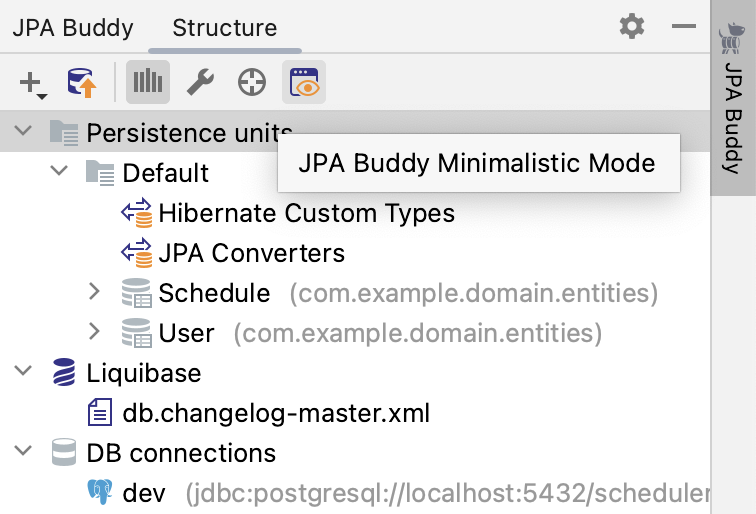
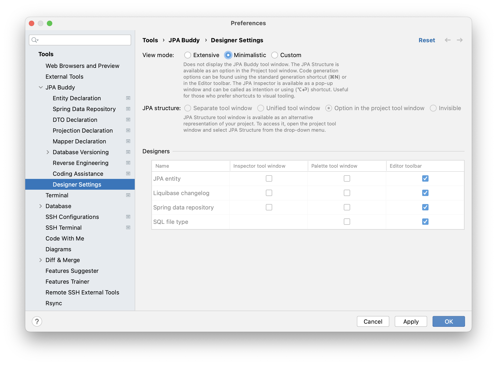
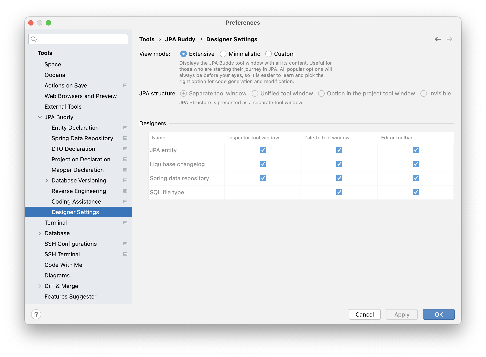
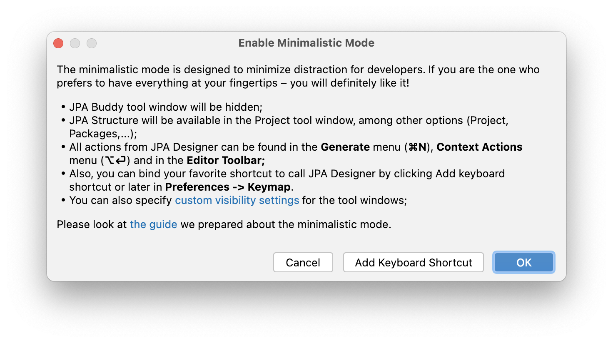

## Introduction

The minimalistic mode is designed to minimize distraction for developers. If you are the one who prefers to have everything at your fingertips – you will like it! JPA Buddy panel will be hidden and its content will be available in standard IntelliJ IDEA windows, such as Project panel, Generate Menu and so on...

<iframe width="560" height="315" src="https://www.youtube.com/embed/fSUnqcZVWnM" title="YouTube video player" allow="accelerometer; autoplay; clipboard-write; encrypted-media; gyroscope; picture-in-picture" allowfullscreen></iframe>

## Enabling Minimalistic Mode

### Via JPA Buddy Tool Window

To enable minimalistic mode, click on the "JPA Buddy Minimalistic Mode" button in the JPA Buddy tool window.

### Via Settings

Another way to activate minimalistic mode is via settings. Open **Settings -> Tools -> JPA Buddy -> Designer Settings** and switch **View mode** to **Minimalistic**.

    Read more about Designer Settings <a href="https://www.jpa-buddy.com/documentation/entity-designer/#designer-settings" target="_blank">here</a>.

## Disabling Minimalistic Mode

To disable minimalistic mode, open **Settings -> Tools -> JPA Buddy -> Designer Settings** and switch **View mode** to **Extensive**. 

    Read more about Designer Settings <a href="https://www.jpa-buddy.com/documentation/entity-designer/#designer-settings" target="_blank">here</a>.

## Using Features in the Minimalistic View

### JPA Structure

Since one of the primary purposes of [JPA Structure](https://www.jpa-buddy.com/documentation/entity-designer/#jpa-structure) tab is to provide a comprehensive data-centric view of the project, it will be available in the Project panel. You can select it from the drop-down list.

### JPA Palette

To utilize wizards from [JPA Palette](https://www.jpa-buddy.com/documentation/entity-designer/#jpa-palette ), you need to call Generate Menu (⌘+N/Alt+Insert). The subsequent interaction with them does not differ from what is described in the section about JPA Palette.

### JPA Inspector

[JPA Inspector](https://www.jpa-buddy.com/documentation/entity-designer/#jpa-inspector) allows you to configure classes and fields in it. Press (⌥+⏎/Alt+Enter) on any element that you need to configure, and select "how JPA Inspector popup".

After that, the resizable and draggable JPA Inspector panel will appear. The cool thing is that you can navigate through it and change anything using the mouse or only the keyboard:

* To move through the lines, use the up (↑) and down (↓) buttons.
* To change the value in the selected row, press the space bar (⎵) twice.
* To close JPA Inspector, click the Esc button.

#### Custom Shortcuts

For JPA Inspector popup, it's possible to bind another shortcut. You can do it directly from the "Enable Minimalistic Mode" window, by clicking on the "Add keyboard shortcut":

or via preferences. Open Preferences -> Keymap -> type JPA Inspector Popup and set wanted combination.
