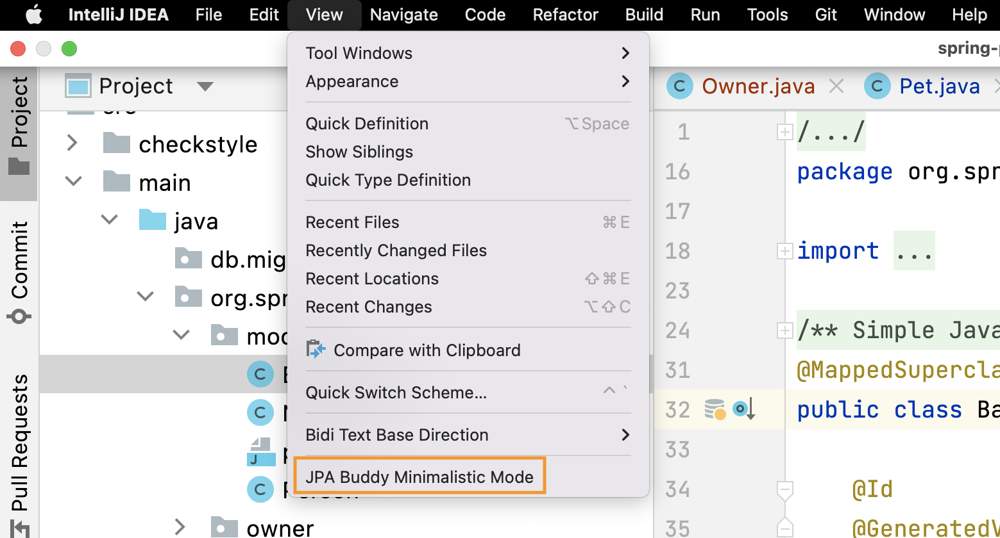
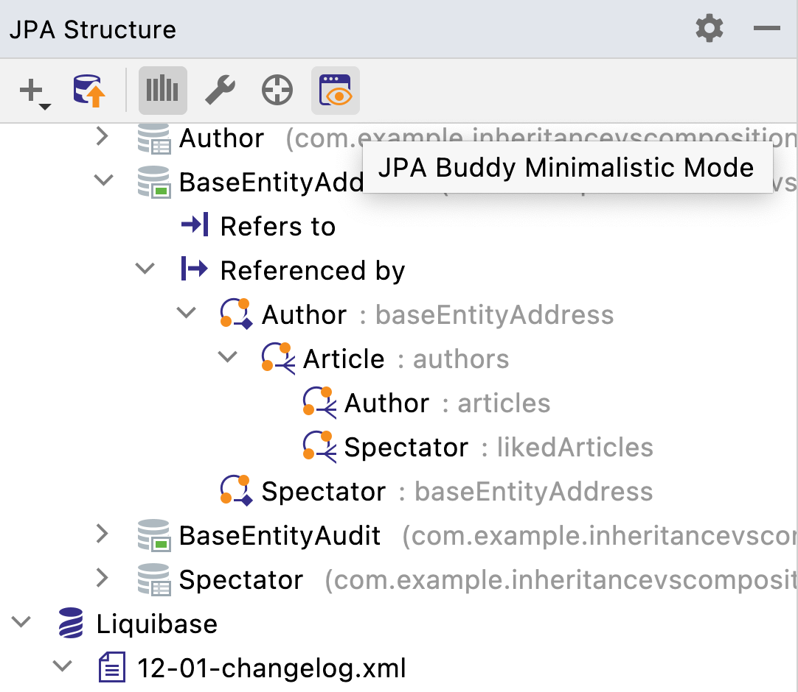
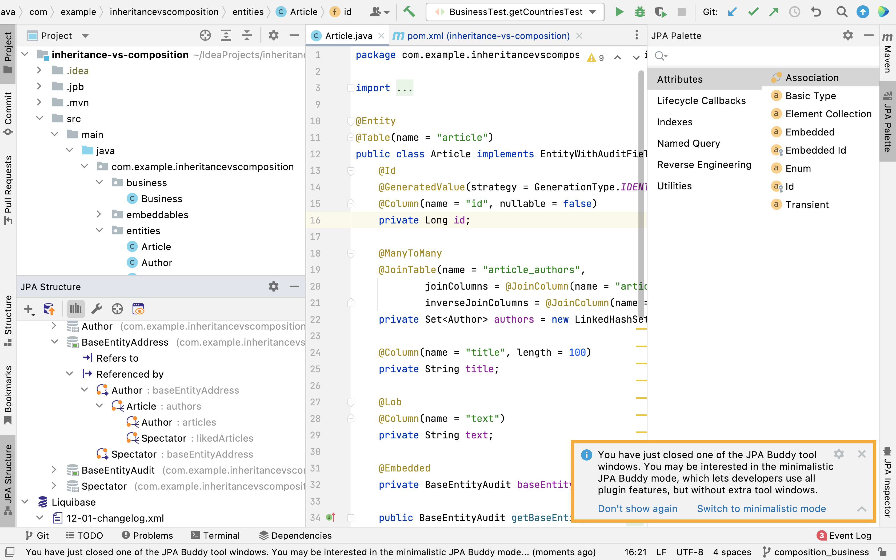
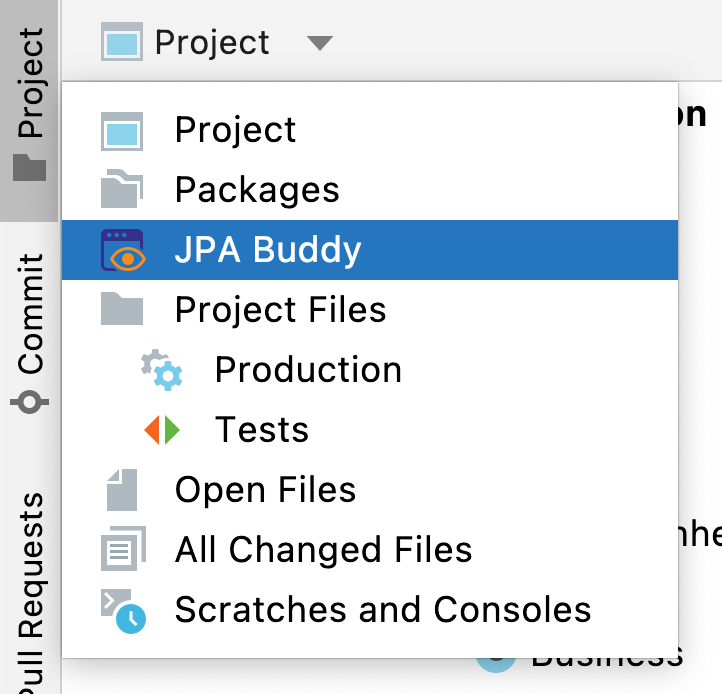
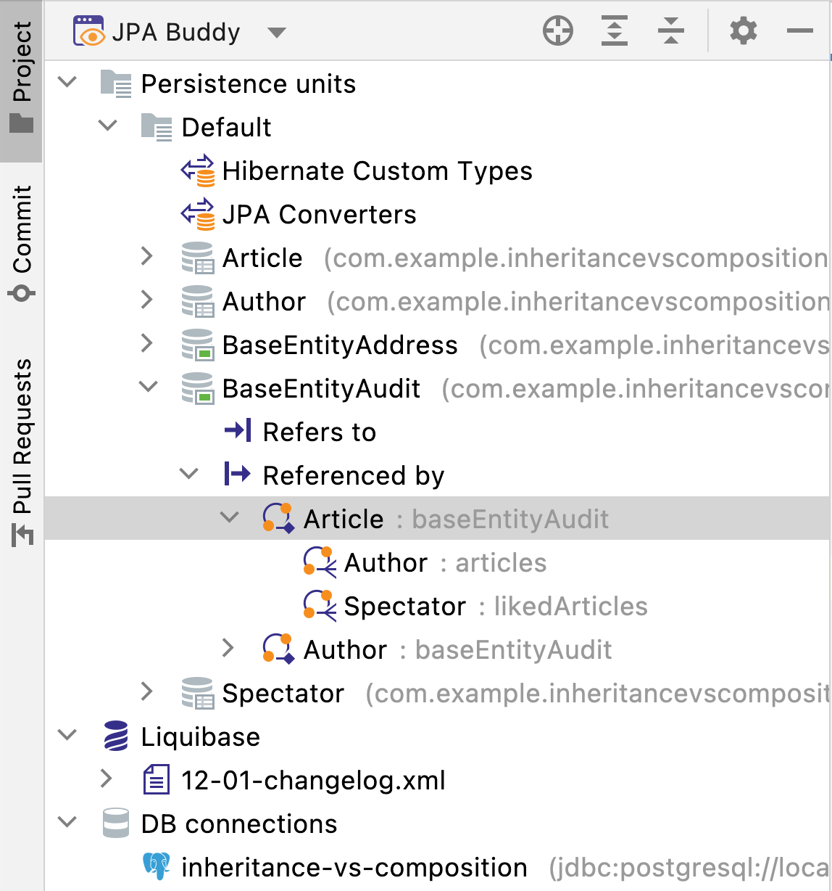
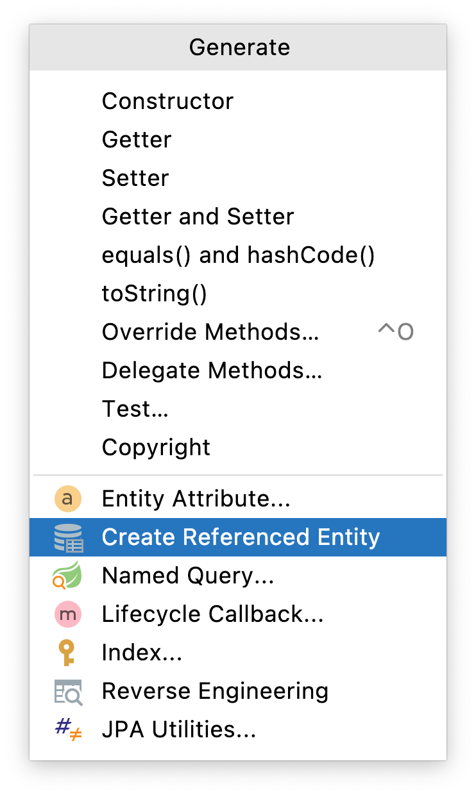
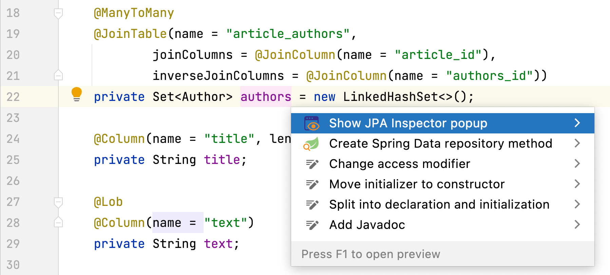
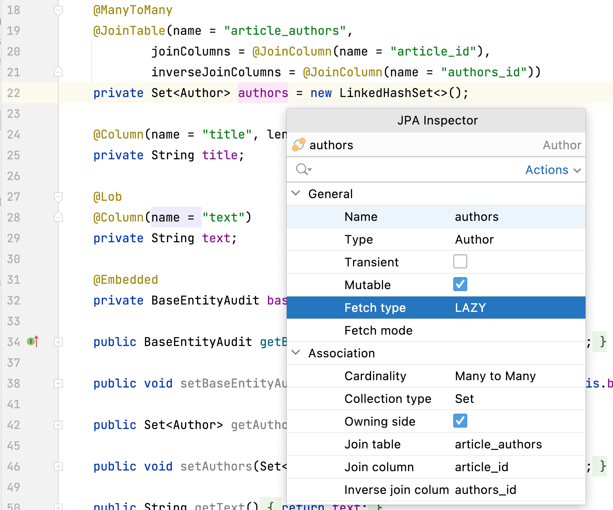
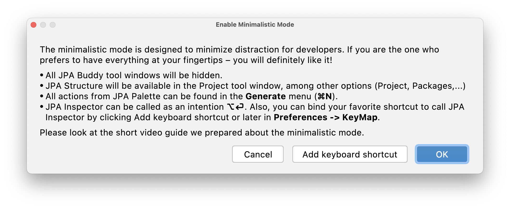
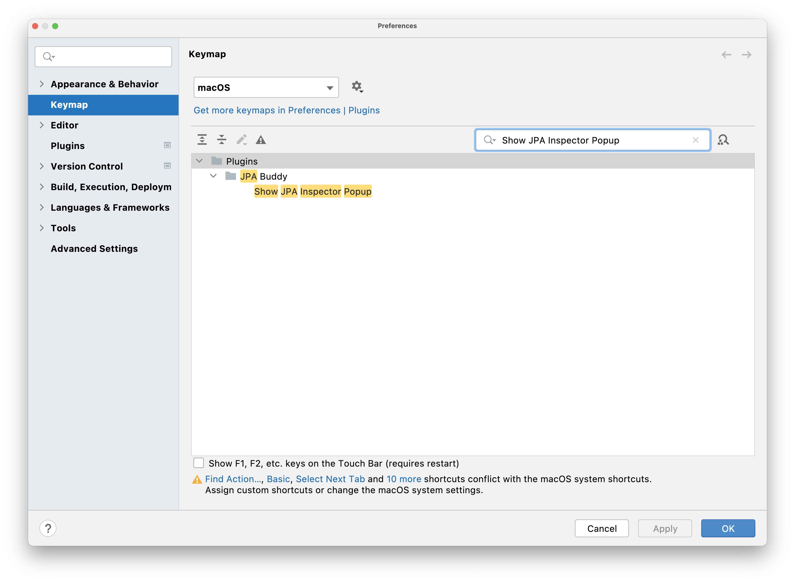

The minimalistic mode is designed to minimize distraction for developers. If you are the one who prefers to have everything at your fingertips – you will like it! All JPA Buddy panels will be hidden and its content will be available in standard IntelliJ IDEA windows, such as Project panel, Generate Menu and so on... 

## Enabling Minimalistic Mode 

There are three ways to activate the minimalistic mode. 

### Via Main Menu 

To enable or disable minimalistic mode, open "View" in the Toolbar window and click on the toggle button "JPA Buddy Minimalistic Mode". Note that all panels will be removed from the sides. You need to click the same button again to bring them back. 

### Via JPA Structure 

Another way to activate minimalistic mode is to click on the "JPA Buddy Minimalistic Mode" button in the JPA Structure. 

### Hide Panels

Since you minimize one of the JPA Buddy panels, it will show a popup message with the suggestion to activate the minimalistic mode. 

## Using Features in the Minimalistic View 

### JPA Structure 

Since one of the primary purposes of [JPA Structure](https://www.jpa-buddy.com/documentation/entity-designer/#jpa-structure) panel is to provide a comprehensive data-centric view of the project, it will be available in the Project panel. You can select it from the drop-down list. 

### JPA Palette 

To utilize wizards from [JPA Palette](https://www.jpa-buddy.com/documentation/entity-designer/#jpa-palette ), you need to call Generate Menu (⌘+N/Alt+Insert). The subsequent interaction with them does not differ from what is described in the section about JPA Palette. 

### JPA Inspector 

[JPA Inspector](https://www.jpa-buddy.com/documentation/entity-designer/#jpa-inspector) allows you to configure classes and fields in it. Press (⌥+⏎/Alt+Enter) on any element that you need to configure, and select "how JPA Inspector popup".

After that, the resizable and draggable JPA Inspector panel will appear. The cool thing is that you can navigate through it and change anything using the mouse or only the keyboard: 

- To move through the lines, use the up (↑) and down (↓) buttons. 
- To change the value in the selected row, press the space bar (⎵) twice. 
- To close JPA Inspector, click the Esc button. 

#### Custom Shortcuts

For JPA Inspector popup, it's possible to bind another shortcut. You can do it directly from the "Enable Minimalistic Mode" window, by clicking on the "Add keyboard shortcut": 

or via preferences. Open Preferences -> Keymap -> type JPA Inspector Popup and set wanted combination. 

