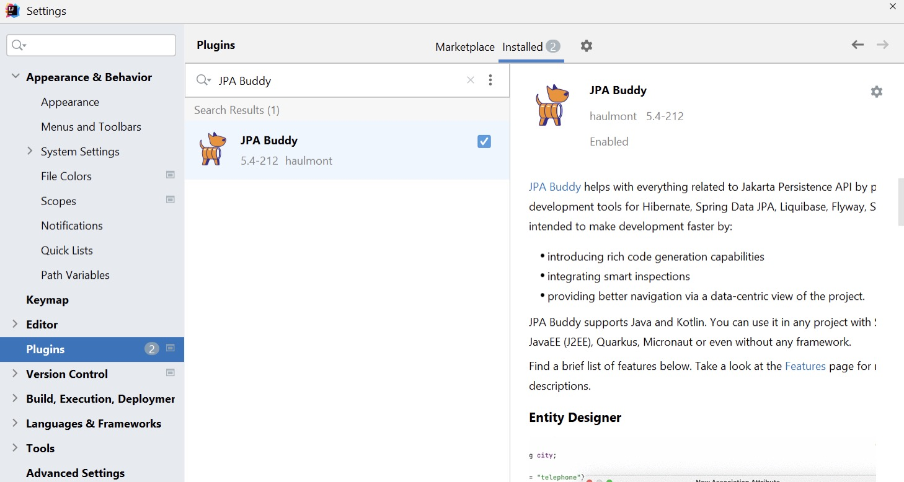
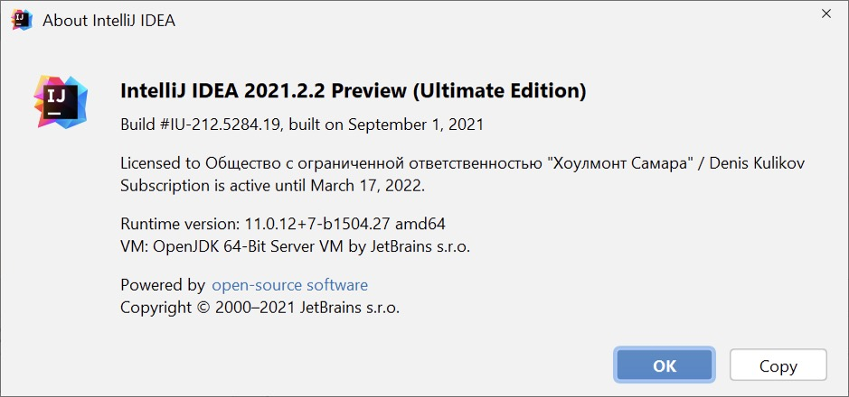
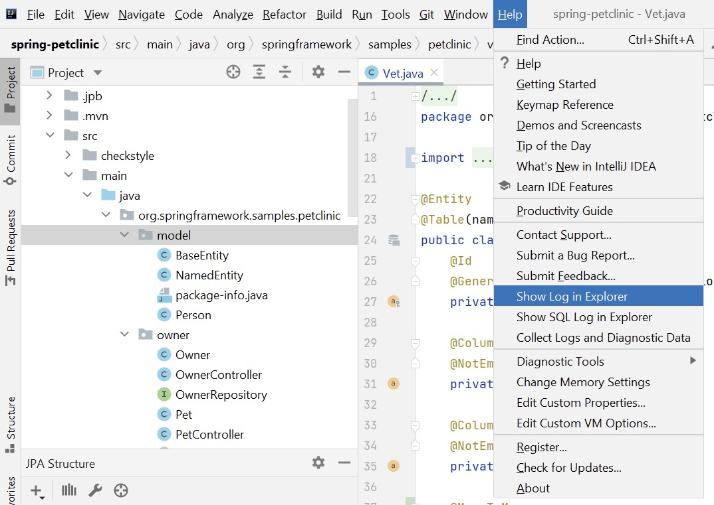

## Contact Us 

JPA Buddy keeps evolving, and we need to hear the users. If you have any suggestions or feedback, don't hesitate to share them with us. You can contact us through the following communication channels: 

- [Website form](https://www.jpa-buddy.com/contacts/) 
- [Discord channel](https://discord.com/invite/DxRDQPk9rh) 
- [Twitter page](https://twitter.com/JPABuddy) 

- [JetBrains Marketplace](https://plugins.jetbrains.com/plugin/15075-jpa-buddy/reviews) 

## Error Reporting 

Unfortunately, there is no escape from bugs and errors. Sometimes they can happen through our fault, and sometimes not. We do our best to catch and fix as many as we can, but some do slip through. To simplify the reporting process, we have added a mechanism for reporting exceptions directly to us, now it’s as simple as clicking a button: 

<iframe width="560" height="315" src="https://www.youtube.com/embed/OkFBn4s-218" title="YouTube video player" frameborder="0" allow="accelerometer; autoplay; clipboard-write; encrypted-media; gyroscope; picture-in-picture" allowfullscreen></iframe>

*It is important to mention that we don’t gather any sensitive information about your project, such as database credentials, schema, and so on...* 

## Helpful Information 

To speed up the process of solving the problem that has arisen, we need to know: 

- Plugin version. File -> Settings -> Plugins. For example, in the picture below, the installed JPA Buddy version is 5.4-212 
- IntelliJ IDEA version. Help -> About -> Copy. 
- If something goes entirely in an unpredictable way and the error reporting mechanism with stake trace did not appear, a log file would be very useful. You can find it in Help -> Show Log in Explorer (or Finder if you use macOS). 
- The order of actions that must be done to reproduce the problem. 

## Issue Tracker 

After discovering a new bug, suggestions to implement a new feature, or improvements, we create tickets on [YouTrack](https://issues.jpa-buddy.com/issues/JPAB). You can always view the priority of the issue and the execution status. 

