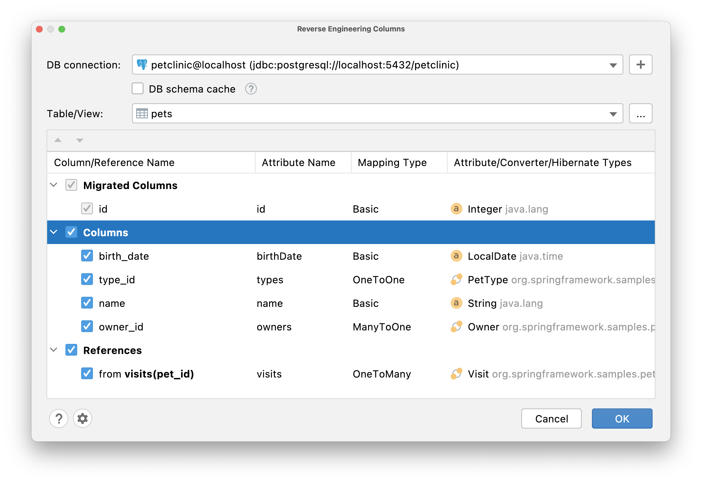

## Basics

JPA Buddy allows you to granularly pick tables and fields from your database and get them as JPA entities: 

<div class="youtube" align="center">
<iframe width="560" height="315" src="https://www.youtube.com/embed/az9ghvGczys" title="YouTube video player" frameborder="0" allow="accelerometer; autoplay; clipboard-write; encrypted-media; gyroscope; picture-in-picture" allowfullscreen></iframe>
</div>

The first thing you need to do to use the reverse engineering features is to create a DB connection. The correct way to do it and possible issues are described in the separate [documentation](https://www.jpa-buddy.com/documentation/database-connections/). Check it out to learn more. 

In the IntelliJ IDEA Community Edition, you can generate entities from DB via JPA Structure: 


In the IntelliJ IDEA Ultimate Edition, you can generate entities from DB via JPA Structure and from the Database panel: 


The “New Entity” window allows you to select the table, set class name, define parent, and configure source root and package name. 


## Migrating Attributes 

After entity configuration, it's time to configure the attributes. Here you can choose which attributes you want to add and change all their params, except "Column Name". Mapping type and attribute/converter/hibernate types are represented as drop-down lists.

All attributes are divided into 3 categories:

* **Migrated Columns** - the ones already presented in the entity

* **Columns** - new, not mapped in the entity or parent @MappedSuperclass yet
* **References** - optional associations that are not represented as a column in the observing table



### Migrating Associations 

For the entity that have associations, JPA Buddy will create corresponding entities as well. The only thing left to do is to reverse engineering columns via JPA Palette. 


<div class="youtube" align="center">
<iframe width="560" height="315" src="https://www.youtube.com/embed/rHwSM08jUuA" title="YouTube video player" frameborder="0" allow="accelerometer; autoplay; clipboard-write; encrypted-media; gyroscope; picture-in-picture" allowfullscreen></iframe>
</div>
### Smart References Detection

JPA Buddy deeply understands your model. In certain cases, it's able to properly detect cardinality: `@`OneToOne, `@`OneToMany, `@`ManyToOne, `@`ManyToMany. The coolest thing is that JPA Buddy can show references for which there are no columns in the current table. 

<div class="youtube" align="center">
<iframe width="560" height="315" src="https://www.youtube.com/embed/VYdpesbhND4" title="YouTube video player" frameborder="0" allow="accelerometer; autoplay; clipboard-write; encrypted-media; gyroscope; picture-in-picture" allowfullscreen></iframe>
</div>
Let's look more precisely at each of these cases.

<div class="note">If the table has a composite primary key, JPA Buddy will generate `@`JoinColumns annotation with multiple columns presented in it, instead of simple `@`JoinColumn.</div>

#### @OneToOne

There are two situations when we know for 100% that the cardinality of the relation is exactly `@`OneToOne:

1) Table has a column with the unique constraint that refers to the primary key of another table
2) Primary key of the table is a foreign key

Situation №1:

```sql
CREATE TABLE profiles
(
    id        BIGINT GENERATED BY DEFAULT AS IDENTITY NOT NULL,
    join_date date,
  	user_id BIGINT,
    status    VARCHAR(255),
    bio       VARCHAR(255),
    CONSTRAINT pk_profiles PRIMARY KEY (id)
);

CREATE TABLE users
(
    id         BIGINT GENERATED BY DEFAULT AS IDENTITY NOT NULL,
    last_name  VARCHAR(255),
    first_name VARCHAR(255),
    CONSTRAINT pk_users PRIMARY KEY (id)
);

ALTER TABLE profiles
    ADD CONSTRAINT uc_profiles_user UNIQUE (user_id);

ALTER TABLE profiles
    ADD CONSTRAINT FK_PROFILES_ON_USER FOREIGN KEY (user_id) REFERENCES users (id);
```


JPA Buddy will generate `@`OneToOne association with `@`JoinColumn annotation in the User entity, and  `@`OneToOne association with `mappedBy` parameter in the Profile entity:

```java
@Entity
@Table(name = "users")
public class User {
	@Id
	@GeneratedValue(strategy = GenerationType.IDENTITY)
	@Column(name = "id", nullable = false)
	private Long id;

	@OneToOne(fetch = FetchType.LAZY)
	@JoinColumn(name = "profile_id")
	private Profile profile;
}

@Entity
@Table(name = "profiles")
public class Profile {
	@Id
	@GeneratedValue(strategy = GenerationType.IDENTITY)
	@Column(name = "id", nullable = false)
	private Long id;

	@OneToOne(fetch = FetchType.LAZY, mappedBy = "profile")
	private User users;
}
```


Situation №2:

```sql
CREATE TABLE users
(
    id         BIGINT GENERATED BY DEFAULT AS IDENTITY NOT NULL,
    last_name  VARCHAR(255),
    first_name VARCHAR(255),
    CONSTRAINT pk_users PRIMARY KEY (id)
);

CREATE TABLE profiles
(
    user_id   BIGINT NOT NULL,
    status    VARCHAR(255),
    bio       VARCHAR(255),
    join_date date,
    CONSTRAINT pk_profiles PRIMARY KEY (user_id)
);

ALTER TABLE profiles
    ADD CONSTRAINT FK_PROFILES_ON_USER FOREIGN KEY (user_id) REFERENCES users (id);
```


 

Since `@`Id should not be a persistence entity, JPA Buddy will generate:

* `id` attribute of basic type and mark it with `@`Id annotation
* `users` `@`OneToOne association and mark it with `@`MapsId annotation

```java
@Entity
@Table(name = "profiles")
public class Profile {
	@Id
	@Column(name = "user_id", nullable = false)
	private Long id;

	@MapsId
	@OneToOne(fetch = FetchType.LAZY, optional = false)
	@JoinColumn(name = "user_id", nullable = false)
	private User users;

	//...
}

@Entity
@Table(name = "users")
public class User {
	@Id
	@GeneratedValue(strategy = GenerationType.IDENTITY)
	@Column(name = "id", nullable = false)
	private Long id;

	@OneToOne(fetch = FetchType.LAZY, mappedBy = "user")
	private Profile profiles;

	//...
}
```

#### @OneToMany & @ManyToOne

If a table has the column that refers to the primary key of another table, it is highly likely `@`ManyToOne association. But you are also able to change cardinality to `@`OneToOne if required. So, depending on which table you call the reverse engineering action, JPA Buddy will detect mapping type as  `@`OneToMany or  `@`ManyToOne:

```sql
CREATE TABLE users
(
    id         BIGINT GENERATED BY DEFAULT AS IDENTITY NOT NULL,
    last_name  VARCHAR(255),
    first_name VARCHAR(255),
    CONSTRAINT pk_users PRIMARY KEY (id)
);

CREATE TABLE profiles
(
    id        BIGINT GENERATED BY DEFAULT AS IDENTITY NOT NULL,
    join_date date,
    status    VARCHAR(255),
    bio       VARCHAR(255),
    user_id   BIGINT,
    CONSTRAINT pk_profiles PRIMARY KEY (id)
);

ALTER TABLE profiles
    ADD CONSTRAINT FK_PROFILES_ON_USER FOREIGN KEY (user_id) REFERENCES users (id);
```


JPA Buddy will generate the following code:

```java
@Entity
@Table(name = "users")
public class User {
	@Id
	@GeneratedValue(strategy = GenerationType.IDENTITY)
	@Column(name = "id", nullable = false)
	private Long id;

	@OneToMany(mappedBy = "user")
	private Set<Profile> profiles = new LinkedHashSet<>();

	//...
}

@Entity
@Table(name = "profiles")
public class Profile {
	@Id
	@GeneratedValue(strategy = GenerationType.IDENTITY)
	@Column(name = "id", nullable = false)
	private Long id;

	@ManyToOne(fetch = FetchType.LAZY)
	@JoinColumn(name = "user_id")
	private User user;

	//...
}
```

#### @ManyToMany

To establish a many-to-many relationship between two tables, you need to use a junction table. The junction table, in this case, contains only two columns - foreign keys. Since JPA Buddy found such a table, it can say that the relation cardinality between two tables whose ids are represented in the junction table as foreign keys is `@`ManyToMany.

```sql
CREATE TABLE users
(
  id         BIGINT GENERATED BY DEFAULT AS IDENTITY NOT NULL,
  last_name  VARCHAR(255),
  first_name VARCHAR(255),
  CONSTRAINT pk_users PRIMARY KEY (id)
);

CREATE TABLE profiles
(
  id        BIGINT GENERATED BY DEFAULT AS IDENTITY NOT NULL,
  join_date date,
  status    VARCHAR(255),
  bio       VARCHAR(255),
  CONSTRAINT pk_profiles PRIMARY KEY (id)
);

CREATE TABLE profiles_users
(
    profile_id BIGINT NOT NULL,
    users_id   BIGINT NOT NULL,
    CONSTRAINT pk_profiles_users PRIMARY KEY (profile_id, users_id)
);

ALTER TABLE profiles_users
    ADD CONSTRAINT fk_prouse_on_profile FOREIGN KEY (profile_id) REFERENCES profiles (id);

ALTER TABLE profiles_users
    ADD CONSTRAINT fk_prouse_on_user FOREIGN KEY (users_id) REFERENCES users (id);
```


If this association does not exist in any of the entities, JPA Buddy will generate it in the entity for which the reverse engineering action was called.

```java
@Entity
@Table(name = "users")
public class User {
   @Id
   @GeneratedValue(strategy = GenerationType.IDENTITY)
   @Column(name = "id", nullable = false)
   private Long id;

   @ManyToMany
   @JoinTable(name = "profiles_users",
      joinColumns = @JoinColumn(name = "users_id"),
      inverseJoinColumns = @JoinColumn(name = "profile_id"))
   private Set<Profile> profiles = new LinkedHashSet<>();

   //...
}
```

If this association already exists in one of the entities, then JPA Buddy will generate the `@`ManyToMany attribute with the `mappedBy` parameter.

```java
@Entity
@Table(name = "profiles")
public class Profile {
   @Id
   @GeneratedValue(strategy = GenerationType.IDENTITY)
   @Column(name = "id", nullable = false)
   private Long id;

   @ManyToMany(mappedBy = "profiles")
   private Set<User> users = new LinkedHashSet<>();
   
   //...
}
```

### Types 

#### Creating Enums 

For those attributes that match String or Integer type, you can change the mapping type from Basic to Enum, and JPA Buddy will create the corresponding Enum class in the project, which will need to be filled in with values manually. 


#### Dealing With Unknown Types 

For some SQL types, there is no exact match to Java classes. In this case, JPA Buddy does not set the type so as not to generate non-working code. You will need to choose the attribute type yourself. You can also configure default type mappings for each DBMS in the [settings](#type-mappings). 

At the same time, some of the unsupported SQL types can be mapped via the [HibernateTypes](https://github.com/vladmihalcea/hibernate-types) library. And if you have it in your project, JPA Buddy finds suitable types and automatically suggests them during reverse engineering: 

<div class="youtube" align="center">
<iframe width="560" height="315" src="https://www.youtube.com/embed/uBjxdAmVDuI" title="YouTube video player" frameborder="0" allow="accelerometer; autoplay; clipboard-write; encrypted-media; gyroscope; picture-in-picture" allowfullscreen></iframe>
</div>

### Adding Attributes to Existing Entities 

During development, new columns can be added directly to the database table. JPA Buddy determines which columns already have the appropriate attributes and which do not. To add attributes to the existing entity, choose Columns action in the Reverse Engineering section in JPA Palette.  


After that, the Reverse Engineering Columns window will appear with only those attributes that don't exist yet: 


## Map DB Views to JPA Entities

JPA Buddy follows all best practices providing the most efficient mapping for DB views while reverse engineering:  	
1. DB views do not have primary keys. Hence, JPA Buddy allows selecting a field or (often) a set of fields that can play the role of identifier for the target entity. 
2. Most of the DB views are immutable. So, JPA Buddy adds @Immutable annotation to the entity and generates only getters. And this will help to win a few points in the application performance.  	
3. Entities representing DB views can only come from the database. To ensure developers don't create new instances in the business logic, JPA Buddy generates only a protected constructor with no parameters for the entity to meet the JPA specifications.

<div class="youtube" align="center">
<iframe width="560" height="315" src="https://www.youtube.com/embed/QUXgJSkBJO8" title="YouTube video player" frameborder="0" allow="accelerometer; autoplay; clipboard-write; encrypted-media; gyroscope; picture-in-picture" allowfullscreen></iframe>
</div>
## Working With Remote DB 

The larger the database and the slower the connection of the database (for example, if it is remote DB), the longer it will take to load DB schema. For better usability, JPA Buddy provides a DB schema cache. Once you enable it (1), a snapshot file will be created for the selected DB in the temporary directory. Otherwise, the DB schema will be loaded from the DB on each reverse engineering use. When you need it, you can refresh saved schema cache (2). 


## Settings

### Fetch Type

To follow best practices and don't cause performance issues, JPA Buddy sets `FetchType.LAZY` for  `@`OneToOne and `@`ManyToOne associations by default. But you can change the default value in any time. Open Preferences -> Tools -> JPA Buddy -> Reverse Engineering:


### Type Mappings

When the application works with several DBMSs, your schema might have slightly different data types for each of them. 

Let’s say the application needs to support both PostgreSQL and MS SQL. And you want to store Unicode characters in your strings. PostgreSQL supports Unicode chars in VARCHAR, but MS SQL has a separate NVARCHAR data type for it. 

JPA Buddy lets you specify type mappings for each DBMS. It is also possible to set mappings for JPA Converters and Hibernate Types: 


