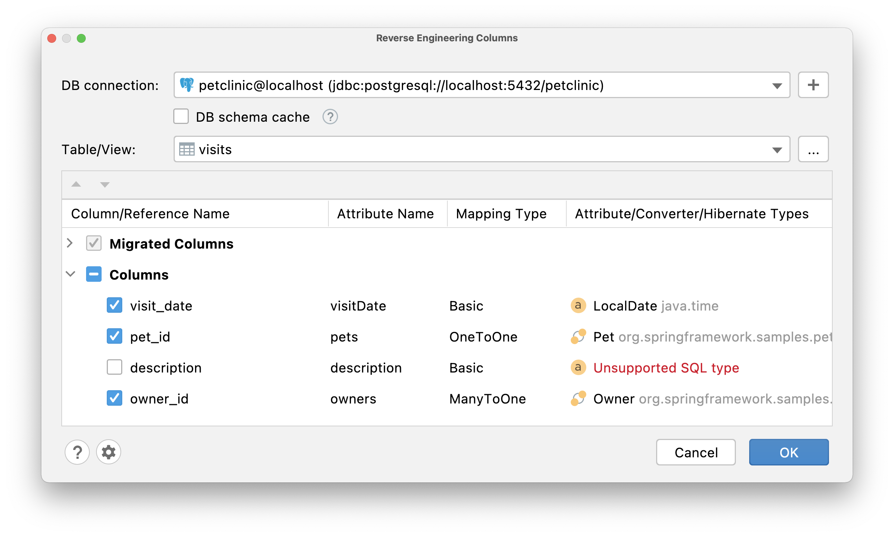
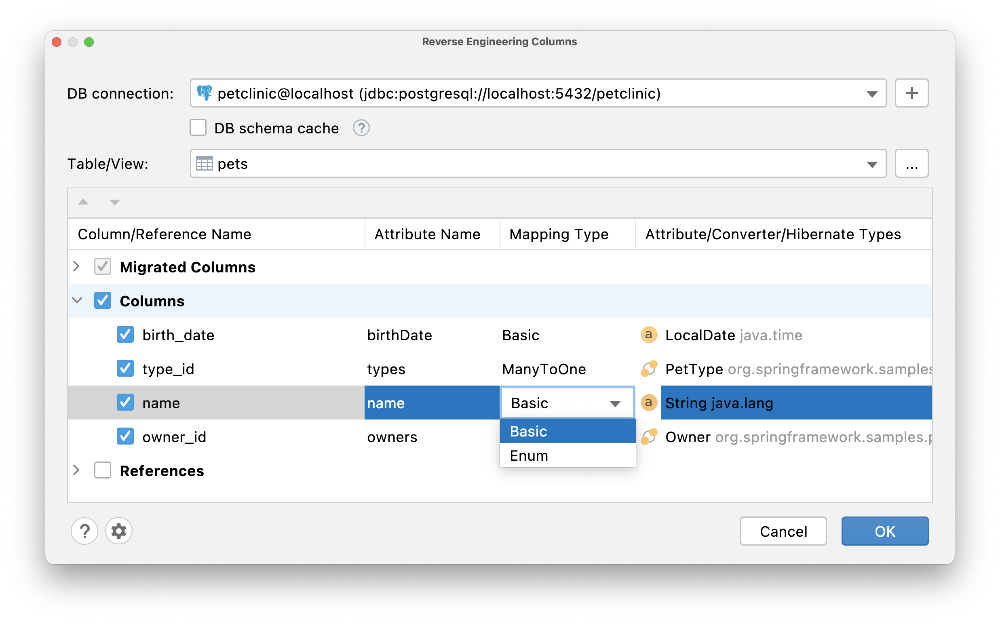

## Basics

JPA Buddy allows you to granularly pick tables and fields from your database and get them as JPA entities: 

<iframe width="560" height="315" src="https://www.youtube.com/embed/az9ghvGczys" title="YouTube video player" frameborder="0" allow="accelerometer; autoplay; clipboard-write; encrypted-media; gyroscope; picture-in-picture" allowfullscreen></iframe>

The first thing you need to do to use the reverse engineering features is to create a DB connection. The correct way to do it and possible issues are described in the separate [documentation](../database-connections/database-connections.md). Check it out to learn more. 

In the IntelliJ IDEA Community Edition, you can generate entities from DB via JPA Structure: 

In the IntelliJ IDEA Ultimate Edition, you can generate entities from DB via JPA Structure and from the Database panel: 

The “New Entity” window allows you to select the table, set class name, define parent, and configure source root and package name. 

## Migrating Attributes 

After entity configuration, it's time to configure the attributes. Here you can choose which attributes you want to add and change all their params, except "Column Name". Mapping type and attribute/converter/hibernate types are represented as drop-down lists.  

### Migrating Associations 

For the entity that have associations, JPA Buddy will create corresponding entities as well. The only thing left to do is to reverse engineering columns via JPA Palette. 

*NOTE: There is no way to determine how exactly to relate one entity to another: OneToOne or ManyToOne. By default, JPA Buddy sets ManyToOne.* 

<iframe width="560" height="315" src="https://www.youtube.com/embed/rHwSM08jUuA" title="YouTube video player" frameborder="0" allow="accelerometer; autoplay; clipboard-write; encrypted-media; gyroscope; picture-in-picture" allowfullscreen></iframe>

### Types 

#### Creating Enums 

For those attributes that match String or Integer type, you can change the mapping type from Basic to Enum, and JPA Buddy will create the corresponding Enum class in the project, which will need to be filled in with values manually. 

#### Dealing With Unknown Types 

For some SQL types, there is no exact match to Java classes. In this case, JPA Buddy does not set the type so as not to generate non-working code. You will need to choose the attribute type yourself. You can also configure default type mappings for each DBMS in the [settings](#type-mappings). 

At the same time, some of the unsupported SQL types can be mapped via the [HibernateTypes](https://github.com/vladmihalcea/hibernate-types) library. And if you have it in your project, JPA Buddy finds suitable types and automatically suggests them during reverse engineering: 

<iframe width="560" height="315" src="https://www.youtube.com/embed/uBjxdAmVDuI" title="YouTube video player" frameborder="0" allow="accelerometer; autoplay; clipboard-write; encrypted-media; gyroscope; picture-in-picture" allowfullscreen></iframe>

### Adding Attributes to Existing Entities 

During development, new columns can be added directly to the database table. JPA Buddy determines which columns already have the appropriate attributes and which do not. To add attributes to the existing entity, choose Columns action in the Reverse Engineering section in JPA Palette.  

After that, the Reverse Engineering Columns window will appear with only those attributes that don't exist yet: 

## Type Mappings 

When the application works with several DBMSs, your schema might have slightly different data types for each of them. 

Let’s say the application needs to support both PostgreSQL and MS SQL. And you want to store Unicode characters in your strings. PostgreSQL supports Unicode chars in VARCHAR, but MS SQL has a separate NVARCHAR data type for it. 

JPA Buddy lets you specify type mappings for each DBMS. It is also possible to set mappings for JPA Converters and Hibernate Types: 

## Working With Remote DB 

The larger the database and the slower the connection of the database (for example, if it is remote DB), the longer it will take to load DB schema. For better usability, JPA Buddy provides a DB schema cache. Once you enable it (1), a snapshot file will be created for the selected DB in the temporary directory. Otherwise, the DB schema will be loaded from the DB on each reverse engineering use. When you need it, you can refresh saved schema cache (2). 

