## Introduction

[Spring Data JPA](https://spring.io/projects/spring-data-jpa) is part of the larger Spring Data family that makes it easy to implement JPA-based repositories quickly. JPA Buddy provides a clear UI for generating repositories, projections, queries, etc., for both Java and Kotlin entities. To enable those features, your project should contain dependencies mentioned in the [Installation Guide](https://www.jpa-buddy.com/documentation/).

## Repository Creation

JPA Buddy provides various ways to create repositories to make working with JPA-related objects more convenient for most users. All possible ways to generate repositories in the project are shown in the following video:

<div class="youtube" align="center">
<iframe width="560" height="315" src="https://www.youtube.com/embed/8pHsZ_HvbXs" title="YouTube video player" frameborder="0" allow="accelerometer; autoplay; clipboard-write; encrypted-media; gyroscope; picture-in-picture" allowfullscreen></iframe>
</div>

In the New JPA Repository window, you can set:

- Entity, which the repository will be created for
- Class name
- Parent class for the repository. It can be:
  - Repository from [org.springframework.data.repository](https://docs.spring.io/spring-data/jpa/docs/current/reference/html/#jpa.repositories) package
  - Repository from your project
- Whether the repository will extend [JpaSpecificationExecutor](https://docs.spring.io/spring-data/jpa/docs/current/reference/html/#specifications) or not
- Source root
- Package

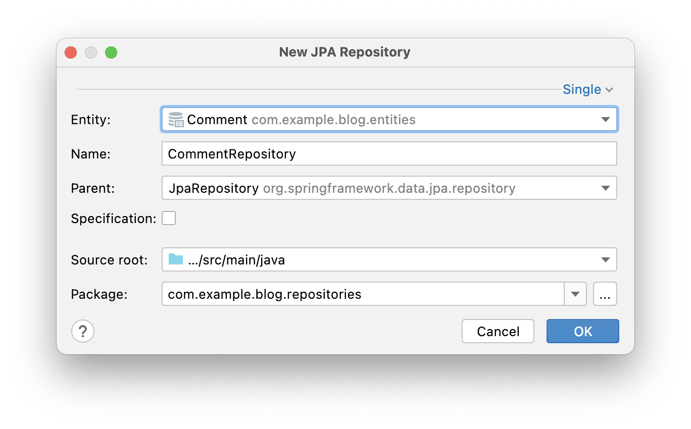

When we have a lot of entities, creating Spring Data repositories one by one becomes a tedious job. With JPA Buddy, you can speed up this process. To create repositories for JPA entities, you need to take three steps. Select entities in the project tree, invoke the JPA Buddy wizard, then adjust your selection. That's it! Look how this feature can speed up the development process:

<div class="youtube" align="center">
<iframe width="560" height="315" src="https://www.youtube.com/embed/nSusI0dq7nQ " title="YouTube video player" frameborder="0" allow="accelerometer; autoplay; clipboard-write; encrypted-media; gyroscope; picture-in-picture" allowfullscreen></iframe>
</div>

## JPA Structure Repositories

For the most efficient navigation in the project, JPA Buddy groups all repositories for each entity. It doesn't matter if the repositories for the entity are located in different or in the same project package. All repositories related to the entity will be displayed in the "Repositories" section. From here, you can quickly move to the repository implementation or create a new one.

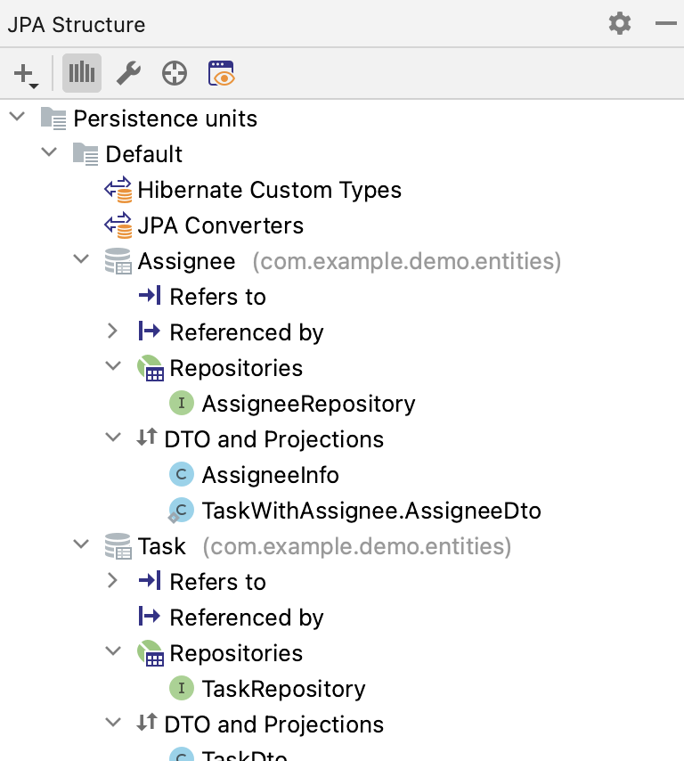

## Queries/Methods Generation

Spring Data provides the ability to define a query with the `@Query` annotation. You can use JPA Palette or Editor Toolbar to write them quickly and without any typos. Choose one of the following types of queries and configure them with the convenient UI.

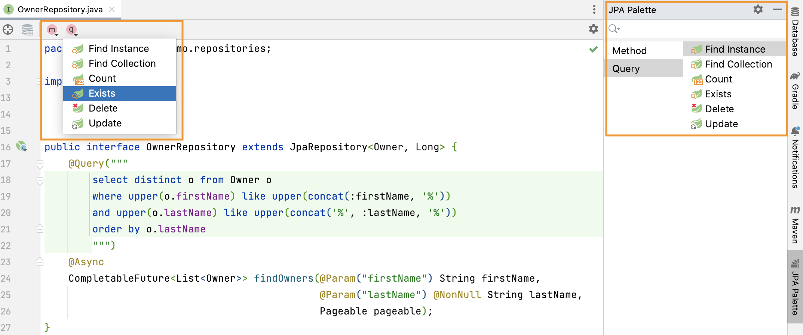

### Example

<div class="note">All that we will consider in the example below can be generated as `@Query` and as a derived query method. The only difference is that for the derived query method, you can't specify its name because it will be generated automatically according to [Naming Conventions for Query.](https://docs.spring.io/spring-data/jpa/docs/current/reference/html/#jpa.query-methods.query-creation)
</div>

Let's look at an example of creating a Find Collection Query.

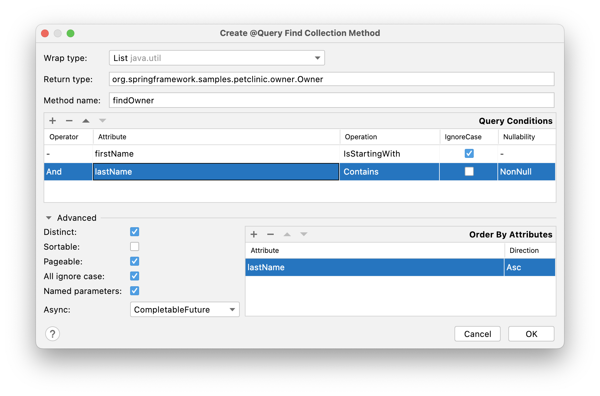

At the top of the window, you can define wrap type for collection and query return type. Moreover, JPA Buddy allows you to generate new [Projection interface](https://www.jpa-buddy.com/documentation/spring-data/#projection-creation) or [DTO class](https://www.jpa-buddy.com/documentation/dto-generator/) right from this window (just click on the `+` button).

You can also specify the method name. Still, if you rest it empty, the name will be generated automatically following [Naming Conventions for Query.](https://docs.spring.io/spring-data/jpa/docs/current/reference/html/#jpa.query-methods.query-creation)

The middle of the window contains the table for the query conditions.

At the bottom of the window, you can specify:

* whether the parameters will be named or not;
* whether to use `Pageable` parameter or not;
* and so on.

Finally, you can specify fields by which the query result will be ordered.

For the above configuration, the following query will be generated:

```java
@Query("""
        select distinct o from Owner o
        where upper(o.firstName) like upper(concat(:firstName, '%'))
        and upper(o.lastName) like upper(concat('%', :lastName, '%'))
        order by o.lastName
        """)
    @Async
    CompletableFuture<List<Owner>> findOwners(@Param("firstName") String firstName,
                                              @Param("lastName") @NonNull String lastName,
                                              Pageable pageable);
```

### Entity Intention

JPA Buddy also provides intention on the entity attributes leading directly to the query/method creation window. Place the cursor on the desired attribute, press Alt+Enter (or Opt+Enter on Mac), and click on the Create Spring Data repository method. In the opened window, choose the required type of query/method.

<div class="youtube" align="center">
<iframe width="560" height="315" src="https://www.youtube.com/embed/mevqm5DzGRs" title="YouTube video player" frameborder="0" allow="accelerometer; autoplay; clipboard-write; encrypted-media; gyroscope; picture-in-picture" allowfullscreen></iframe>
</div>

### Unresolved Reference

Some developers prefer to declare a call to the method that doesn't exist yet first and only then implement it. JPA Buddy will help those developers who adhere to this programming style. Just write the desired signature and move to the query or method creation wizard via special actions:

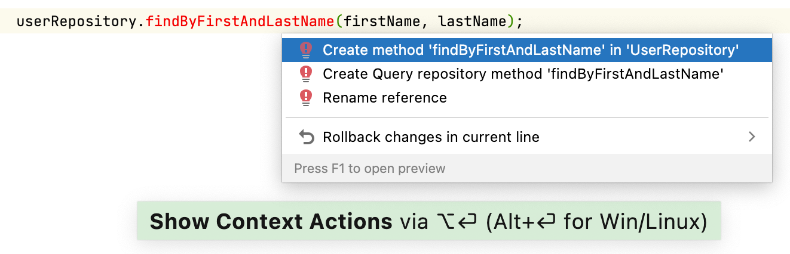

### Settings

Spring Data provides several keyword expressions for derived query method names. You can use NameContaining, NameIsContaining, or NameContains - the result is the same. On the one hand, it gives us some flexibility in methods naming. On the other hand, in big teams, different naming for the same actions may be confusing for code reviewers and maintainers. If you have naming standards established for the development team, you can configure JPA Buddy to use only approved keywords for method names generation:

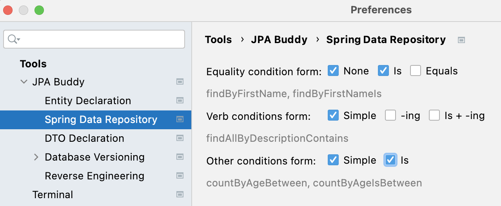

## JPA Inspector

Since JPA Inspector is a context-dependent panel intended to modify already existing code, let’s consider the scope related to methods and queries. Once you place a cursor on the method or query you can configure the result, signature, query options, and string.

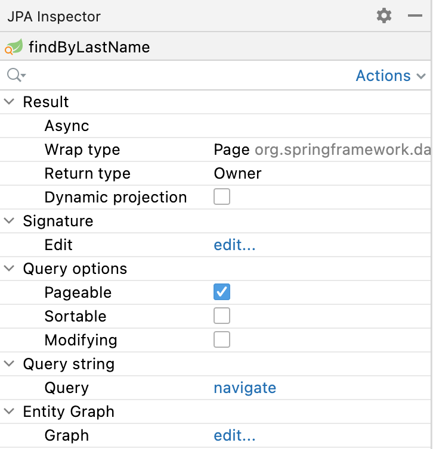

### EntityGraph Support

The EntityGraph feature has been introduced in JPA 2.1, it has been one of the most awaited features for quite a long time. Entity graphs give us another layer of control over data that needs to be fetched. JPA Buddy supports them, so you can build graphs using a handy GUI wizard:

<div class="youtube" align="center">
<iframe width="560" height="315" src="https://www.youtube.com/embed/Duco-QWBXy0" title="YouTube video player" frameborder="0" allow="accelerometer; autoplay; clipboard-write; encrypted-media; gyroscope; picture-in-picture" allowfullscreen></iframe>
</div>
## Query Refactoring

### Async

Spring Data JPA provides the ability to run repository queries asynchronously. The correct way to make asynchronous query is not only to add `@Async` annotation, but also to change the return type to one of the following:

* Future<ClassName>
* CompletableFuture<ClassName>

- ListenableFuture<ClassName>

Learn more about asynchronous query results at the corresponding Spring Data JPA documentation [page](https://docs.spring.io/spring-data/jpa/docs/current/reference/html/#repositories.query-async).

To make query async, place the cursor on the query you want to change and choose the result return type from the drop-down list:

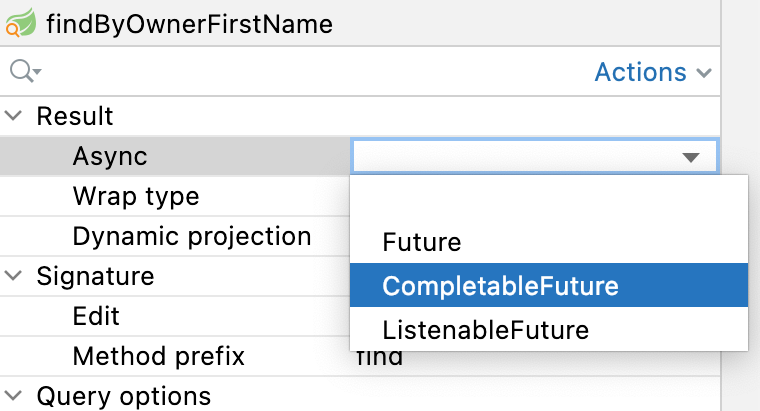

### Dynamic Projection

In Spring Data JPA, projections can also be specified during runtime by using generic repository methods. Add a type class parameter to your repository method to use the same query with different projections. This enables you to define the preferred returned type in your business code.

To make query generic, place the cursor on the query you want to change and check the box “Dynamic projection”.

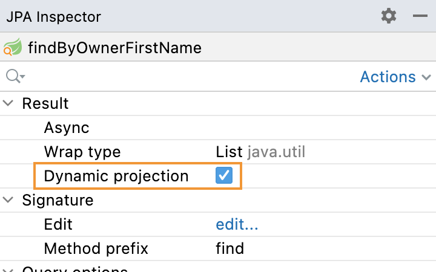

### Query Extracting

Derived query methods are a handy way to define queries. But over time, they may evolve into bulky and unreadable structures you would prefer to transform into neat `@`Query-annotated methods. This can be easily achieved with JPA Buddy. Place the cursor on the query and click on the “Query extract...” in the JPA Inspector.

<div class="youtube" align="center">
<iframe width="560" height="315" src="https://www.youtube.com/embed/lYZielYtVXI" title="YouTube video player" frameborder="0" allow="accelerometer; autoplay; clipboard-write; encrypted-media; gyroscope; picture-in-picture" allowfullscreen></iframe>
</div>

### Query Autocompletion

For the IntelliJ IDEA Community edition, JPA Buddy provides query autocompletion (similar to what IntelliJ IDEA Ultimate Edition provides). Place the cursor on the query and click on the “Query edit...” in the JPA Inspector.

<div class="youtube" align="center">
<iframe width="560" height="315" src="https://www.youtube.com/embed/IQDgQ5_l764" title="YouTube video player" frameborder="0" allow="accelerometer; autoplay; clipboard-write; encrypted-media; gyroscope; picture-in-picture" allowfullscreen></iframe>
</div>

## Projection

Sometimes you only need a subset of columns from a table. In such cases, Spring Data JPA projections come in handy, letting you return only required fields from queries.

<div class="youtube" align="center">
<iframe width="560" height="315" src="https://www.youtube.com/embed/xevxVvu_Hbc" title="YouTube video player" frameborder="0" allow="accelerometer; autoplay; clipboard-write; encrypted-media; gyroscope; picture-in-picture" allowfullscreen></iframe>
</div>

In the "New Spring Projection" window, you can:

- Define source root and package;
- Choose entity class;
- Set a name for a projection class;
- Select the fields you want to include.

Also, JPA Buddy allows you to generate Projections for the referenced entities. Select the associated entity, choose the Projection type, and pick the required fields.

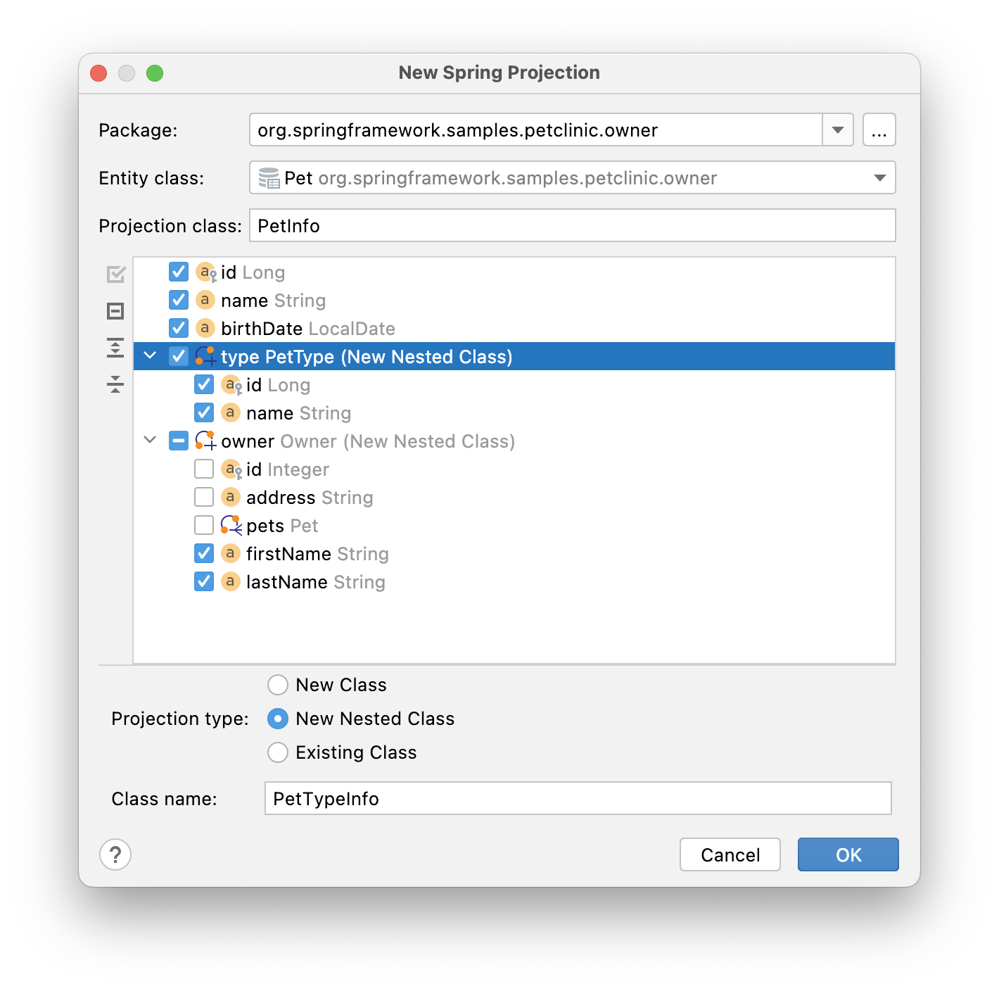

For the above configuration the following projection will be generated:

```java
/**
 * A Projection for the {@link Pet} entity
 */
public interface PetInfo {
	Integer getId();

	String getName();

	LocalDate getBirthDate();

	PetTypeInfo getType();

	OwnerInfo getOwner();

	/**
	 * A Projection for the {@link PetType} entity
	 */
	interface PetTypeInfo {
		Integer getId();

		String getName();
	}

	/**
	 * A Projection for the {@link Owner} entity
	 */
	interface OwnerInfo {
		String getFirstName();

		String getLastName();
	}
}
```

### Projection Declaration Settings

Each project may follow its own conventions for code writing. In the Tools -> JPA Buddy -> Projection Declaration you can configure:

1. Class name postfix.
2. Comment link regexp. This option allows JPA Buddy to associate Projection with its JPA Entity. To specify a placeholder for the target entity FQN (Fully Qualified Name) in a comment use the `(?<entity>.*)` pattern. So, if the regexp is defined as `A Projection for the \{@link (?<entity>.*)\} entity` it will be resolved in the following Javadoc comment:

  ```java
  /**
   * A Projection for the {@link Pet} entity
   */
  ```

  The feature is disabled when the field is empty.
3. Name pattern regexp. This option is useful if you use an obligatory naming convention for Projections. It allows JPA Buddy to associate Projection with its JPA Entity using a Projection name only. To specify a placeholder for the simple class name of the target JPA entity, use the `(?<entity>.)` pattern. E.g., `(?<entity>.*(?:Info|Prj|Projection|VO|Vo|View|Request|Browse)` means that the `MyEntityInfo`, `MyEntityPrj` and etc. classes will be considered as a Projections for `MyEntity`.

  The feature is disabled when the field is empty. 
4. Class comment. Defines the comment that will be generated over the Projection interface.

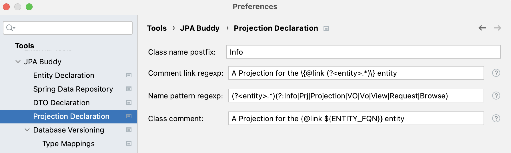

#### Convenient Navigation between Entity and its Projections

As soon as JPA Buddy is able to associate Projection interface with the entity:

- The Projection interface will appear in the **Dto & Projections** section in the JPA Structure panel and in the Editor Toolbar (1)
- The gutter icon will appear in the Projection to ease the navigation to its entity (2)

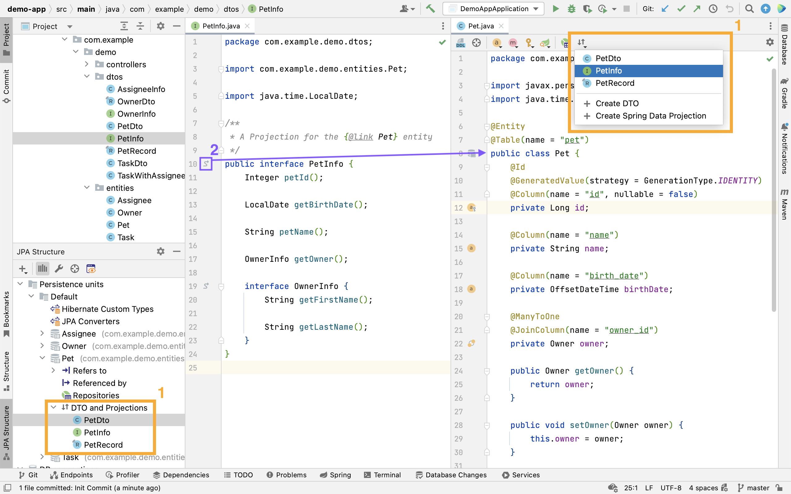