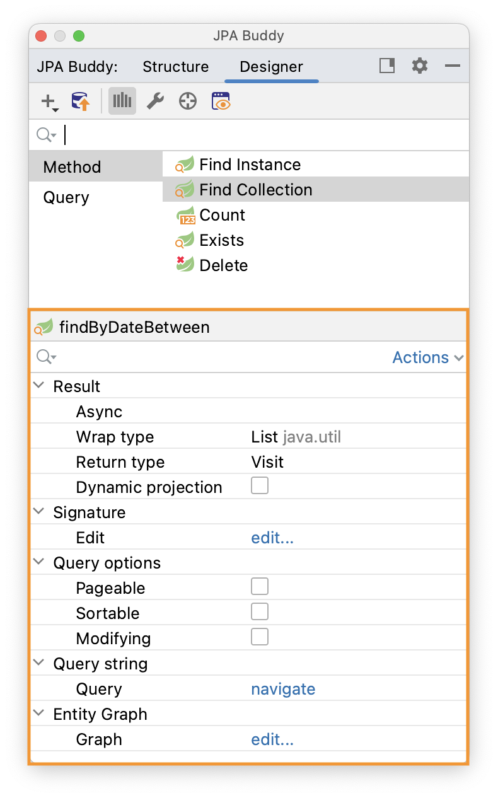

## Introduction

<a href="https://spring.io/projects/spring-data-jpa" target="_blank">Spring Data JPA</a> is part of the larger Spring Data family that makes it easy to implement JPA-based repositories quickly. JPA Buddy provides a clear UI for generating repositories, projections, queries, etc., for both Java and Kotlin entities. To enable those features, your project should contain dependencies mentioned in the [Installation Guide](https://www.jpa-buddy.com/documentation/).

## Repository Creation

JPA Buddy provides various ways to create repositories to make working with JPA-related objects more convenient for most users. All possible ways to generate repositories in the project are shown in the following video:

<div class="youtube">
<iframe width="560" height="315" src="https://www.youtube.com/embed/8pHsZ_HvbXs" title="YouTube video player" allow="accelerometer; autoplay; clipboard-write; encrypted-media; gyroscope; picture-in-picture" allowfullscreen></iframe>
</div>

<div class="note">You can create a Spring Data JPA repository only for an entity with a field annotated with @Id.</div>

In the New JPA Repository window, you can set:

* The entity for which the repository will be created
* The name of the repository class 
* The parent class for the repository. It can be:
  * A repository from the <a href="https://docs.spring.io/spring-data/jpa/docs/current/reference/html/#jpa.repositories" target="_blank">org.springframework.data.repository</a> package
  * Any repository from your project
* Whether the repository will extend <a href="https://docs.spring.io/spring-data/jpa/docs/current/reference/html/#specifications" target="_blank">JpaSpecificationExecutor</a> or not
* The source root 
* The package where the repository will be created


Creating Spring Data repositories one by one for each entity can become a tedious job. With JPA Buddy, you can speed up this process. To create repositories for multiple JPA entities at once, you need to take three steps. Select the entities in the project tree, invoke the JPA Buddy wizard, then adjust your selection. That's it! Look how this feature can accelerate the development process:

<div class="youtube">
<iframe width="560" height="315" src="https://www.youtube.com/embed/nSusI0dq7nQ " title="YouTube video player" allow="accelerometer; autoplay; clipboard-write; encrypted-media; gyroscope; picture-in-picture" allowfullscreen></iframe>
</div>

## JPA Structure Repositories

JPA Buddy groups all repositories for each entity in one place to enable the most efficient navigation within the project. It doesn't matter if the repositories for the entity are located in different or in the same project package. All repositories related to the entity will be displayed in the "Repositories" section. From here, you can quickly move to the repository implementation or create a new one.


## Query/Method Generation

Spring Data provides the ability to define a query with the `@Query` annotation. You can use JPA Palette (1) or Editor Toolbar (2) to write them quickly and avoid typos. Choose one of the following types of queries and configure them with the convenient UI.


### Example

<div class="note">As opposed to @Query the derived query method's name can only be generated automatically according to <a href="https://docs.spring.io/spring-data/jpa/docs/current/reference/html/#jpa.query-methods.query-creation" target="_blank">Naming Conventions for Queries</a> or by specifying its <a href="https://docs.spring.io/spring-data/jpa/docs/current/reference/html/#appendix.query.method.subject" target="_blank">Subject Keyword</a>.
</div>

Let's look at an example of creating a Find **Collection Query**.


At the top of the window, you can define the wrap type for collections' and queries' return type. Moreover, JPA Buddy allows you to generate new [Projection interfaces](https://www.jpa-buddy.com/documentation/spring-data/#projection-creation) or [DTO classes](https://www.jpa-buddy.com/documentation/dto-generator/) by clicking on the `+` button.

You can also specify the method name. Still, if you leave it empty, the name will be generated automatically following <a href="https://docs.spring.io/spring-data/jpa/docs/current/reference/html/#jpa.query-methods.query-creation" target="_blank">Naming Conventions for Query</a>.

The middle of the window contains the table for the query conditions.

At the bottom of the window, you can specify:

* whether the parameters will be named or not;
* whether to use `Pageable` parameter or not;
* and so on.

Finally, you can specify fields you want to order the query result by.

For the above configuration, the following query will be generated:

```java
@Query("""
        select distinct o from Owner o
        where upper(o.firstName) like upper(concat(:firstName, '%'))
        and upper(o.lastName) like upper(concat('%', :lastName, '%'))
        order by o.lastName
        """)
    @Async
    CompletableFuture<List<Owner>> findOwners(@Param("firstName") String firstName,
                                              @Param("lastName") @NonNull String lastName,
                                              Pageable pageable);
```

The same approach applies to derived query methods. Instead of using the Method name field, you can utilize the Method prefix drop-down menu to define the desired subject keyword and add an alias.


This allows you to customize the naming convention for the generated query method, providing flexibility and consistency in your code.

### Entity Intention

JPA Buddy also provides intention on the entity attributes leading directly to the query/method creation window. Place the cursor on the desired attribute, press Alt+Enter (or Opt+Enter on Mac), and click on the Create Spring Data repository method. In the opened window, choose the required type of query/method.

<div class="youtube">
<iframe width="560" height="315" src="https://www.youtube.com/embed/mevqm5DzGRs" title="YouTube video player" allow="accelerometer; autoplay; clipboard-write; encrypted-media; gyroscope; picture-in-picture" allowfullscreen></iframe>
</div>

### Unresolved Reference

JPA Buddy can help those developers who prefer to call a method that doesn't exist yet first and only then implement it. Just write the desired signature and move to the query or method creation wizard via special actions:


### Settings

Spring Data provides several keyword expressions for derived query method names. You can use NameContaining, NameIsContaining, or NameContains - the result is the same. On the one hand, it gives us some flexibility in methods naming. On the other hand, in big teams, different naming for the same actions may be confusing for code reviewers and maintainers. If you have naming standards established for the development team, you can configure JPA Buddy to use only approved keywords for method names generation:


## Existing methods/queries modification

To configure the method or query, place a cursor on it and use JPA Inspector:



### EntityGraph Support

The EntityGraph has been one of the most awaited features introduced in JPA 2.1. Entity graphs give us another layer of control over data that needs to be fetched. JPA Buddy supports them, so you can build graphs using a handy GUI wizard:

<div class="youtube">
<iframe width="560" height="315" src="https://www.youtube.com/embed/Duco-QWBXy0" title="YouTube video player" allow="accelerometer; autoplay; clipboard-write; encrypted-media; gyroscope; picture-in-picture" allowfullscreen></iframe>
</div>

## Query Refactoring

### Async

Spring Data JPA provides the ability to run repository queries asynchronously. To make a query asynchronous, it's not enough to add the '@Async' annotation, it's also necessary to change the return type to one of the following:

* Future<ClassName>
* CompletableFuture<ClassName>
* ListenableFuture<ClassName>

Learn more about asynchronous query results at the corresponding Spring Data JPA documentation <a href="https://docs.spring.io/spring-data/jpa/docs/current/reference/html/#repositories.query-async" target="_blank">page</a>.

To make query async, place the cursor on the query you want to change and choose the result return type from the drop-down list:


### Dynamic Projection

In Spring Data JPA, you can specify projections at runtime using generic repository methods. Add a type class parameter to your repository method to use the same query with different projections. This enables you to define the preferred return type in your business code.

To make a query generic, place the cursor on the query you want to change and check the “Dynamic projection” box.


### Query Extracting

Derived query methods are a handy way to define queries. But over time, they may evolve into bulky and unreadable structures that you can transform into neat `@`Query-annotated methods instead. This can be easily achieved with JPA Buddy. Place the cursor on the query and click on the “Query extract...” in the JPA Inspector.

<div class="youtube">
<iframe width="560" height="315" src="https://www.youtube.com/embed/lYZielYtVXI" title="YouTube video player" allow="accelerometer; autoplay; clipboard-write; encrypted-media; gyroscope; picture-in-picture" allowfullscreen></iframe>
</div>

### Query Autocompletion

For the IntelliJ IDEA Community edition, JPA Buddy provides query autocompletion (similar to what IntelliJ IDEA Ultimate Edition provides). Place the cursor on the query and click on the “Query edit...” in the JPA Inspector.

<div class="youtube">
<iframe width="560" height="315" src="https://www.youtube.com/embed/IQDgQ5_l764" title="YouTube video player" allow="accelerometer; autoplay; clipboard-write; encrypted-media; gyroscope; picture-in-picture" allowfullscreen></iframe>
</div>

## Projection

Sometimes you only need a subset of columns from a table. In such cases, Spring Data JPA projections come in handy, letting you return only required fields from queries.

<div class="youtube">
<iframe width="560" height="315" src="https://www.youtube.com/embed/xevxVvu_Hbc" title="YouTube video player" allow="accelerometer; autoplay; clipboard-write; encrypted-media; gyroscope; picture-in-picture" allowfullscreen></iframe>
</div>

In the "New Spring Projection" window, you can:

* Define source root and package;
* Choose entity class;
* Set a name for a projection class;
* Select the fields you want to include.

Also, JPA Buddy allows you to generate Projections for the referenced entities. Select the associated entity, choose the Projection type, and pick the required fields.


For the above configuration the following projection will be generated:

```java
/**
 * A Projection for the {@link Pet} entity
 */
public interface PetInfo {
	Integer getId();

	String getName();

	LocalDate getBirthDate();

	PetTypeInfo getType();

	OwnerInfo getOwner();

	/**
	 * A Projection for the {@link PetType} entity
	 */
	interface PetTypeInfo {
		Integer getId();

		String getName();
	}

	/**
	 * A Projection for the {@link Owner} entity
	 */
	interface OwnerInfo {
		String getFirstName();

		String getLastName();
	}
}
```

### Keep Projections in sync with its JPA entity

As time passes, entities may change, and you need to change projections accordingly. JPA Buddy allows you to synchronize an entity with its projection and vice versa. Read more about this feature in the [DTO Generator](https://www.jpa-buddy.com/documentation/dto-generator/keep-dtos-in-sync-with-its-jpa-entity) section.

### Projection Declaration Settings

Each project may follow its own conventions for code writing. In the Tools -> JPA Buddy -> Projection Declaration you can configure:

1. Class name postfix.
2. Name pattern regexp (the feature is disabled when the field is empty). This option is useful if you use an obligatory naming convention for Projections. It allows JPA Buddy to associate Projection with its JPA Entity using a Projection name only. To specify a placeholder for the simple class name of the target JPA entity, use the `(?<entity>.)` pattern. E.g., `(?<entity>.*(?:Info|Prj|Projection|VO|Vo|View|Request|Browse)` means that the `MyEntityInfo`, `MyEntityPrj` etc. classes will be considered as a Projections for `MyEntity`.
3. Class comment. Defines the comment that will be generated over the Projection interface.
4. Comment link regexp (the feature is disabled when the field is empty). This option allows JPA Buddy to associate Projection with its JPA Entity. To specify a placeholder for the target entity FQN (Fully Qualified Name) in a comment use the `(?<entity>.*)` pattern. So, if the regexp is defined as `A Projection for the \{@link (?<entity>.*)\} entity` it will be resolved in the following Javadoc comment:

  ```java
  /**
   * A Projection for the {@link Pet} entity
   */
  ```


#### Convenient Navigation between Entity and its Projections

As soon as JPA Buddy is able to associate Projection interface with the entity:

* The Projection interface will appear in the **Dto & Projections** section in the JPA Structure panel and in the Editor Toolbar (1)
* The gutter icon will appear in the Projection to ease the navigation to its entity (2)


## Auditing Support

In a large application, having auditing is crucial. JPA Buddy makes it effortless by providing annotations such as `@CreatedBy`, `@CreatedDate`, `@LastModifiedBy` and `@LastModifiedDate`for commonly used audit fields. What's more, JPA Buddy will notify you if you forget to add the `@EnableJpaAuditing` annotation to your configuration or if the AuditingEntityListener is not added to the current entity. This leaves even less room for mistakes!

<div class="youtube">
<iframe width="560" height="315" src="https://www.youtube.com/embed/1D5zEzLX1iY" title="YouTube video player" allow="accelerometer; autoplay; clipboard-write; encrypted-media; gyroscope; picture-in-picture" allowfullscreen></iframe>
</div>

Tags: Spring Data, JPA, Projections, Auditing, DTO, Query, Repository, Entity, JPQL, Native Query, Dynamic Projections

## Blaze Persistence Support

<a href="https://persistence.blazebit.com/" target="_blank">Blaze-Persistence</a> seamlessly integrates with Spring Data JPA, allowing you to leverage the advanced querying and optimization capabilities while benefiting from the convenience and productivity of Spring Data. JPA Buddy provides support for this framework to create Spring Data JPA repositories for Entity Views, but only when [the relevant library](https://jpa-buddy.com/documentation/#dependencies) is included in the project.

Creating Spring Data JPA repositories for Entity Views is available from the standard repository creation window. Once you select an Entity View, the only options for the parent interface are `com.blazebit.persistence.spring.data.repository.EntityViewRepository` or one of its successors.


```java
import com.blazebit.persistence.spring.data.repository.EntityViewRepository;
import com.example.blazepersistence.view.BaseView;

public interface BaseViewRepository extends EntityViewRepository<BaseView, Long> { }
```

<div class="youtube">
<iframe width="560" height="315" src="https://www.youtube.com/embed/OWH4Y2onh_A" title="YouTube video player" allow="accelerometer; autoplay; clipboard-write; encrypted-media; gyroscope; picture-in-picture" allowfullscreen></iframe>
</div>